<p align="center">
  
</p>

<h1 align="center">Rockxy</h1>

<p align="center">
  <a href="README.md">English</a> |
  <a href="README.vi.md">Tiếng Việt</a> |
  <a href="README.zh.md">中文</a> |
  <a href="README.zh-TW.md">繁體中文</a> |
  <a href="README.es.md">Español</a> |
  <a href="README.pt-BR.md">Português do Brasil</a> |
  <a href="README.ja.md">日本語</a> |
  <a href="README.ko.md">한국어</a> |
  <a href="README.fr.md">Français</a> |
  <a href="README.de.md">Deutsch</a> |
  <a href="README.it.md">Italiano</a> |
  <a href="README.tr.md">Türkçe</a> |
  <a href="README.pl.md">Polski</a> |
  <a href="README.nl.md">Nederlands</a> |
  <a href="README.ru.md">Русский</a> |
  <a href="README.uk.md">Українська</a> |
  <a href="README.ar.md">العربية</a> |
  <a href="README.fa.md">فارسی</a> |
  <a href="README.bn.md">বাংলা</a> |
  <a href="README.ro.md">Română</a> |
  <a href="README.ka.md">ქართული</a>
</p>

<p align="center">
  <strong>ওপেন সোর্স, macOS-এর জন্য অডিটযোগ্য ডিবাগিং প্রক্সি।</strong>
</p>

<p align="center">
  একটি নেটিভ সুইফট অ্যাপের মাধ্যমে HTTP/HTTPS/WebSocket/GraphQL ট্র্যাফিককে আটকান, পরিদর্শন করুন এবং সংশোধন করুন আপনি পরিদর্শন, নির্মাণ এবং বিশ্বাস করতে পারেন।<br>
  এপিআই, মোবাইল, এমসিপি-সহায়তা, এআই, এবং ব্লকচেইন-যুগের ডিবাগিং ওয়ার্কফ্লোগুলির জন্য তৈরি করা হয়েছে রকক্সি বিকশিত হওয়ার সাথে সাথে।<br>
  একটি স্থানীয়-প্রথম, AGPL-3.0 এর বিকল্প <a href="#rockxy-vs-alternatives">প্রক্সিম্যান এবং চার্লস প্রক্সি</a>.
</p>

<p align="center">
  <a href="https://github.com/RockxyApp/Rockxy/releases"></a>
  
  
  <a href="LICENSE"></a>
  <a href="CONTRIBUTING.md"></a>
  <a href="https://github.com/sponsors/LocNguyenHuu"></a>
  <a href="https://opencollective.com/rockxy/donate"></a>
</p>

<p align="center">
  <a href="https://youtu.be/RvkQuwUjBaQ" title="Watch the Rockxy demo on YouTube">
    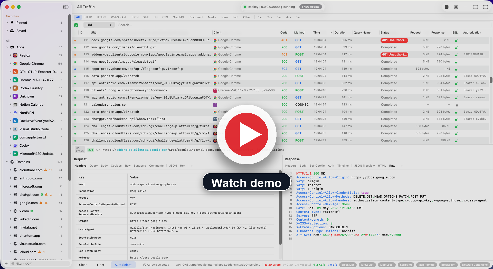
  </a>
</p>

---

<!-- BEGIN GENERATED: latest-release -->
## Latest Tagged Release

**v0.29.0** — 2026-07-12

### Added

- Added dedicated model API traffic inspection with provider and model hints, streaming state, usage details when available, tool-call summaries, retrieval hints, and clear unavailable-field warnings.
- Added Web3 JSON-RPC inspection for EVM and Solana-style HTTP RPC traffic, including provider host, request ID, method, batch summary, error, chain, transaction, payload, and debug-intent details.
- Added x402-style payment-flow hints for payment-required and retry-oriented HTTP traffic.
- Added a default Protocol column and protocol filters that make model API, Web3 RPC, gRPC, GraphQL, WebSocket, and HTTP traffic easier to scan in the request list.

### Changed

- Kept model API, Web3, and gRPC inspector tabs together at the end of the inspector tab row for a more consistent response-review workflow.
- Clarified that rules and debugging tools continue to match URL, HTTP method, and headers rather than model names, tool calls, chain IDs, JSON-RPC methods, or batch subcalls.
- Refined General settings so proxy controls, certificate status, and certificate actions are easier to scan.

See [CHANGELOG.md](CHANGELOG.md) for the full release history.
<!-- END GENERATED: latest-release -->

## বর্তমান শাখা হাইলাইট

- আপস্ট্রিম প্রক্সিতে এখন PAC URL রাউটিং সহ বিনামূল্যে/কোর স্বয়ংক্রিয় প্রক্সি কনফিগারেশন অন্তর্ভুক্ত রয়েছে `DIRECT`, HTTP, এবং HTTPS রুট বিদ্যমান SOCKS5 এবং প্রমাণীকরণ নীতি সীমানা সংরক্ষণ করার সময়।
- রপ্তানি কর্মপ্রবাহ এখন OpenAPI YAML/HTML এবং নির্বাচিত-ট্র্যাফিক সংক্ষিপ্ত প্রকাশনাকে রিডাকশন-সচেতন পেলোড বিল্ডিং সহ কভার করে।
- পরিদর্শক সরঞ্জামগুলিতে এখন JSONPath/কী/মান ফিল্টারিং এবং JWT-এর মতো নির্বাচিত পেলোড পাঠ্যের জন্য দ্রুত পূর্বরূপ অন্তর্ভুক্ত রয়েছে।
- Node.js বিকাশকারী সেটআপ এখন বৈধকরণের সময় নির্বাচিত ক্লায়েন্টকে মিরর করে এবং একটি পূর্ণাঙ্গ লোকালহোস্ট নমুনা গাইড রয়েছে।
- ডেভেলপার সেটআপ হাব এখন রানটাইম, ব্রাউজার, ক্লায়েন্ট, ডিভাইস, ফ্রেমওয়ার্ক এবং টার্গেট-নির্দিষ্ট স্নিপেট, বৈধতা পর্যবেক্ষক এবং সৎ গাইড সামগ্রী সহ পরিবেশ কভার করে।
- WebSocket Protobuf কাজ Rockxy এর সমৃদ্ধ প্রোটোকল পরিদর্শন নির্দেশের অংশ হিসাবে চলতে থাকে।
- পাবলিক রোডম্যাপ পরিকল্পনায় এখন AI ট্র্যাফিকের জন্য প্রোটোকল-সচেতন ডিবাগিং, Web3/RPC ফ্লো, x402-স্টাইলের অর্থপ্রদানের প্রবাহ এবং নিরাপদ সংশোধিত প্রমাণ ভাগ করা অন্তর্ভুক্ত।

## বৈশিষ্ট্য

যখন ব্রাউজার DevTools পর্যাপ্ত নয় তখন আপনি যে টুলগুলির জন্য পৌঁছান। Mac এবং iOS কাজের জন্য মূল ট্রাফিক ডিবাগিং — macOS-এ নেটিভ, পাবলিক রিলিজ এবং স্থানীয়-প্রথম ওয়ার্কফ্লো সহ।

### ট্রাফিক ক্যাপচার

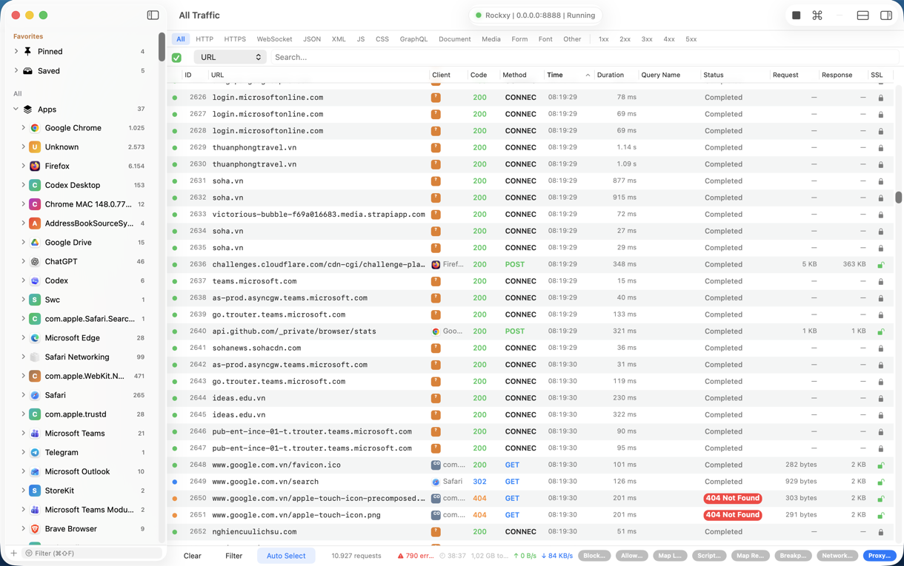

যেকোন ম্যাক অ্যাপ, সিএলআই বা iOS ডিভাইস থেকে HTTP, HTTPS, WebSocket এবং GraphQL ট্র্যাফিক পরিদর্শন করুন। ব্রাউজার DevTools ব্রাউজারে শেষ হয় — Rockxy আপনার বাকি স্ট্যাক দেখে।

`HTTP / HTTPS` · `WebSocket` · `GraphQL` · `iOS Device & Simulator` · `Filter by Process ID` · `Timing Waterfall`

### উন্নত ফিল্টার এবং অনুসন্ধান

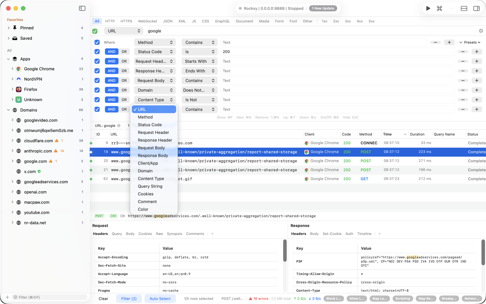

কয়েক সেকেন্ডের মধ্যে ক্যাপচার করা অনুরোধগুলিকে সংকুচিত করুন। মেথড, হোস্ট, স্ট্যাটাস, হেডার, বডি এবং প্রসেস ফিল্টার একত্রিত করুন — অথবা পুরো সেশন জুড়ে একটি পূর্ণ-পাঠ্য অনুসন্ধান চালান।

`Multi-Field Filters` · `Full-Text Search` · `Status / Method` · `Header / Body Match` · `Process / Host` · `Saved Filters`

### AI সহকারীর জন্য MCP সার্ভার

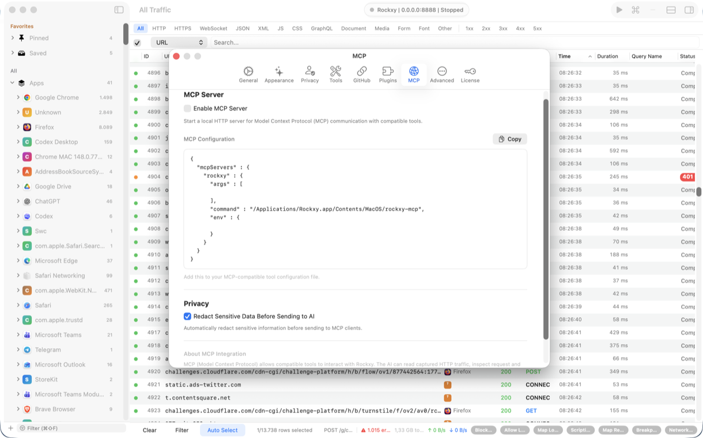

ক্লাউড ডেস্কটপ বা কার্সরকে স্থানীয় MCP সার্ভারের মাধ্যমে আপনার ক্যাপচার করা ট্র্যাফিক পড়তে দিন। জিজ্ঞাসা করুন "কেন এই 500?" চ্যাটে হেডার আটকানোর পরিবর্তে। স্থানীয়, সংশোধন-সচেতন, এবং ওপেন সোর্স।

`Claude Desktop` · `Cursor` · `Local stdio` · `Redaction` · `Open Source`

### বিকাশকারী সেটআপ হাব

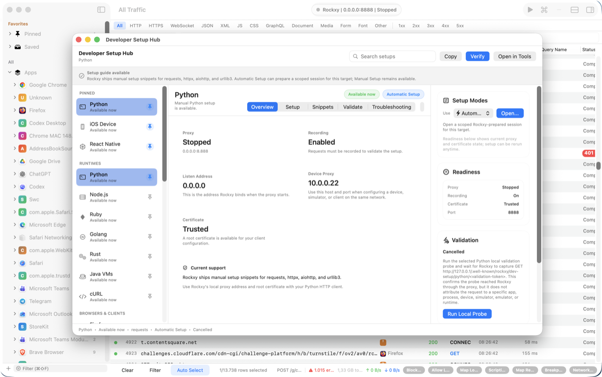

Python, Node.js, Go, Rust, cURL, Docker এবং ব্রাউজারগুলির জন্য প্রক্সি স্নিপেট কপি-পেস্ট করুন, তারপরে ট্র্যাফিক আসলে প্রবাহিত হচ্ছে তা নিশ্চিত করতে Run Test-এ ক্লিক করুন।

`Python` · `Node.js` · `Go / Rust / Java` · `cURL / Docker` · `One-Click Verify` · `Trust Diagnostics`

### HTTPS ডিবাগিংয়ের জন্য শংসাপত্র ব্যবস্থাপনা

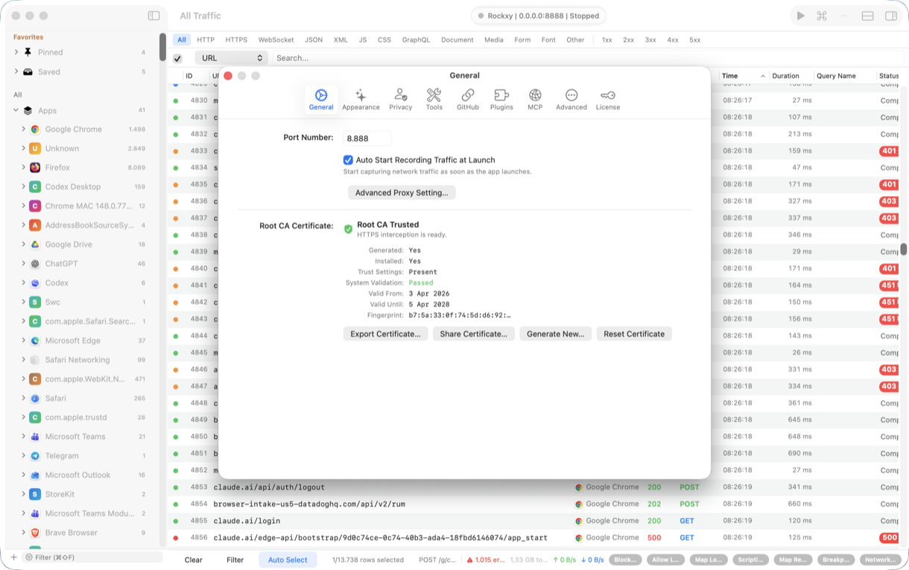

একটি P-256 ECDSA রুট CA প্রথম লঞ্চের সময় উত্পন্ন, আপনার কীচেইনে সিল করা হয়েছে৷ প্রথম চেষ্টায় HTTPS ডিক্রিপ্ট করুন; পিন করা হোস্ট স্বয়ংক্রিয়ভাবে পাস.

`P-256 ECDSA Root CA` · `Keychain-Sealed Key` · `Per-Host Leaf Certs` · `Trust Wizard` · `Pinned-Host Passthrough` · `Rotate / Reset`

### SSL প্রক্সি এবং HTTPS ডিক্রিপশন

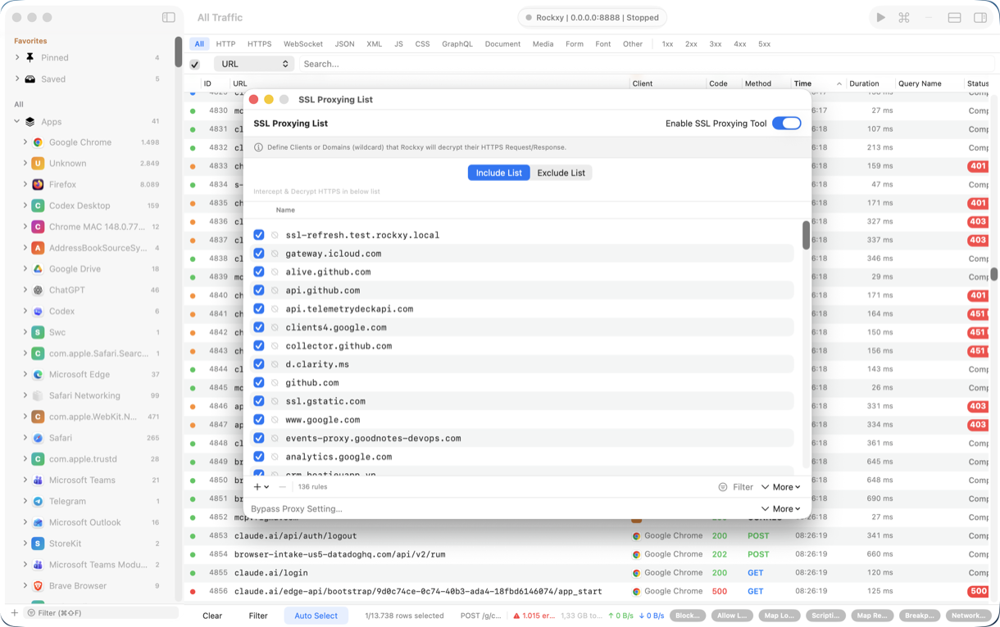

কোন হোস্ট টিএলএস ডিক্রিপশন পাবেন তা বেছে নিন। ডিক্রিপ্ট করা ট্রাফিক বাস্তব হেডার এবং JSON দেখায়; বাকি সবকিছু এনক্রিপ্টেড মাধ্যমে পাস. ওয়াইল্ডকার্ড নিয়ম আপনাকে এক ক্লিকে ডোমেনের মাধ্যমে সুযোগ দিতে দেয়।

`Per-Host Decryption` · `Wildcard Rules` · `Allow / Deny List` · `TLS 1.2 / 1.3` · `Pinned Host Passthrough`

### বাইপাস প্রক্সি

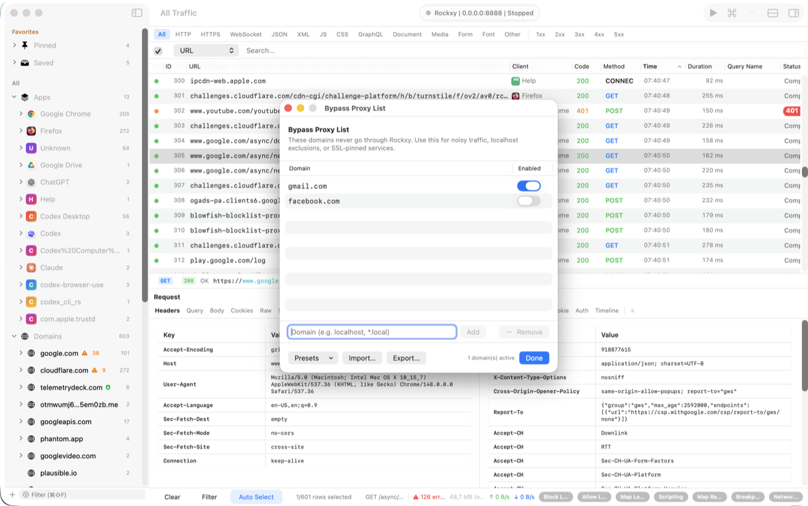

নির্দিষ্ট হোস্টগুলি এড়িয়ে যান যাতে শংসাপত্র-পিন করা অ্যাপ, অভ্যন্তরীণ পরিষেবা, বা শোরগোলপূর্ণ টেলিমেট্রি কখনই ক্যাপচারে প্রবেশ না করে। ওয়াইল্ডকার্ড তালিকাটি সংক্ষিপ্ত রাখে এবং আপনার অনুরোধের লগ আপনি আসলে কী বিষয়ে যত্নশীল তার উপর ফোকাস করে।

`Per-Host Bypass` · `Wildcard Patterns` · `Skip Pinned Hosts` · `Mute Telemetry` · `Reduce Noise` · `Toggle Anytime`

### ব্লক তালিকা

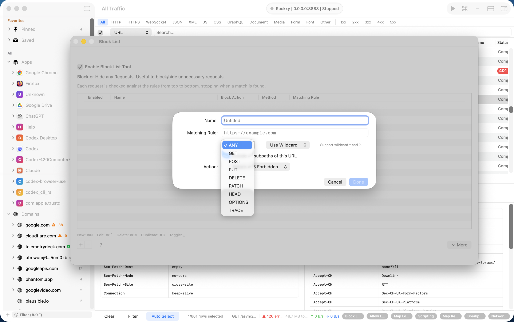

কোনো হোস্ট ব্যর্থ করুন. বিজ্ঞাপন নেটওয়ার্ক, থার্ড-পার্টি ট্র্যাকার বা ফ্ল্যাকি ডিপেন্ডেন্সি বাদ দিন যে আপনার অ্যাপটি চলে গেলে কীভাবে এটির অবনতি হয় — কোডের একটি লাইন পরিবর্তন না করেই।

`Per-Host Block` · `Wildcard Match` · `Simulate Outage` · `Test Fallbacks` · `Strip Trackers` · `Toggle Anytime`

### মানচিত্র স্থানীয়

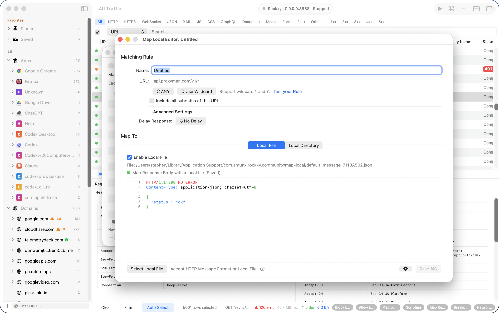

একটি লাইভ প্রতিক্রিয়ার জায়গায় একটি সংরক্ষিত ফাইল বা একটি ডিরেক্টরি গাছ পরিবেশন করুন। আপনি ডিবাগ করার সময় একটি JSON পেলোড অদলবদল করুন, একটি স্ন্যাপশট পুনরায় চালান, বা একটি ফ্ল্যাকি তৃতীয় পক্ষের API পিন করুন স্থানীয় অনুলিপিতে।

`File or Directory` · `Response Snapshot` · `Regex Patterns`

### ম্যাপ রিমোট

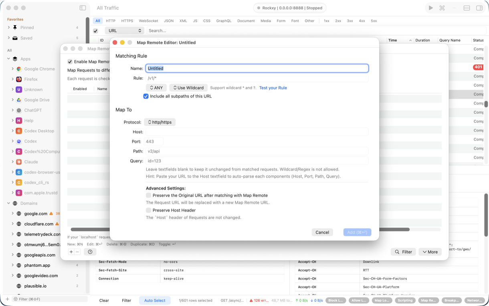

অ্যাপ কোড বা /etc/hosts স্পর্শ না করে একটি ক্যাপচার করা অনুরোধের গন্তব্য পুনরায় লিখুন। একটি পুনরুত্পাদনযোগ্য বাগ রিপ্রোর জন্য স্টেজিং, আপনার ডেভ সার্ভার বা সহকর্মীর মেশিনে প্রোডাকশন ট্র্যাফিক পয়েন্ট করুন।

`Host Rewrite` · `Regex Patterns` · `Preserve Host Header`

### ব্রেকপয়েন্ট এবং নিয়ম

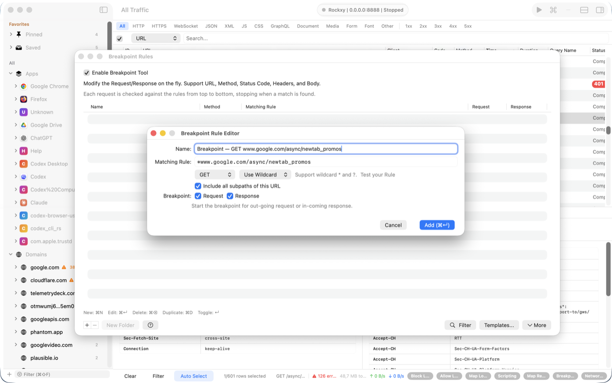

একটি অনুরোধ বা প্রতিক্রিয়া, সম্পাদনা পদ্ধতি, শিরোনাম, বডি, বা স্থিতি বিরতি দিন, তারপর চালিয়ে যান। পরীক্ষা করার দ্রুততম উপায় "যদি API 401 ফেরত দেয়?" ব্যাকএন্ড স্পর্শ না করে।

`Request Breakpoints` · `Response Breakpoints` · `Block` · `Throttle` · `Regex / Wildcard Match` · `Inject Failure States`

### হেডার পরিবর্তন করুন

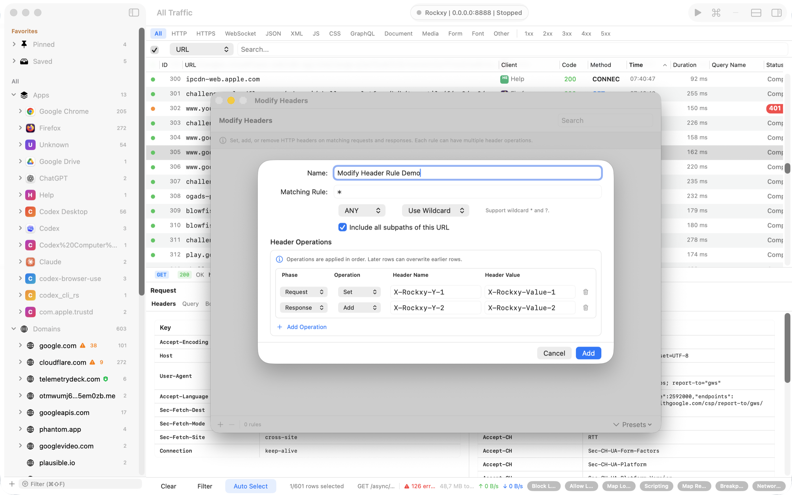

পুনঃনিয়োগ না করে যেকোনো হোস্টে শিরোনাম যোগ করুন, সরান বা প্রতিস্থাপন করুন। বিল্ট-ইন প্রিসেটগুলির সাথে কয়েক সেকেন্ডে CORS, প্রমাণীকরণ বা ক্যাশে পরিবর্তনগুলি পরীক্ষা করুন৷

`Add / Remove / Replace` · `CORS Presets` · `Auth Stripping` · `Request Phase` · `Response Phase` · `URL Pattern Scope`

### কাস্টম অনুরোধ এবং প্রতিক্রিয়া শিরোনাম

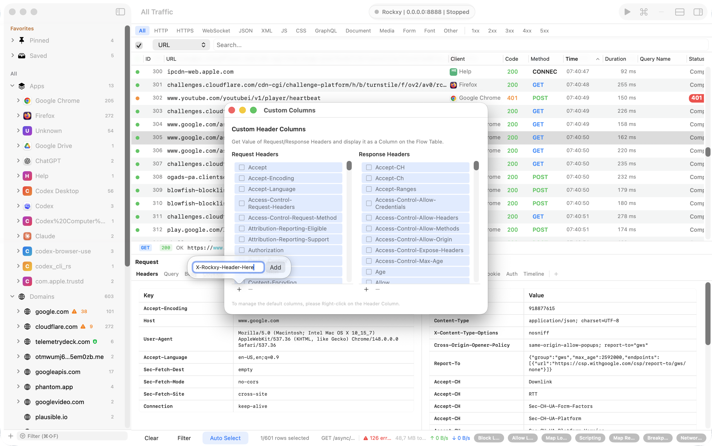

উভয় পর্যায়ে সম্পূর্ণ নিয়ন্ত্রণ সহ হোস্ট প্রতি হেডার ওভাররাইড করুন। বহির্গামী অনুরোধে প্রমাণীকরণ টোকেন ইনজেক্ট করুন, প্রতিক্রিয়াগুলিতে সেট-কুকি স্ট্রিপ করুন বা একটি কাস্টম ব্যবহারকারী-এজেন্ট পিন করুন — নামযুক্ত নিয়ম হিসাবে সংরক্ষিত আপনি যে কোনও সময় টগল করতে পারেন৷

`Per-Host Override` · `Request Phase` · `Response Phase` · `Auth Token Inject` · `Cookie Strip` · `Named Rules`

### নেটওয়ার্ক শর্তাবলী

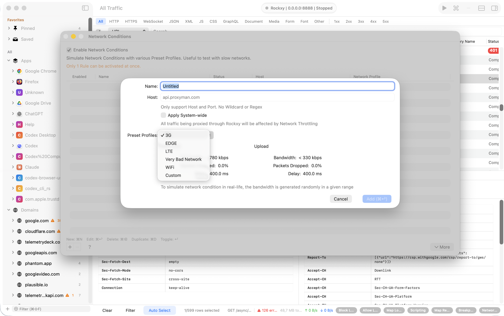

থ্রটল 3G, EDGE, LTE, WiFi, বা একটি কাস্টম বিলম্ব। আপনার ল্যাপটপ ফাইবার আছে; আপনার ব্যবহারকারীরা নন — তারা করার আগে 400 ms RTT এ UX দেখুন।

`3G` · `EDGE` · `LTE` · `WiFi` · `Very Bad Network` · `Custom Latency`

### রচনা করুন — সম্পাদনা করুন এবং পুনরায় চালান

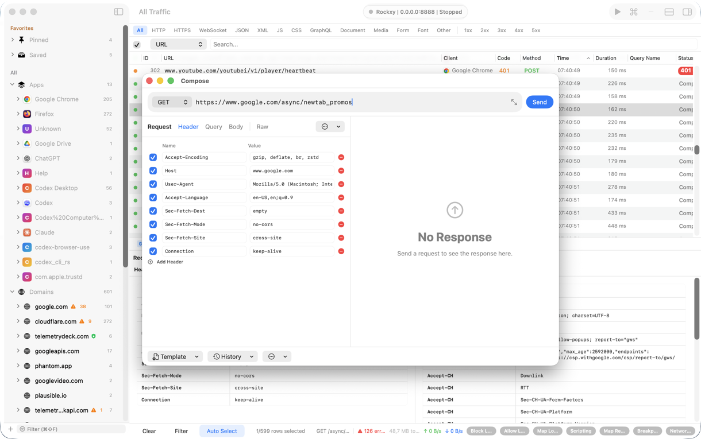

কোনো ক্যাপচার করা HTTP অনুরোধ পুনর্নির্মাণ করুন — পদ্ধতি, URL, শিরোনাম, ক্যোয়ারী প্যারাম, বা বডি পরিবর্তন করুন — এবং Rockxy না রেখেই পুনরায় পাঠান। পোস্টম্যান, অনিদ্রা, বা কার্ল কপি-পেস্ট লুপ নেই। LLM প্রম্পট, অস্পষ্ট প্রমাণীকরণের সীমানাগুলির উপর পুনরাবৃত্তি করুন বা OpenAI, Anthropic, এবং Cohere এন্ডপয়েন্টের জন্য সেকেন্ডের মধ্যে একটি ব্যর্থ কেস পুনরুত্পাদন করুন।

`Edit Headers` · `Edit Body` · `Edit Query` · `Edit Method` · `LLM Prompt Iteration` · `Postman Alternative` · `OAuth Flow Debug` · `Webhook Replay`

### তুলনা করুন

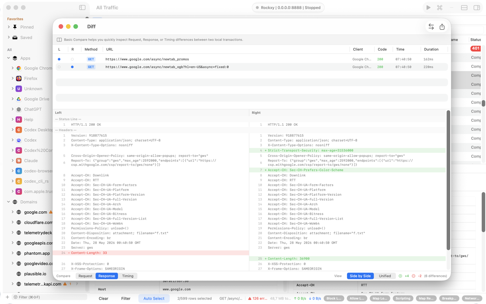

দুটি ক্যাপচার করা প্রতিক্রিয়া পাশাপাশি স্ট্যাক করুন এবং ফ্লিপ করা প্রতিটি ক্ষেত্র চিহ্নিত করুন — স্ট্যাটাস, হেডার, JSON কী, বডি বাইট। নীরব API রিগ্রেশন, নন-ডিটারমিনিস্টিক এলএলএম আউটপুট এবং তৃতীয় পক্ষের ডিফ টুলে কিছু পাইপ না করে প্রম্পট ড্রিফ্ট ধরুন। সাইড বাই সাইড ডিফ হাইলাইট করে কি পরিবর্তন হয়েছে; গভীর JSON তুলনা কী ক্রম উপেক্ষা করে।

`Diff Compare` · `Side-by-Side` · `JSON Diff` · `Header Diff` · `Body Diff` · `LLM Output Compare` · `Non-determinism` · `API Regression` · `Schema Drift`

### কাস্টম প্রিভিউয়ার ট্যাব

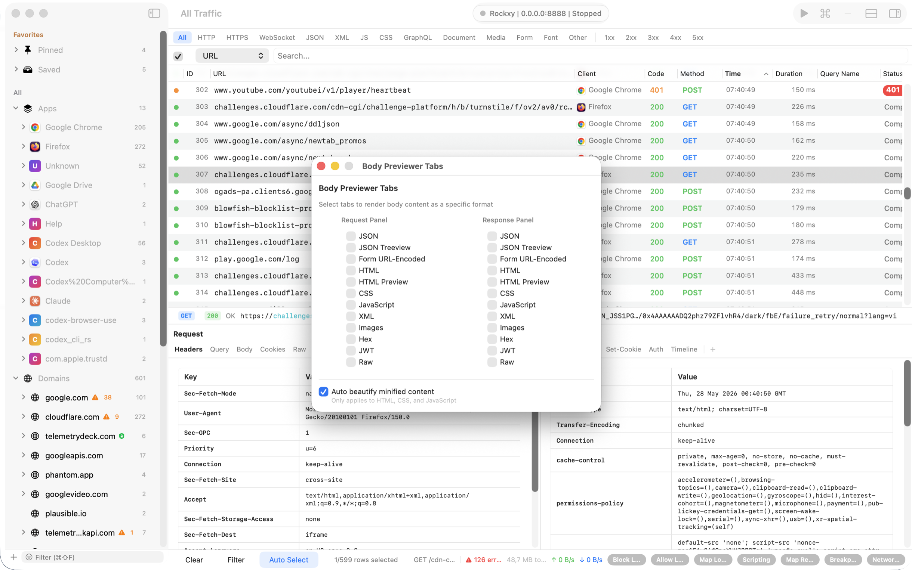

আপনি যেভাবে চান অনুরোধ এবং প্রতিক্রিয়া সংস্থাগুলিকে রেন্ডার করুন। JSON, GraphQL, JWT, ইমেজ বা আপনার নিজস্ব ফর্ম্যাটের জন্য পরিদর্শকের কাছে অতিরিক্ত ট্যাবগুলি পিন করুন — প্রতিটি ক্যাপচার করা অনুরোধ জুড়ে পুনরায় ব্যবহারযোগ্য।

`JSON` · `GraphQL` · `JWT Decoder` · `Image / Hex` · `Custom Format` · `Pinned per Inspector`

### অধিবেশন এবং রপ্তানি

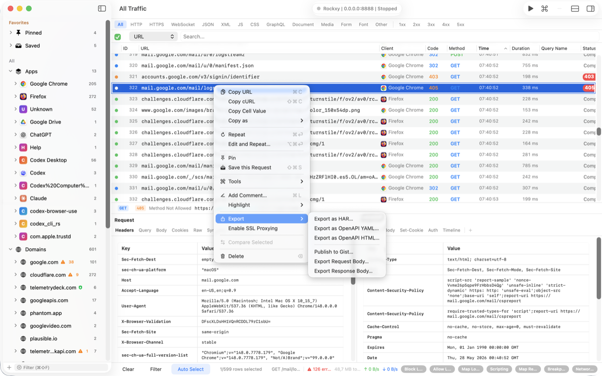

সেশন সংরক্ষণ করুন, ক্রস-টুল হ্যান্ডঅফের জন্য HAR আমদানি/রপ্তানি করুন, CURL বা JSON হিসাবে যেকোনো অনুরোধ অনুলিপি করুন। শেয়ার করার আগে অনুমোদনের শিরোনাম, কুকিজ, এবং বাহক টোকেনগুলি সংশোধন করুন — গোপনীয়তা ফাঁস না করে একজন সতীর্থকে একটি কার্যকরী বাগ রিপ্রো হস্তান্তর করুন৷

`.rockxysession` · `HAR Import / Export` · `Copy as cURL` · `Copy as JSON` · `Raw HTTP` · `Secret Redaction` · `Token Sanitize` · `Privacy-Safe Share`

### মাল্টি-ট্যাব ওয়ার্কস্পেস

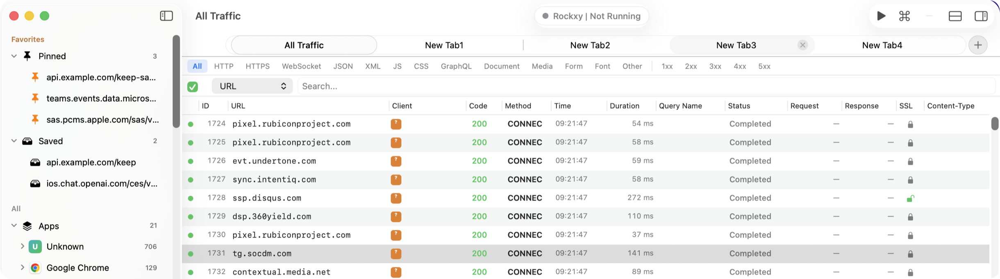

স্বাধীন ক্যাপচার সেশনগুলি পাশাপাশি চালান — স্টেজিংয়ের জন্য একটি ট্যাব, একটি প্রোডের জন্য, একটি iOS ডিভাইস বিল্ডের জন্য৷ প্রতিটি ট্যাবের নিজস্ব ফিল্টার, নির্বাচন এবং পরিদর্শক অবস্থা আছে, তাই প্রসঙ্গ পরিবর্তনের জন্য কিছুই খরচ হয় না।

`Independent Sessions` · `Per-Tab Filters` · `Per-Tab Inspector` · `Compare Environments` · `Mac & iOS Together` · `Detach & Rename`

### জাভাস্ক্রিপ্ট স্ক্রিপ্টিং

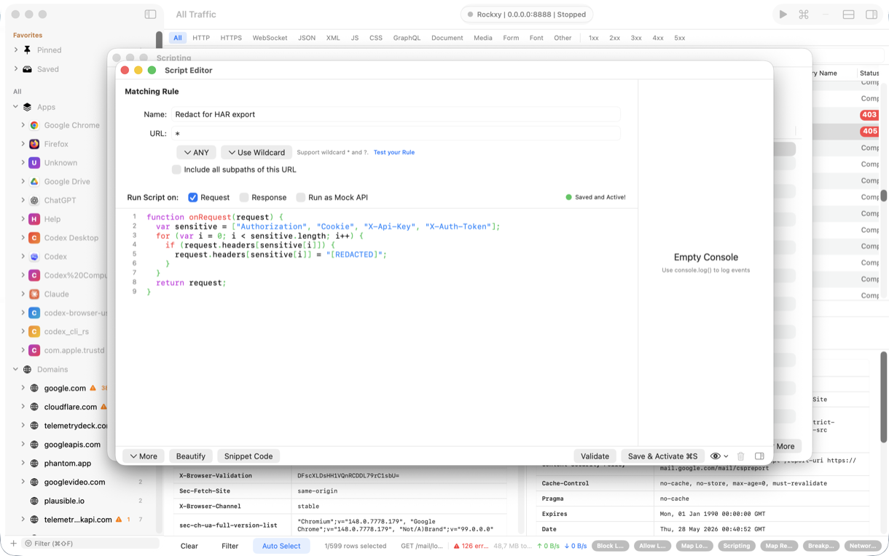

একটি স্ট্যাটিক নিয়ম কভার করতে পারে না এমন ক্ষেত্রে অনুরোধ এবং প্রতিক্রিয়াগুলির উপর JS হুক করে — PII সংশোধন করুন, টোকেন সাইন করুন, পেলোডগুলি পুনরায় লিখুন। ট্র্যাফিককে দূষিত করার পরিবর্তে ত্রুটিগুলি সারফেস ইনলাইন।

`Request Hooks` · `Response Hooks` · `Programmatic Filtering` · `PII Redaction` · `Inline Error Feedback`

## আরো বৈশিষ্ট্য শীঘ্রই আসছে

ভবিষ্যতের বৈশিষ্ট্যগুলি সর্বজনীনভাবে ট্র্যাক করা হয় এবং শুধুমাত্র বাস্তবায়ন, পরীক্ষা, গোপনীয়তা আচরণ এবং ডকুমেন্টেশন প্রস্তুত হলেই পাঠানো হয়।

### এআই ট্রাফিক পরিদর্শন `শীঘ্রই আসছে`

সাধারণ ক্যাপচার ওয়ার্কফ্লোতে মডেল ট্রাফিক ডিবাগ করা সহজ করুন। এআই অনুরোধগুলি সনাক্ত করুন, নির্বাচিত মডেল কলগুলি পরিদর্শন করুন, স্ট্রিমিং প্রতিক্রিয়াগুলি নির্ণয় করুন, প্রম্পট/আউটপুট আচরণের তুলনা করুন এবং সংবেদনশীল পেলোডগুলিকে অন্য পরিষেবাতে পেস্ট না করে টুল-কল চেইনগুলি বোঝুন।

`AI Requests` · `Model Inspector` · `Streaming Diagnostics` · `Tool Calls` · `Prompt Safety` · `Usage Signals`

### Web3/RPC পরিদর্শন `শীঘ্রই আসছে`

ব্লকচেইন যুগের নেটওয়ার্ক কলগুলিকে পাঠযোগ্য ডিবাগিং প্রমাণে পরিণত করুন। JSON-RPC এবং Solana RPC ট্র্যাফিক পরিদর্শন করুন, গোষ্ঠী সম্পর্কিত কলগুলি প্রবাহে, সাধারণ RPC ত্রুটিগুলি ব্যাখ্যা করুন এবং মানিব্যাগ বা ব্লক এক্সপ্লোরার না হয়ে নির্বাচিত অনুরোধগুলি পুনরায় প্লে করুন৷

`JSON-RPC` · `Solana RPC` · `Wallet Flows` · `RPC Errors` · `Replay Helpers` · `Network Evidence`

### x402 পেমেন্ট ফ্লো ডিবাগিং `শীঘ্রই আসছে`

নেটওয়ার্ক লেয়ার থেকে পেমেন্ট-গেটেড HTTP ফ্লো বুঝুন। অর্থপ্রদান-প্রয়োজনীয় প্রতিক্রিয়াগুলি হাইলাইট করুন, পুনরায় চেষ্টা করার পথ অনুসরণ করুন এবং ডিবাগিং প্রমাণ স্থানীয় এবং সংশোধন-সচেতন রাখুন।

`Payment Required` · `Retry Flow` · `Headers` · `Redaction` · `Local First`

### রিডাক্টেড এভিডেন্স বান্ডেল `শীঘ্রই আসছে`

গোপনীয়তা ফাঁস না করে একটি বাগ পুনরুত্পাদন করার জন্য প্রয়োজনীয় তথ্যগুলি ভাগ করুন৷ প্রোটোকল সারাংশ, রিডাকশন প্রিভিউ এবং সোর্স-ব্যাকড কনটেক্সট সহ নির্বাচিত ট্র্যাফিক প্যাকেজ করুন একজন সতীর্থ অডিট করতে পারে।

`Debug Bundles` · `Protocol Summary` · `Export Preview` · `Secret Redaction` · `Repro Context`

### প্রোটোকল-সচেতন ফিল্টার এবং নিয়ম `শীঘ্রই আসছে`

AI এবং Web3 মেটাডেটা ব্যবহার করুন যেখানে Rockxy ইতিমধ্যেই কাজ করে: ফিল্টার, ব্যাজ, ঐচ্ছিক কলাম, তুলনা, নিয়ম, বিকাশকারী সেটআপ এবং স্থানীয় MCP সারাংশ।

`Smart Filters` · `Request Badges` · `Optional Columns` · `Rules` · `Compare` · `Local MCP`

### টিম শেয়ারিং এবং সহযোগিতা `শীঘ্রই আসছে`

এক ক্লিকে সতীর্থকে একটি ক্যাপচার করা সেশন পাঠান। ইনলাইনে ব্যর্থ হওয়া অনুরোধগুলি টীকা করুন, রিয়েল টাইমে কে কী দেখছে তা দেখুন এবং স্ক্রিন-শেয়ারিং ছাড়াই HTTPS ট্র্যাফিক জোড়া-ডিবাগ করুন৷ ভবিষ্যতের মুক্তির লক্ষ্যে।

`Shared Sessions` · `Team Workspaces` · `Inline Comments` · `Live Cursor` · `Cloud Sync` · `Pair Debug` · `SSO` · `Audit Log`

> 100% নেটিভ macOS। ইলেক্ট্রন নেই। কোনো ওয়েব ভিউ নেই। SwiftUI + AppKit + SwiftNIO।

## দ্রুত শুরু

```bash
git clone https://github.com/RockxyApp/Rockxy.git
cd Rockxy
open Rockxy.xcodeproj
```

এক্সকোডে তৈরি করুন এবং চালান। স্বাগতম উইন্ডো আপনাকে রুট CA সেটআপ, হেল্পার ইনস্টলেশন এবং প্রক্সি অ্যাক্টিভেশনের মাধ্যমে গাইড করে।

**প্রয়োজনীয়তা:** macOS 14.0+, Xcode 16+, Swift 5.9

আপনি যদি ইনস্টলেশনের পরে স্থানীয় MCP ক্লায়েন্টের সাথে Rockxy সংযোগ করতে চান, দেখুন [MCP ইন্টিগ্রেশন গাইড](docs/features/mcp.mdx).

## রকক্সি বনাম বিকল্প

|    | **Rockxy** | **Proxyman** | **Charles Proxy** |
|---|---|---|---|
| **প্রকল্পের মডেল** | AGPL-3.0 ওপেন সোর্স প্রকল্প | মালিকানাধীন বাণিজ্যিক অ্যাপ | মালিকানাধীন বাণিজ্যিক অ্যাপ |
| **সোর্স কোড** | পাবলিক, নিরীক্ষণযোগ্য, কাঁটাচামচযোগ্য | বন্ধ উৎস | বন্ধ উৎস |
| **উৎস থেকে তৈরি করুন** | এই রেপো থেকে Xcode সহ বিনামূল্যে | পাবলিক সোর্স থেকে পাওয়া যায় না | পাবলিক সোর্স থেকে পাওয়া যায় না |
| **নেটিভ ম্যাকোস ফাউন্ডেশন** | Swift + SwiftNIO + SwiftUI/AppKit | নেটিভ macOS বাণিজ্যিক অ্যাপ | ক্রস-প্ল্যাটফর্ম বাণিজ্যিক অ্যাপ |
| **স্থানীয়-প্রথম ক্যাপচার** | স্থানীয় প্রক্সি, সার্টিফিকেট, হেল্পার এবং ক্যাপচার ডেটা আপনার Mac এ থাকে | ডেস্কটপ প্রক্সি অ্যাপ | ডেস্কটপ প্রক্সি অ্যাপ |
| **ডেভেলপার সেটআপ ওয়ার্কফ্লো** | রানটাইম, ক্লায়েন্ট, ডিভাইস, ফ্রেমওয়ার্ক এবং পরিবেশের জন্য অন্তর্নির্মিত বিকাশকারী সেটআপ হাব | পণ্য-নির্দিষ্ট সেটআপ নির্দেশিকা | পণ্য-নির্দিষ্ট সেটআপ নির্দেশিকা |
| **বাহ্যিক প্রক্সি + PAC রাউটিং** | HTTP/HTTPS আপস্ট্রিম প্রক্সি, PAC অটো-কনফিগারেশন, এবং বাইপাস নিয়ম | পরিণত বাণিজ্যিক প্রক্সি টুলিং | পরিণত বাণিজ্যিক প্রক্সি টুলিং |
| **MCP/স্থানীয় অটোমেশন সেতু** | অন্তর্নির্মিত, টোকেন-প্রমাণিত, ডিফল্টরূপে সংশোধন | পর্যালোচনা করা পাবলিক ডক্সে দাবি করা হয়নি | পর্যালোচনা করা পাবলিক ডক্সে দাবি করা হয়নি |
| **অবদানের পথ খোলা** | জনসাধারণের সমস্যা, আলোচনা, রোডম্যাপ এবং জনসংযোগ | বিক্রেতা-নিয়ন্ত্রিত পণ্য | বিক্রেতা-নিয়ন্ত্রিত পণ্য |

রোডম্যাপে: গভীর রিপ্লে/ডিফ/নিয়ম/স্ক্রিপ্টিং ওয়ার্কফ্লো, উন্নত ওয়েবসকেট এবং গ্রাফকিউএল পরিদর্শন, প্রোটোকল-সচেতন AI এবং Web3/RPC ডিবাগিং, x402-স্টাইলের পেমেন্ট-ফ্লো দৃশ্যমানতা, এবং gRPC/Protobuf প্লাস HTTP/2 এবং HTTP/3 সমর্থনের অনুসন্ধান।

## নিরাপত্তা

Rockxy নেটওয়ার্ক ট্র্যাফিক বাধা দেয় — নিরাপত্তা মৌলিক, ঐচ্ছিক নয়।

- XPC সাহায্যকারীর মাধ্যমে কলকারীদের যাচাই করে **শংসাপত্র-চেইন তুলনা**, শুধু বান্ডিল আইডি নয়
- প্লাগইন চালু হয় **স্যান্ডবক্সযুক্ত জাভাস্ক্রিপ্টকোর** 5-সেকেন্ড টাইমআউট সহ, কোনো ফাইল সিস্টেম/নেটওয়ার্ক অ্যাক্সেস নেই
- **ইনপুট বৈধতা** সমস্ত সীমানায় — শরীরের আকারের ক্যাপ, URI সীমা, regex DoS সুরক্ষা, পাথ ট্রাভার্সাল প্রতিরোধ
- শংসাপত্র **স্বয়ংক্রিয়ভাবে সংশোধন করা হয়েছে** বন্দী লগ ইন
- সংবেদনশীল ফাইল সংরক্ষিত **0o600 অনুমতি**

মাধ্যমে দুর্বলতা রিপোর্ট করুন [SECURITY.md](SECURITY.md). দেখুন [সম্পূর্ণ নিরাপত্তা আর্কিটেকচার](docs/development/security.mdx) বিস্তারিত জানার জন্য

## রোডম্যাপ

Rockxy এর পাবলিক রোডম্যাপ ওয়ার্কফ্লো-ভিত্তিক এবং তারিখ-মুক্ত। এটি নির্ভরযোগ্যতা, নেটিভ macOS UX, ডিবাগিং ওয়ার্কফ্লো, প্রোটোকল সমর্থন, AI/Web3-era ট্র্যাফিক দৃশ্যমানতা, ডকুমেন্টেশন এবং অবদানকারী অনবোর্ডিং এর উপর ফোকাস করে।

- [ROADMAP.md](ROADMAP.md): উচ্চ-স্তরের পাবলিক ইঞ্জিনিয়ারিং দিকনির্দেশ
- [রকক্সি পাবলিক রোডম্যাপ](https://github.com/orgs/RockxyApp/projects/1): রোডম্যাপ-ট্র্যাক করা সমস্যাগুলির জন্য কার্যক্ষম দৃশ্যমানতা

## ডকুমেন্টেশন

সম্পূর্ণ ডকুমেন্টেশন উপলব্ধ [রকক্সি ডক্স](docs/index.mdx):

- [কুইকস্টার্ট গাইড](docs/quickstart.mdx) - কয়েক মিনিটের মধ্যে উঠুন এবং দৌড়ান
- [বিকাশকারী সেটআপ হাব](docs/features/developer-setup-hub.mdx) — রানটাইম স্নিপেট, ডিভাইস গাইড, যাচাইকরণ প্রোব, এবং সমর্থন ম্যাট্রিক্স
- [MCP ইন্টিগ্রেশন](docs/features/mcp.mdx) — স্থানীয় MCP ক্লায়েন্টদের সাথে Rockxy সংযোগ করুন
- [স্থাপত্য](docs/development/architecture.mdx) — প্রক্সি ইঞ্জিন, অভিনেতা মডেল, ডেটা প্রবাহ
- [নিরাপত্তা মডেল](docs/development/security.mdx) — বিশ্বাসের সীমানা, XPC বৈধতা, শংসাপত্র ব্যবস্থাপনা
- [নকশা সিদ্ধান্ত](docs/development/design-decisions.mdx) — কেন SwiftNIO, NSTableView, অভিনেতা
- [উৎস থেকে বিল্ডিং](docs/development/building.mdx) — বিল্ড, টেস্ট, লিন্ট এবং ডিবাগ
- [কোড স্টাইল](docs/development/code-style.mdx) — সুইফ্টলিন্ট, সুইফটফরম্যাট এবং নিয়মাবলী
- [চেঞ্জলগ](CHANGELOG.md) — অপ্রকাশিত কাজ এবং ট্যাগ করা রিলিজ

## অবদান

অবদান স্বাগত জানাই — কোড, পরীক্ষা, ডক্স, বাগ রিপোর্ট, এবং UX প্রতিক্রিয়া।

দেখুন **[CONTRIBUTING.md](CONTRIBUTING.md)** সেটআপ নির্দেশাবলী, কোড শৈলী এবং সম্পূর্ণ PR চেকলিস্টের জন্য।

ভাল প্রথম সমস্যা লেবেল করা হয় [`good first issue`](https://github.com/RockxyApp/Rockxy/labels/good%20first%20issue). একটি PR খোলার দ্বারা, আপনি সম্মত হন [সিএলএ](CLA.md).

## স্পনসর এবং অংশীদার

Rockxy স্বাধীন ডেভেলপারদের দ্বারা নির্মিত এবং রক্ষণাবেক্ষণ করা হয়। স্পনসরশিপ তহবিল অব্যাহত উন্নয়ন, নিরাপত্তা অডিট, এবং নতুন বৈশিষ্ট্য.

<p align="center">
  <a href="https://opencollective.com/rockxy/donate">
    
  </a>
  <a href="https://github.com/sponsors/LocNguyenHuu">
    
  </a>
</p>

Rockxy আর্থিকভাবে [Open Source Collective](https://docs.oscollective.org/) দ্বারা হোস্ট করা হয়। অবদান এবং প্রকল্পের ব্যয় [Rockxy-এর সর্বজনীন Open Collective পৃষ্ঠায়](https://opencollective.com/rockxy) নথিভুক্ত থাকে, যাতে সমর্থকেরা তহবিল গ্রহণ ও ব্যবহারের স্বচ্ছ চিত্র দেখতে পারেন।

| স্তর | অবদান | যা সমর্থন করে |
|------|--------|----------------|
| **Backer** | মাসে $5 থেকে | ওপেন-সোর্স রক্ষণাবেক্ষণ, ডকুমেন্টেশন, পরীক্ষা এবং রিলিজ |
| **Builder** | মাসে $25 থেকে | রিগ্রেশন টেস্টিং, পারফরম্যান্স উন্নতি এবং দৈনন্দিন ডিবাগিং ওয়ার্কফ্লো |
| **Sponsor** | মাসে $100 | ডেভেলপারদের জন্য বিনামূল্যে থাকা গোপনীয়তা-কেন্দ্রিক টুলের দীর্ঘমেয়াদি রক্ষণাবেক্ষণ |
| **Sustaining Sponsor** | মাসে $500 | রিলিজ অটোমেশন ও প্রোটোকল সমর্থনসহ কেন্দ্রীভূত রক্ষণাবেক্ষণ এবং পণ্য উন্নয়ন |

**অংশীদারিত্ব অনুসন্ধান** — ডেভেলপার টুল কোম্পানি, নিরাপত্তা সংস্থা, এবং এন্টারপ্রাইজ দলগুলি কাস্টম ইন্টিগ্রেশন বা হোয়াইট-লেবেল সমাধান খুঁজছে: [rockxyapp@gmail.com](mailto:rockxyapp@gmail.com)

## সমর্থন

- [Open Collective](https://opencollective.com/rockxy/donate) — স্বচ্ছ প্রকল্প বাজেটের মাধ্যমে Rockxy-তে অবদান রাখুন
- [GitHub Sponsors](https://github.com/sponsors/LocNguyenHuu) — Rockxy এর উন্নয়ন সমর্থন করুন
- [গিটহাব সমস্যা](https://github.com/RockxyApp/Rockxy/issues) — বাগ রিপোর্ট এবং বৈশিষ্ট্য অনুরোধ
- [GitHub আলোচনা](https://github.com/RockxyApp/Rockxy/discussions) — প্রশ্ন এবং সম্প্রদায় চ্যাট
- **ইমেইল** — [rockxyapp@gmail.com](mailto:rockxyapp@gmail.com)
- **নিরাপত্তা সমস্যা** — দেখুন [SECURITY.md](SECURITY.md) দায়িত্বশীল প্রকাশের জন্য

## লাইসেন্স

[GNU Affero জেনারেল পাবলিক লাইসেন্স v3.0](LICENSE) — কপিরাইট 2024–2026 Rockxy Contributors.

## তারকা ইতিহাস

<a href="https://www.star-history.com/?repos=RockxyApp%2FRockxy&type=date&legend=top-left">
 <picture>
   <source media="(prefers-color-scheme: dark)" srcset="https://api.star-history.com/chart?repos=RockxyApp/Rockxy&type=date&theme=dark&legend=top-left" />
   <source media="(prefers-color-scheme: light)" srcset="https://api.star-history.com/chart?repos=RockxyApp/Rockxy&type=date&legend=top-left" />
   
 </picture>
</a>

---

<p align="center">
  <sub>দ্বারা তৈরি <a href="https://github.com/LocNguyenHuu">স্টিফেন</a>. Swift, SwiftNIO, SwiftUI, এবং AppKit দিয়ে তৈরি।</sub>
</p>
