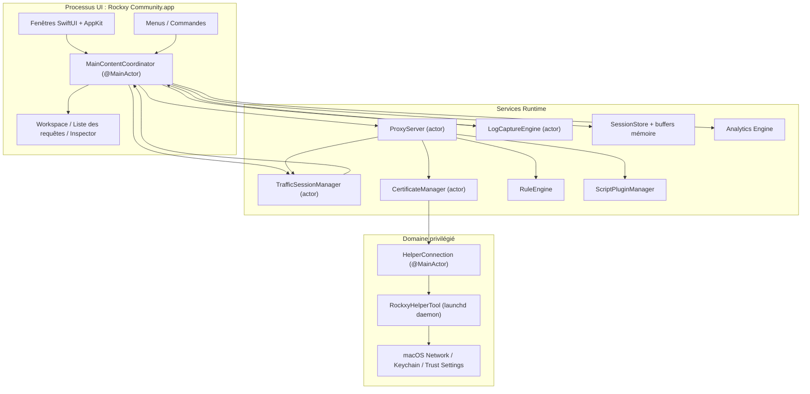
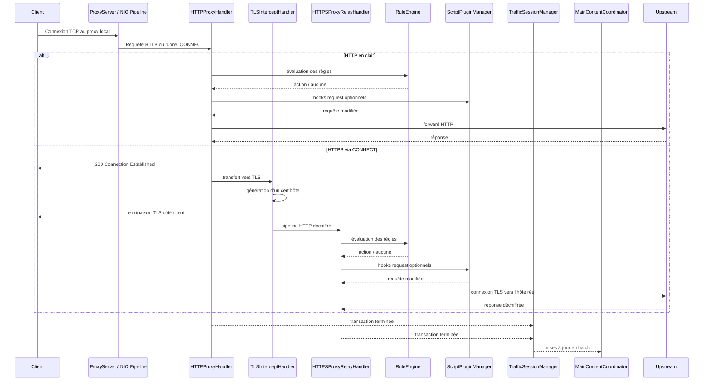
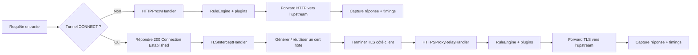
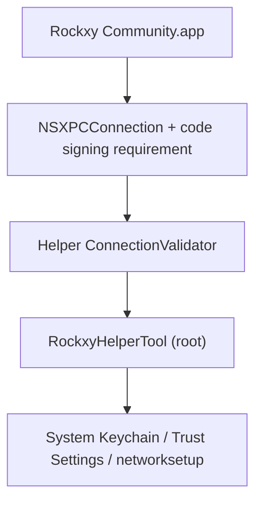

<p align="center">
  
</p>

<h1 align="center">Rockxy</h1>

<p align="center">
  <strong>Proxy de débogage HTTP open source pour macOS.</strong>
</p>

<p align="center">
  Interceptez le trafic HTTP/HTTPS, inspectez les requêtes API, déboguez les connexions WebSocket et analysez les requêtes GraphQL.<br>
  Construit en Swift avec SwiftNIO, SwiftUI et AppKit.
</p>

<p align="center">
  <a href="#"></a>
  <a href="#"></a>
  <a href="LICENSE"></a>
  <a href="CONTRIBUTING.md"></a>
  <a href="https://github.com/sponsors/LocNguyenHuu"></a>
</p>

<p align="center">
  
</p>

---

> **Statut** : Développement actif. Le moteur proxy, l’interception HTTPS, le système de règles, l’écosystème de plugins et l’UI d’inspection sont fonctionnels. Voir [CHANGELOG.md](CHANGELOG.md).

## Fonctionnalités

### Capture du trafic réseau
- **Proxy HTTP/HTTPS** — proxy d’interception basé sur SwiftNIO avec prise en charge de CONNECT
- **Interception SSL/TLS** — déchiffrement MITM avec certificats par hôte auto‑générés (cache LRU ~1000)
- **Débogage WebSocket** — capture et inspection des frames bidirectionnelles
- **Détection GraphQL** — extraction automatique du nom d’opération et inspection des requêtes
- **Identification du processus** — détermine l’app d’origine (Safari, Chrome, curl, Slack, Postman, etc.) via `lsof` + User‑Agent

### Inspecteur requête/réponse
- **Visualiseur JSON** — arborescence repliable avec coloration syntaxique
- **Inspecteur hexadécimal** — affichage binaire pour les contenus non textuels
- **Timing waterfall** — DNS, TCP, TLS, TTFB et transfert visualisés par requête
- **Headers, cookies, query params, auth** — inspecteur en onglets avec vue brute
- **Colonnes d’en‑têtes personnalisées** — afficher des en‑têtes supplémentaires en colonnes

### Espace de travail & productivité
- **Onglets d’espace de travail** — espaces de capture séparés avec filtres indépendants
- **Favoris** — épingler des hôtes ou requêtes fréquents
- **Vue chronologique** — timeline visuelle d’un sous‑ensemble de requêtes

### Manipulation du trafic & Mock API
- **Map Local** — servir des réponses depuis des fichiers locaux
- **Map Remote** — rediriger vers un autre host/port/path
- **Breakpoints** — mettre en pause, modifier URL/headers/body/status, puis relayer ou annuler
- **Block List** — bloquer par motif d’URL (wildcard ou regex)
- **Throttle** — simuler un réseau lent via délai de transfert
- **Modify Headers** — ajouter, supprimer ou remplacer des en‑têtes
- **Allow List** — ne capturer que des domaines/apps ciblés
- **Bypass Proxy** — exclure certains hôtes lorsque le proxy système est actif
- **Règles SSL Proxying** — contrôle de l’interception TLS par domaine

### Débogage & analyse
- **Intégration OSLog** — capture des logs macOS corrélés aux requêtes
- **Diff côte à côte** — comparer deux requêtes/réponses capturées
- **Timeline des requêtes** — waterfall des séquences et timings
- **Masquage des secrets** — redaction automatique des tokens Bearer et mots de passe

### Extensibilité
- **Plugins JavaScript** — scripts via JavaScriptCore (sandbox 5 s)
- **Hooks requête/réponse** — inspection et modification dans le pipeline proxy
- **UI de configuration des plugins** — formulaires auto‑générés depuis le manifest
- **Formats d’export** — cURL, HAR, HTTP brut ou JSON
- **Compose + replay** — éditer et renvoyer des requêtes, ou rejouer une capture
- **Revue d’import** — valider les imports HAR/session avant stockage

### Expérience macOS native
- **SwiftUI + AppKit natif** — pas d’Electron, pas de web views
- **Liste NSTableView** — défilement virtuel fluide pour 100k+ requêtes
- **Icônes d’app réelles** — résolution via `NSWorkspace`
- **Intégration proxy système** — helper privilégié sans mots de passe répétés
- **Mode sombre** — support complet
- **Raccourcis clavier** — Cmd+Shift+R (start), Cmd+. (stop), Cmd+K (clear), etc.

## Cas d’usage

- **Débogage d’app iOS/macOS** — inspecter les appels API depuis le simulateur ou l’appareil
- **Test d’API REST** — visualiser les paires requête/réponse exactes
- **Débogage GraphQL** — voir opérations, variables et réponses d’un coup d’œil
- **Mock d’API** — mapper des fichiers locaux à des endpoints
- **Inspection WebSocket** — déboguer les connexions temps réel
- **Profilage de performance** — identifier endpoints lents, gros payloads, requêtes redondantes
- **Débogage SSL/TLS** — analyser HTTPS avec contrôle par domaine
- **Enregistrement réseau** — capturer et rejouer des sessions HTTP
- **Reverse engineering d’API** — comprendre des API non documentées
- **Intégration CI/CD** — proxy headless pour tests automatisés (prévu)

## Rockxy vs Proxyman vs Charles Proxy

Vous cherchez une alternative open‑source à Proxyman ou Charles Proxy ? Voici une comparaison :

| Fonction | Rockxy | Proxyman | Charles Proxy |
|---------|--------|----------|---------------|
| **Licence** | Open source (AGPL-3.0) | Propriétaire (freemium) | Propriétaire (payant) |
| **Prix** | Gratuit | Gratuit + $69/an | $50 une fois |
| **Plateforme** | macOS | macOS, iOS, Windows | macOS, Windows, Linux |
| **Code source** | Disponible sur GitHub | Fermé | Fermé |
| **Technologie** | Swift + SwiftNIO (natif) | Swift + AppKit (natif) | Java (multiplateforme) |
| **Interception HTTP/HTTPS** | Oui | Oui | Oui |
| **Débogage WebSocket** | Oui | Oui | Oui |
| **Détection GraphQL** | Oui (auto) | Oui | Non |
| **Map Local** | Oui | Oui | Oui |
| **Map Remote** | Oui | Oui | Oui |
| **Breakpoints** | Oui | Oui | Oui |
| **Block List** | Oui | Oui | Oui |
| **Modify Headers** | Oui | Oui | Oui (rewrite) |
| **Throttle / Network Conditions** | Oui | Oui | Oui |
| **Diff de requêtes** | Oui (côte à côte) | Oui | Non |
| **Plugins JavaScript** | Oui (sandbox JSCore) | Oui (scripting) | Non |
| **Rejeu de requêtes** | Oui (Repeat + Edit) | Oui | Oui |
| **Import/Export HAR** | Oui | Oui | Non (format propriétaire) |
| **Intégration OSLog** | Oui | Non | Non |
| **Identification du processus** | Oui (app d’origine) | Oui | Non |
| **Vue JSON arborescente** | Oui | Oui | Oui |
| **Inspecteur hex** | Oui | Oui | Oui |
| **Timing waterfall** | Oui | Oui | Oui |
| **Virtual scroll (100k+ lignes)** | Oui (NSTableView) | Oui | Lent à fort volume |
| **Helper privilégié (sans sudo)** | Oui (SMAppService) | Oui | Non (prompts répétés) |
| **Mode sombre** | Oui | Oui | Partiel |
| **Auto‑hébergeable / auditable** | Oui | Non | Non |
| **Contributions communautaires** | PR ouvertes | Non | Non |

**Pourquoi choisir Rockxy ?**
- Vous voulez un proxy HTTP **gratuit et open source** sans restrictions de licence
- Vous voulez **auditer le code source** de l’outil qui intercepte votre trafic
- Vous souhaitez **contribuer** ou **personnaliser** l’outil
- Vous avez besoin de **corréler les logs OSLog** avec le trafic réseau
- Vous voulez une **expérience macOS native** sans dépendance Java

## Prérequis

- macOS 14.0+ (Sonoma ou plus récent)
- Xcode 16+
- Swift 5.9

## Démarrage rapide

```bash
git clone https://github.com/LocNguyenHuu/Rockxy.git
cd Rockxy
xcodebuild -project Rockxy.xcodeproj -scheme Rockxy -configuration Debug build
```

Ou ouvrez `Rockxy.xcodeproj` dans Xcode et lancez l’app.

Au premier lancement, la fenêtre Welcome guide :
1. Génération et confiance du root CA
2. Installation du helper privilégié pour le proxy système
3. Activation du proxy système
4. Démarrage du serveur proxy

## Architecture

### Vue d’ensemble

Rockxy est divisé en trois domaines de confiance et d’exécution :

1. **UI + orchestration** — fenêtres SwiftUI/AppKit, inspecteurs, menus, `MainContentCoordinator`
2. **Proxy/runtime** — handlers SwiftNIO, génération de certificats, mutation des requêtes, stockage, analytics, plugins
3. **Helper privilégié** — daemon launchd séparé pour les opérations système à privilèges élevés

L’objectif est de sortir le traitement des paquets du main thread, d’isoler les opérations privilégiées, et de synchroniser l’état UI via actor ou `@MainActor`.

### Carte des composants



### Couches runtime

| Couche | Types principaux | Rôle |
|-------|------------|----------------|
| **Presentation** | `MainContentCoordinator`, `ContentView`, vues inspector/request‑list/sidebar | État UI, routage des commandes, liaison des données proxy/logs |
| **Capture / transport** | `ProxyServer`, `HTTPProxyHandler`, `TLSInterceptHandler`, `HTTPSProxyRelayHandler` | Réception du trafic, CONNECT, MITM TLS, forward |
| **Mutation / policy** | `RuleEngine`, `BreakpointRequestBuilder`, `AllowListManager`, `NoCacheHeaderMutator`, `MapLocalDirectoryResolver` | Application des règles avant forwarding/stockage |
| **Certificate / trust** | `CertificateManager`, `RootCAGenerator`, `HostCertGenerator`, `CertificateStore`, `KeychainHelper` | Cycle de vie root CA, cache certs, vérification de confiance |
| **Storage / session** | `TrafficSessionManager`, `LogCaptureEngine`, `SessionStore`, buffers mémoire | Buffering, persistance SQLite, mises à jour UI en batch |
| **Observability / analysis** | analytics, détection GraphQL, détection content‑type, corrélation logs | Enrichissement du trafic capturé |
| **Intégration système privilégiée** | `HelperConnection`, `RockxyHelperTool`, protocole XPC partagé | Proxy système et opérations cert privilégiées |

### Cycle de vie d’une requête



### Flux HTTP vs HTTPS



### Modèle de concurrence

- `ProxyServer` est un actor qui gère bind et shutdown.
- Les handlers NIO tournent sur l’event‑loop et ne bridgent vers les actors que si nécessaire.
- `CertificateManager` et `TrafficSessionManager` utilisent l’isolation actor.
- `MainContentCoordinator` est `@MainActor` pour la synchronisation SwiftUI/AppKit.
- Les mises à jour UI sont batchées pour éviter la surcharge du main thread.

### Sous‑systèmes principaux

| Sous‑système | Emplacement | Rôle |
|-----------|----------|--------------|
| **Proxy Engine** | `Core/ProxyEngine/` | `ServerBootstrap` SwiftNIO, pipeline, CONNECT, TLS, forward HTTP/HTTPS |
| **Certificate** | `Core/Certificate/` | Root CA, certificats hôte, vérifications, persistance Keychain, cache |
| **Rule Engine** | `Core/RuleEngine/` | Évaluation des règles (block, map local, map remote, throttle, modify headers, breakpoint) |
| **Traffic Capture** | `Core/TrafficCapture/` | Batch sessions, allow‑list, replay, synchronisation UI |
| **Storage** | `Core/Storage/` | SQLite, buffers mémoire, offload des bodies |
| **Detection / enrichment** | `Core/Detection/` | Détection GraphQL, content‑type, regroupement d’API |
| **Plugins** | `Core/Plugins/` | Exécution JSCore et configuration des plugins |
| **Helper Tool** | `RockxyHelperTool/`, `Shared/` | Service XPC privilégié pour proxy/certificats |

### Architecture de sécurité

> **Signalement de vulnérabilité :** merci de signaler en privé. Voir [SECURITY.md](SECURITY.md).

Rockxy adopte un modèle de sécurité en couches car il termine TLS, stocke du trafic sensible et dialogue avec un helper root.



#### Frontières de sécurité

| Frontière | Risque | Contrôle actuel |
|----------|------|-----------------|
| **App ↔ helper** | App non fiable appelle des opérations privilégiées | `NSXPCConnection` + exigences de signature, validation côté helper |
| **Interception TLS** | Root CA obsolète entraînant un état MITM confus | cycle de vie explicite, vérification de confiance, suivi d’empreinte |
| **Body des requêtes** | épuisement mémoire via bodies trop grands | limite 100 MB (413), URI 8 KB (414), WebSocket 10 MB/frame, 100 MB/connexion |
| **Map Local** | traversal ou échappement par symlink | chargement via fd, résolution symlink, vérif de confinement |
| **Regex de règles** | ReDoS par regex pathologique | validation à la compilation, cache, limite 500 caractères, input 8 KB |
| **Éditions en breakpoint** | requêtes malformées après édition | reconstruction via `BreakpointRequestBuilder`, normalisation scheme, recalcul content‑length |
| **Exécution plugin** | scripts non sûrs | bridge JSCore, API bornée, timeout, validation ID, pas d’accès FS/réseau |
| **Trafic stocké** | données sensibles conservées trop longtemps | mémoire + SQLite, permissions 0o600, validation de chemin, redaction |
| **Injection d’en‑têtes** | CRLF via MapRemote | nettoyage des caractères de contrôle |
| **Validation helper** | domaines/servicenames invalides | validation ASCII, sanitization, whitelisting |

#### Modèle de confiance du helper

Le helper tourne en daemon launchd (`com.amunx.Rockxy.HelperTool`) via `SMAppService.daemon()` pour éviter les prompts répétés de `networksetup`.

Défense en profondeur :

- connexion XPC privilégiée côté app
- validation du caller dans `ConnectionValidator`
- exigences de signature (`anchor apple generic`)
- comparaison de chaînes de certificats
- rate limiting des opérations sensibles
- validation des paramètres
- fichiers temporaires atomiques avec permissions 0o600
- backup/restore du proxy

#### Modèle de confiance des certificats

- `CertificateManager` gère la création et la persistance du root CA.
- l’app contrôle création, chargement et vérification de confiance.
- le helper assiste pour l’installation système uniquement.
- les certs hôtes sont générés à la demande et mis en cache.
- suivi d’empreinte root pour nettoyage des certificats obsolètes.

#### Notes de sécurité pratiques

- Rockxy est un outil développeur avec accès à du trafic sensible. N’activez pas le proxy système plus longtemps que nécessaire.
- Installer le root CA active l’interception HTTPS pour les clients qui lui font confiance.
- Sessions sauvegardées, exports et plugins doivent être traités comme sensibles.

## Structure du projet

```
Rockxy/
├── Core/
│   ├── ProxyEngine/       # SwiftNIO server, HTTP/TLS/WS handlers, helper client
│   ├── Certificate/       # X.509 generation, root CA, Keychain integration
│   ├── RuleEngine/        # Rule matching and action execution
│   ├── LogEngine/         # OSLog + process log capture and correlation
│   ├── TrafficCapture/    # Session manager, system proxy, request replay
│   ├── Storage/           # SQLite store, in-memory buffer, settings
│   ├── Detection/         # Content type, GraphQL, API grouping
│   ├── Plugins/           # Plugin discovery, JS runtime, manifest parsing
│   ├── Services/          # Window management, notifications
│   └── Utilities/         # Body decoder, input validation, formatters
├── Views/
│   ├── Main/              # Main window, coordinator extensions
│   ├── RequestList/       # NSTableView-backed request list (100k+ rows)
│   ├── Inspector/         # Request/response tabs, JSON tree, hex display
│   ├── Sidebar/           # Domain tree, app grouping, favorites
│   ├── Toolbar/           # Status indicators, control buttons
│   ├── Welcome/           # Setup wizard, certificate checklist
│   ├── Settings/          # General, Proxy, SSL Proxying, Privacy tabs
│   ├── Rules/             # Rule list, add/edit dialogs
│   ├── Compose/           # Edit and Repeat request editor
│   ├── Diff/              # Side-by-side transaction comparison
│   ├── Scripting/         # Code editor, plugin console
│   ├── Timeline/          # Request waterfall visualization
│   ├── Breakpoint/        # Breakpoint edit window
│   └── Components/        # Reusable: StatusCodeBadge, FilterPill, etc.
├── Models/
│   ├── Network/           # HTTPTransaction, Request/Response, TimingInfo, WebSocket
│   ├── Log/               # LogEntry, LogLevel, LogSource
│   ├── Analytics/         # ErrorGroup, PerformanceMetric, SessionTrend
│   ├── Certificate/       # RootCA, RootCAStatusSnapshot
│   ├── Rules/             # ProxyRule, RuleAction
│   ├── Settings/          # AppSettings, ProxySettings
│   ├── UI/                # SidebarItem, FilterState
│   └── Plugins/           # PluginInfo, PluginConfig, PluginManifest
├── ViewModels/
├── Extensions/
└── Theme/

RockxyHelperTool/              # Privileged launchd daemon (runs as root)
├── main.swift                 # Entry point, XPC listener
├── HelperDelegate.swift       # Connection validation, disconnect handling
├── HelperService.swift        # Protocol impl, rate limiting, port validation
├── ConnectionValidator.swift  # Certificate chain extraction & comparison
├── CrashRecovery.swift        # Backup/restore proxy settings
└── ProxyConfigurator.swift    # networksetup wrapper

Shared/
└── RockxyHelperProtocol.swift # @objc XPC protocol (app ↔ helper)

RockxyTests/                   # Swift Testing framework (@Suite, @Test, #expect)
├── Core/                      # Rule engine, certificate, plugin, storage, proxy tests
├── ViewModels/                # WelcomeViewModel tests
└── Helpers/                   # TestFixtures factory methods

docs/                          # Documentation (Mintlify format)
.github/workflows/             # CI: lint → build (arm64 + x86_64) → release
```

## Stack technique

| Couche | Technologie |
|-------|-----------|
| UI Framework | SwiftUI + AppKit (NSTableView, NSViewRepresentable) |
| Networking | [SwiftNIO](https://github.com/apple/swift-nio) 2.95 + [SwiftNIO SSL](https://github.com/apple/swift-nio-ssl) 2.36 |
| Certificates | [swift-certificates](https://github.com/apple/swift-certificates) 1.18 + [swift-crypto](https://github.com/apple/swift-crypto) 4.2 |
| Database | [SQLite.swift](https://github.com/stephencelis/SQLite.swift) 0.16 |
| Concurrency | Swift Actors, structured concurrency, @MainActor |
| Plugins | JavaScriptCore (framework macOS intégré) |
| Helper IPC | XPC Services + SMAppService (macOS 13+) |
| Testing | Swift Testing framework (@Suite, @Test, #expect) |
| CI/CD | GitHub Actions (SwiftLint → build arm64/x86_64 en parallèle → release) |

## Compilation depuis les sources

### Development Build

```bash
git clone https://github.com/LocNguyenHuu/Rockxy.git
cd Rockxy
./scripts/setup-developer.sh   # Génère Configuration/Developer.xcconfig pour la signature locale
xcodebuild -project Rockxy.xcodeproj -scheme Rockxy -configuration Debug build
```

### Release Build

```bash
# Apple Silicon (M1/M2/M3/M4)
xcodebuild -project Rockxy.xcodeproj -scheme Rockxy -configuration Release -arch arm64 build

# Intel
xcodebuild -project Rockxy.xcodeproj -scheme Rockxy -configuration Release -arch x86_64 build
```

### Exécuter les tests

```bash
# Tous les tests
xcodebuild -project Rockxy.xcodeproj -scheme Rockxy test

# Un test class spécifique
xcodebuild -project Rockxy.xcodeproj -scheme Rockxy test -only-testing:RockxyTests/CertificateTests

# Une méthode de test spécifique
xcodebuild -project Rockxy.xcodeproj -scheme Rockxy test -only-testing:RockxyTests/RuleEngineTests/testWildcardMatching
```

### Linting & formatage

```bash
brew install swiftlint swiftformat

swiftlint lint --strict    # 0 violation exigée
swiftformat .              # Auto‑format
```

### Notes sur l’outil helper

Si vous modifiez `RockxyHelperTool/` ou `Shared/RockxyHelperProtocol.swift`, reconstruire l’app ne suffit pas. Désinstallez l’ancien helper et réinstallez‑le via le gestionnaire helper de l’app.

## Décisions de conception

### Pourquoi SwiftNIO plutôt que URLSession

URLSession est un client HTTP de haut niveau. Rockxy a besoin d’un serveur TCP bas niveau pour accepter des connexions, parser HTTP, faire du MITM TLS via CONNECT et forwarder le trafic. SwiftNIO fournit les fondations I/O non bloquantes nécessaires.

### Pourquoi NSTableView pour la liste des requêtes

SwiftUI `List` ne gère pas 100k+ lignes avec un scrolling fluide. La liste utilise `NSTableView` via `NSViewRepresentable` pour un défilement O(1).

### Pourquoi un daemon helper privilégié

macOS exige une authentification admin pour chaque `networksetup`. Le helper (`SMAppService.daemon()`) tourne en root et valide les appels via la chaîne de certificats, évitant les prompts répétés.

### Concurrence basée sur les actors

Le serveur proxy, les session managers et le certificate manager sont des actors Swift. Cela évite les data races. `MainContentCoordinator` relaie les données vers `@MainActor` par batch (toutes les 250 ms).

### Sandbox des plugins

Les plugins JavaScript s’exécutent dans JavaScriptCore avec une API contrôlée (`$rockxy`). Chaque exécution est limitée à 5 s. Les plugins ne peuvent pas accéder directement au fichier système ni au réseau.

## Performance

- **100k+ requêtes** — scrolling virtuel NSTableView sans lag
- **Éviction du ring buffer** — au‑delà de 50k, 10% des plus anciennes sont déplacées vers SQLite ou supprimées
- **Offloading des bodies** — body >1MB stocké sur disque, chargement à la demande
- **Mises à jour UI batchées** — toutes les 250 ms ou 50 éléments
- **Performance des chaînes** — `NSString.length` (O(1)) pour les gros bodies
- **Log buffer** — 100k entrées en mémoire, overflow vers SQLite
- **Build concurrent** — threads NIO selon `System.coreCount`

## Stockage

| Donnée | Mécanisme | Emplacement |
|------|-----------|----------|
| Préférences utilisateur | UserDefaults | `AppSettingsStorage` |
| Sessions actives | Ring buffer en mémoire | `InMemorySessionBuffer` |
| Sessions sauvegardées | SQLite | `SessionStore` |
| Clé privée root CA | Trousseau macOS | `KeychainHelper` |
| Règles | Fichier JSON | `RuleStore` |
| Gros bodies | Fichiers sur disque | `~/Library/Application Support/Rockxy/bodies/` |
| Logs | SQLite | `SessionStore` (table log_entries) |
| Backup proxy | Plist (0o600) | `/Library/Application Support/com.amunx.Rockxy/proxy-backup.plist` |
| Plugins | Fichiers JS + manifest | `~/Library/Application Support/Rockxy/Plugins/` |

## Style de code

Les règles complètes sont dans `.swiftlint.yml` et `.swiftformat`. Points clés :

- Indentation 4 espaces, largeur cible 120 caractères
- Contrôle d’accès explicite partout
- Pas de force unwrap (`!`) ni force cast (`as!`) — utiliser `guard let`, `if let`, `as?`
- OSLog pour les logs, pas de `print()`
- `String(localized:)` pour les chaînes UI
- Messages de commit [Conventional Commits](https://www.conventionalcommits.org/)

### Limites de taille des fichiers

| Métrique | Warning | Error |
|--------|---------|-------|
| Longueur du fichier | 1200 lignes | 1800 lignes |
| Corps de type | 1100 lignes | 1500 lignes |
| Corps de fonction | 160 lignes | 250 lignes |
| Complexité cyclomatique | 40 | 60 |

Si vous approchez les limites, extrayez en `TypeName+Category.swift`.

## CI/CD

Workflow GitHub Actions (exécution manuelle avec paramètre channel) :

1. **Lint** — `swiftlint lint --strict` sur macOS 14
2. **Build** — builds release arm64 et x86_64 en parallèle avec Xcode 16
3. **Artifacts** — upload des builds signés

## Feuille de route

### Livré

- [x] Import/export HAR
- [x] Rejeu de requêtes (Repeat et Edit and Repeat)
- [x] Sessions `.rockxysession` (save, open, metadata)
- [x] Détection et inspection GraphQL‑over‑HTTP
- [x] Scripting JavaScript (création, édition, test, activation/désactivation)
- [x] Diff côte à côte
- [x] Renforcement sécurité (limites body, validation regex, protection traversal, validation input)
- [x] Masquage des secrets dans les logs capturés

### Prévu

- [ ] Regroupement d’erreurs et tableau de bord analytics (HTTP 4xx/5xx, latence)
- [ ] Support HTTP/2 et HTTP/3
- [ ] Enregistrement de séquences (rejeu de chaînes dépendantes)
- [ ] Proxy pour appareils distants (debug iOS USB/Wi‑Fi)
- [ ] Mode headless pour CI/CD
- [ ] Inspection gRPC / Protocol Buffers
- [ ] Simulation des conditions réseau (latence, perte de paquets, bande passante)

## Contribuer

Les contributions sont bienvenues : corrections de bugs, nouvelles fonctionnalités, documentation ou UX. Merci de lire [CODE_OF_CONDUCT.md](CODE_OF_CONDUCT.md) avant de participer.

**Bien démarrer :**

1. Forkez le dépôt et clonez votre fork
2. Créez une branche depuis `develop` (`feat/your-change` ou `fix/your-fix`)
3. Faites vos changements et assurez‑vous que `swiftlint lint --strict` passe
4. Ouvrez une PR claire et concise

Voir [CONTRIBUTING.md](CONTRIBUTING.md) pour les détails.

**Façons de contribuer :**

- **Code** — corrections, nouvelles fonctionnalités, optimisations
- **Tests** — amélioration de la couverture, cas limites, fixtures
- **Documentation** — amélioration de `docs/`, corrections, exemples
- **Bug reports** — issues reproductibles avec version macOS
- **UX feedback** — propositions sur l’inspector, la sidebar ou la toolbar

Les issues pour débuter sont marquées [`good first issue`](https://github.com/LocNguyenHuu/Rockxy/labels/good%20first%20issue).

En ouvrant une PR, vous acceptez le [CLA](CLA.md).

## Support

- [GitHub Sponsors](https://github.com/sponsors/LocNguyenHuu) — soutenir le développement
- [GitHub Issues](https://github.com/LocNguyenHuu/Rockxy/issues) — bugs et demandes de features
- [GitHub Discussions](https://github.com/LocNguyenHuu/Rockxy/discussions) — questions et échanges
- **Email** — [rockxyapp@gmail.com](mailto:rockxyapp@gmail.com)
- **Sécurité** — voir [SECURITY.md](SECURITY.md)

## Licence

[GNU Affero General Public License v3.0](LICENSE) — Copyright 2024–2026 Rockxy Contributors.

---

**Construit avec Swift, SwiftNIO, SwiftUI et AppKit.**
