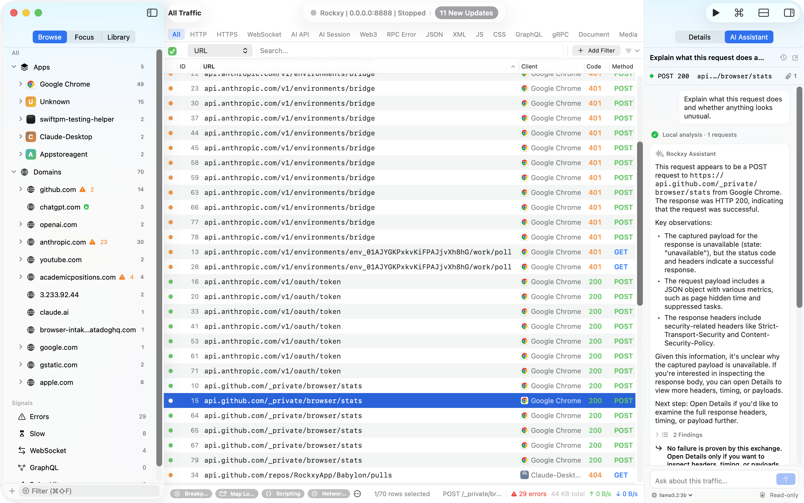

<p align="center">
  
</p>

<h1 align="center">Rockxy</h1>

<p align="center">
  <a href="README.md">English</a> |
  <a href="README.vi.md">Tiếng Việt</a> |
  <a href="README.zh.md">中文</a> |
  <a href="README.zh-TW.md">繁體中文</a> |
  <a href="README.es.md">Español</a> |
  <a href="README.pt-BR.md">Português do Brasil</a> |
  <a href="README.ja.md">日本語</a> |
  <a href="README.ko.md">한국어</a> |
  <a href="README.fr.md">Français</a> |
  <a href="README.de.md">Deutsch</a> |
  <a href="README.it.md">Italiano</a> |
  <a href="README.tr.md">Türkçe</a> |
  <a href="README.pl.md">Polski</a> |
  <a href="README.nl.md">Nederlands</a> |
  <a href="README.ru.md">Русский</a> |
  <a href="README.uk.md">Українська</a> |
  <a href="README.ar.md">العربية</a> |
  <a href="README.fa.md">فارسی</a> |
  <a href="README.bn.md">বাংলা</a> |
  <a href="README.ro.md">Română</a> |
  <a href="README.ka.md">ქართული</a>
</p>

<p align="center">
  <strong>Proxy de d&eacute;bogage open-source et auditable pour macOS.</strong>
</p>

<p align="center">
  Interceptez, inspectez et modifiez le trafic HTTP/HTTPS/WebSocket/GraphQL avec une app Swift native que vous pouvez inspecter, compiler et v&eacute;rifier.<br>
  Con&ccedil;u pour les workflows de d&eacute;bogage API, mobile, assist&eacute;s par MCP, IA et de l'&egrave;re blockchain &agrave; mesure que Rockxy &eacute;volue.<br>
  Une alternative local-first, AGPL-3.0 &agrave; <a href="#rockxy-vs-alternatives">Proxyman et Charles Proxy</a>.
</p>

<p align="center">
  <a href="https://github.com/RockxyApp/Rockxy/releases"></a>
  
  
  <a href="LICENSE"></a>
  <a href="CONTRIBUTING.md"></a>
  <a href="https://github.com/sponsors/LocNguyenHuu"></a>
  <a href="https://opencollective.com/rockxy/donate"></a>
</p>

<p align="center">
  <a href="https://youtu.be/RvkQuwUjBaQ" title="Watch the Rockxy demo on YouTube">
    
  </a>
</p>

---

<!-- BEGIN GENERATED: latest-release -->
## Latest Tagged Release

**v0.31.0** — 2026-07-24

### Added

- Added Rockxy Assistant for investigating selected requests, explaining failures, comparing related traffic, checking authentication signals, and preparing bug reports.
- Added built-in local analysis and optional configured model workflows, with a review step before selected traffic is shared.
- Added secure Babylon pairing and capture intake for supported companion traffic sessions.

### Fixed

- Kept investigations anchored to the exact request being reviewed.
- Prevented provider traffic from being recaptured into the active session.
- Improved streaming responsiveness, request-table stability, and bottom-inspector behavior.

### Changed

- Rebuilt the workspace around native macOS split views for more stable sidebar, request list, Context Dock, and inspector sizing.
- Expanded local model setup, provider configuration, context limits, and response-review controls.
- Refined workspace typography, mode switching, inspector persistence, and narrow-window actions.

See [CHANGELOG.md](CHANGELOG.md) for the full release history.
<!-- END GENERATED: latest-release -->

## Points forts de la branche actuelle

- AI Assistant analyse une ou plusieurs requ&ecirc;tes s&eacute;lectionn&eacute;es avec l'analyse locale int&eacute;gr&eacute;e ou un mod&egrave;le Ollama/provider configur&eacute;, avec Review Data explicite, redaction born&eacute;e, r&eacute;ponses streaming, r&eacute;v&eacute;lation des preuves et handoffs initi&eacute;s par l'utilisateur.
- La sidebar native inclut maintenant des Focus Sets r&eacute;utilisables pour les scopes application/domain/path et un Noise Control par workspace qui masque les domains ou paths correspondants sans arr&ecirc;ter la capture.
- Le workspace principal utilise des split views natives verticales et horizontales pour le Context Dock et l'inspecteur inf&eacute;rieur, avec dividers pleine hauteur, s&eacute;parateurs toolbar/footer align&eacute;s et redimensionnement automatique.
- Upstream Proxy inclut d&eacute;sormais une Automatic Proxy Configuration free/core avec routage PAC URL pour les routes `DIRECT`, HTTP et HTTPS, tout en pr&eacute;servant les fronti&egrave;res de policy SOCKS5 et d'authentification existantes.
- Les workflows d'export couvrent d&eacute;sormais OpenAPI YAML/HTML et la publication Gist du trafic s&eacute;lectionn&eacute; avec construction de payload redaction-aware.
- Les outils Inspector incluent d&eacute;sormais le filtrage JSONPath/key/value et des aper&ccedil;us rapides pour le texte de payload s&eacute;lectionn&eacute;, comme les JWT.
- L'inspection du trafic IA et Web3 ajoute des labels de protocole, des onglets Inspector et des r&eacute;sum&eacute;s de debug pour les appels de mod&egrave;les, le trafic JSON-RPC et les indices de paiement x402 reconnus.
- Node.js Developer Setup refl&egrave;te d&eacute;sormais le client s&eacute;lectionn&eacute; pendant la validation et dispose d'un guide localhost plus complet.
- Developer Setup Hub couvre d&eacute;sormais les runtimes, navigateurs, clients, appareils, frameworks et environnements avec des snippets cibl&eacute;s, des watchers de validation et une documentation honn&ecirc;te.
- L'inspection des frames binaires WebSocket inclut maintenant des heuristiques Protobuf wire-format born&eacute;es et &agrave; la demande, sans ajouter de d&eacute;codage au hot path de capture.
- La roadmap publique se concentre maintenant sur des r&egrave;gles protocol-aware plus profondes, le replay, la comparaison et le partage s&ucirc;r d'evidence redig&eacute;e.

## Fonctionnalit&eacute;s

Les outils que vous saisissez quand les DevTools du navigateur ne suffisent plus. Du d&eacute;bogage de trafic principal pour le travail Mac et iOS &mdash; natif macOS, avec des releases publiques et un flux local-first.

### Capture du trafic


Inspectez le trafic HTTP, HTTPS, WebSocket et GraphQL depuis n'importe quelle application Mac, CLI ou appareil iOS. Les DevTools du navigateur s'arr&ecirc;tent au navigateur &mdash; Rockxy voit le reste de votre stack.

`HTTP / HTTPS` · `WebSocket` · `GraphQL` · `iOS Device & Simulator` · `Filter by Process ID` · `Timing Waterfall`

### Filtres et recherche avanc&eacute;s


R&eacute;duisez des milliers de requ&ecirc;tes captur&eacute;es en quelques secondes. Combinez les filtres method, host, status, header, body et processus &mdash; ou lancez une recherche plein texte sur toute la session.

`Multi-Field Filters` · `Full-Text Search` · `Status / Method` · `Header / Body Match` · `Process / Host` · `Saved Filters`

### Focus Sets et Noise Control

Transformez les enqu&ecirc;tes r&eacute;currentes en scopes r&eacute;utilisables dans la sidebar. Les Focus Sets combinent les inclusions application/domain/path et les exclusions domain/path, persistent entre les lancements et sont disponibles dans chaque workspace. Noise Control continue de capturer la t&eacute;l&eacute;m&eacute;trie et les flux de faible valeur, mais les masque dans le workspace courant.

`Reusable Focus Sets` · `App / Domain / Path Scope` · `Include & Exclude` · `Workspace Noise Control` · `Capture Continues`

### AI Assistant



S&eacute;lectionnez une ou plusieurs requ&ecirc;tes captur&eacute;es et demandez ce qui s'est pass&eacute;, ce qui a &eacute;chou&eacute;, ce qui a chang&eacute; ou quoi v&eacute;rifier ensuite. Rockxy commence par une analyse fond&eacute;e sur les preuves sur ce Mac ; un mod&egrave;le Ollama ou provider configur&eacute; ne s'ex&eacute;cute qu'apr&egrave;s que Review Data a montr&eacute; le contexte exact, born&eacute; et redig&eacute;. Les r&eacute;ponses peuvent r&eacute;v&eacute;ler la requ&ecirc;te source et pr&eacute;parer des workflows de suivi natifs, sans modifier le trafic ni ex&eacute;cuter d'action automatiquement.

`Built-in Local Analysis` · `Multi-Request Context` · `Ollama & Provider Models` · `Review Data` · `Sensitive-Data Redaction` · `Read-only Actions`

[Lire le guide AI Assistant](docs/features/ai-assistant.mdx).

### Serveur MCP pour clients IA externes


Laissez Claude Desktop ou Cursor lire votre trafic captur&eacute; via un serveur MCP local. Demandez "pourquoi cette requ&ecirc;te a renvoy&eacute; 500 ?" au lieu de coller des headers dans le chat. Local, redaction-aware et open source.

`Claude Desktop` · `Cursor` · `Local stdio` · `Redaction` · `Open Source`

### Developer Setup Hub


Copiez-collez les snippets de proxy pour Python, Node.js, Go, Rust, cURL, Docker et les navigateurs, puis cliquez sur Run Test pour confirmer que le trafic passe r&eacute;ellement.

`Python` · `Node.js` · `Go / Rust / Java` · `cURL / Docker` · `One-Click Verify` · `Trust Diagnostics`

### Gestion des certificats pour d&eacute;boguer HTTPS


Un root CA P-256 ECDSA g&eacute;n&eacute;r&eacute; au premier lancement, scell&eacute; dans votre Keychain. D&eacute;chiffrez HTTPS du premier coup ; les h&ocirc;tes &eacute;pingl&eacute;s sont automatiquement laiss&eacute;s en transit.

`P-256 ECDSA Root CA` · `Keychain-Sealed Key` · `Per-Host Leaf Certs` · `Trust Wizard` · `Pinned-Host Passthrough` · `Rotate / Reset`

### SSL Proxy et d&eacute;chiffrement HTTPS


Choisissez quels h&ocirc;tes seront d&eacute;chiffr&eacute;s en TLS. Le trafic d&eacute;chiffr&eacute; r&eacute;v&egrave;le les vrais headers et JSON ; le reste passe chiffr&eacute;. Les r&egrave;gles wildcard permettent de cibler un domaine en un clic.

`Per-Host Decryption` · `Wildcard Rules` · `Allow / Deny List` · `TLS 1.2 / 1.3` · `Pinned Host Passthrough`

### Bypass Proxy


Sautez certains h&ocirc;tes pour que les applis &agrave; pinning de certificat, les services internes ou la t&eacute;l&eacute;m&eacute;trie bruyante n'entrent jamais dans la capture. Les wildcards gardent la liste courte et le journal de requ&ecirc;tes concentr&eacute; sur ce qui compte.

`Per-Host Bypass` · `Wildcard Patterns` · `Skip Pinned Hosts` · `Mute Telemetry` · `Reduce Noise` · `Toggle Anytime`

### Block List


Faites &eacute;chouer n'importe quel h&ocirc;te. Coupez les r&eacute;gies pub, les trackers tiers ou une d&eacute;pendance instable pour voir comment votre app se d&eacute;grade sans elle &mdash; sans changer une ligne de code.

`Per-Host Block` · `Wildcard Match` · `Simulate Outage` · `Test Fallbacks` · `Strip Trackers` · `Toggle Anytime`

### Map Local


Servez un fichier enregistr&eacute; ou une arborescence locale &agrave; la place d'une r&eacute;ponse en direct. Substituez un payload JSON, rejouez un snapshot ou &eacute;pinglez une API tierce capricieuse sur une copie locale pendant le d&eacute;bogage.

`File or Directory` · `Response Snapshot` · `Regex Patterns`

### Map Remote


R&eacute;&eacute;crivez la destination d'une requ&ecirc;te captur&eacute;e sans toucher au code de l'application ni &agrave; /etc/hosts. Pointez le trafic de prod vers staging, votre serveur de d&eacute;v ou la machine d'un coll&egrave;gue pour reproduire un bug de mani&egrave;re fiable.

`Host Rewrite` · `Regex Patterns` · `Preserve Host Header`

### Breakpoints et r&egrave;gles


Mettez une requ&ecirc;te ou r&eacute;ponse en pause, modifiez method, headers, body ou status, puis continuez. Le moyen le plus rapide de tester "et si l'API renvoie 401 ?" sans toucher au backend.

`Request Breakpoints` · `Response Breakpoints` · `Block` · `Throttle` · `Regex / Wildcard Match` · `Inject Failure States`

### Modifier les headers


Ajoutez, supprimez ou remplacez des headers sur n'importe quel h&ocirc;te sans red&eacute;ployer. Testez CORS, l'auth ou les changements de cache en quelques secondes gr&acirc;ce aux presets int&eacute;gr&eacute;s.

`Add / Remove / Replace` · `CORS Presets` · `Auth Stripping` · `Request Phase` · `Response Phase` · `URL Pattern Scope`

### Headers de requ&ecirc;te et de r&eacute;ponse personnalis&eacute;s


Surchargez les headers par h&ocirc;te avec un contr&ocirc;le total sur les deux phases. Injectez des tokens d'auth sur les requ&ecirc;tes sortantes, supprimez Set-Cookie sur les r&eacute;ponses ou figez un User-Agent personnalis&eacute; &mdash; le tout sauvegard&eacute; en r&egrave;gles nomm&eacute;es activables &agrave; tout moment.

`Per-Host Override` · `Request Phase` · `Response Phase` · `Auth Token Inject` · `Cookie Strip` · `Named Rules`

### Conditions r&eacute;seau


Bridez en 3G, EDGE, LTE, WiFi ou avec un d&eacute;lai personnalis&eacute;. Votre laptop est en fibre ; vos utilisateurs non &mdash; voyez l'UX &agrave; 400 ms de RTT avant eux.

`3G` · `EDGE` · `LTE` · `WiFi` · `Very Bad Network` · `Custom Latency`

### Compose &mdash; &Eacute;diter et rejouer


Reconstruisez n'importe quelle requ&ecirc;te HTTP captur&eacute;e &mdash; changez method, URL, headers, query params ou body &mdash; et renvoyez-la sans quitter Rockxy. Plus de boucle copier-coller vers Postman, Insomnia ou curl. It&eacute;rez sur des prompts LLM, fuzzez des limites d'auth ou reproduisez un cas qui &eacute;choue pour OpenAI, Anthropic et Cohere en quelques secondes.

`Edit Headers` · `Edit Body` · `Edit Query` · `Edit Method` · `LLM Prompt Iteration` · `Postman Alternative` · `OAuth Flow Debug` · `Webhook Replay`

### Comparer


Empilez deux r&eacute;ponses captur&eacute;es c&ocirc;te &agrave; c&ocirc;te et rep&eacute;rez chaque champ qui a bascul&eacute; &mdash; status, headers, cl&eacute;s JSON, octets du body. Attrapez les r&eacute;gressions API silencieuses, les sorties LLM non d&eacute;terministes et la d&eacute;rive de prompt sans pousser quoi que ce soit vers un outil tiers. Le diff c&ocirc;te &agrave; c&ocirc;te met en &eacute;vidence ce qui change ; la comparaison JSON profonde ignore l'ordre des cl&eacute;s.

`Diff Compare` · `Side-by-Side` · `JSON Diff` · `Header Diff` · `Body Diff` · `LLM Output Compare` · `Non-determinism` · `API Regression` · `Schema Drift`

### Onglets de pr&eacute;visualisation personnalis&eacute;s


Rendez les bodies de requ&ecirc;te et de r&eacute;ponse comme vous le souhaitez. &Eacute;pinglez des onglets suppl&eacute;mentaires dans l'inspecteur pour JSON, GraphQL, JWT, image ou votre propre format &mdash; r&eacute;utilisables sur chaque requ&ecirc;te captur&eacute;e.

`JSON` · `GraphQL` · `JWT Decoder` · `Image / Hex` · `Custom Format` · `Pinned per Inspector`

### Sessions et export


Sauvegardez des sessions, importez/exportez du HAR pour le passage d'un outil &agrave; l'autre, copiez n'importe quelle requ&ecirc;te en cURL ou JSON. Redactez les headers d'authorization, cookies et bearer tokens avant partage &mdash; donnez &agrave; un coll&egrave;gue un repro de bug fonctionnel sans fuiter de secrets.

`.rockxysession` · `HAR Import / Export` · `Copy as cURL` · `Copy as JSON` · `Raw HTTP` · `Secret Redaction` · `Token Sanitize` · `Privacy-Safe Share`

### Espaces de travail multi-onglets


Conservez c&ocirc;te &agrave; c&ocirc;te des vues d'enqu&ecirc;te ind&eacute;pendantes de la m&ecirc;me capture live. Chaque onglet garde ses filtres, son tri, sa s&eacute;lection, son scope de sidebar et son &eacute;tat d'inspecteur, tout en partageant le proxy et les transactions captur&eacute;es.

`Shared Live Capture` · `Per-Tab Filters & Sort` · `Per-Tab Inspector` · `Compare Environments` · `Mac & iOS Together` · `Detach & Rename`

### Scripting JavaScript


Hooks JS sur les requ&ecirc;tes et r&eacute;ponses pour les cas qu'une r&egrave;gle statique ne couvre pas &mdash; redacter les PII, signer des tokens, r&eacute;&eacute;crire des payloads. Les erreurs apparaissent inline au lieu de corrompre le trafic.

`Request Hooks` · `Response Hooks` · `Programmatic Filtering` · `PII Redaction` · `Inline Error Feedback`

## Inspection protocol-aware

Rockxy fournit l'inspection protocol-aware IA, Web3 RPC et x402 dans le workflow normal de d&eacute;bogage HTTP.

### Inspection du trafic IA

Rendre le trafic de mod&egrave;le plus facile &agrave; d&eacute;boguer dans le workflow de capture normal. D&eacute;tecter les requ&ecirc;tes IA, inspecter les appels de mod&egrave;le s&eacute;lectionn&eacute;s, diagnostiquer les r&eacute;ponses streaming, comparer le comportement prompt/output et comprendre les cha&icirc;nes de tool-calls sans coller de payloads sensibles dans un autre service.

`AI Requests` · `Model Inspector` · `Streaming State` · `Tool Calls` · `Retrieval Hints` · `Usage Signals`

### Inspection Web3/RPC

Inspectez le trafic HTTP JSON-RPC de type EVM et Solana avec provider host, request ID, m&eacute;thode, r&eacute;sum&eacute; batch, erreur, chain, transaction, payload et debug intent, sans transformer Rockxy en wallet ou block explorer.

`JSON-RPC` · `Solana RPC` · `Request ID` · `RPC Errors` · `Batch Summary` · `Network Evidence`

### Indices de flow de paiement x402

Comprendre les flows HTTP payment-gated depuis la couche r&eacute;seau. Mettre en &eacute;vidence les r&eacute;ponses payment-required, suivre le chemin de retry et garder l'evidence de d&eacute;bogage locale et redaction-aware.

`Payment Required` · `Retry Flow` · `Headers` · `Redaction` · `Local First`

## Travaux futurs

Les sections suivantes d&eacute;crivent une direction publique, pas le comportement actuel.

### R&egrave;gles protocol-aware

Rockxy peut d&eacute;j&agrave; labelliser et inspecter le trafic IA et Web3. Le matching plus profond par mod&egrave;le, tool call, m&eacute;thode JSON-RPC, chain, transaction hash ou batch subcall reste futur ; les outils actuels de modification du trafic matchent URL, m&eacute;thode HTTP et headers.

`Smart Filters` · `Request Badges` · `Optional Columns` · `Rules` · `Compare` · `Local MCP`

### Bundles d'evidence redig&eacute;e `Bient&ocirc;t disponible`

Partager les faits n&eacute;cessaires pour reproduire un bug sans divulguer de secrets. Packager le trafic s&eacute;lectionn&eacute; avec des r&eacute;sum&eacute;s de protocole, des aper&ccedil;us de redaction et un contexte source-backed qu'un coll&egrave;gue peut auditer.

`Debug Bundles` · `Protocol Summary` · `Export Preview` · `Secret Redaction` · `Repro Context`

### Partage et collaboration en &eacute;quipe `Bient&ocirc;t disponible`

Envoyez une session captur&eacute;e &agrave; un coll&egrave;gue d'un seul clic. Annotez les requ&ecirc;tes en &eacute;chec en inline, voyez qui regarde quoi en temps r&eacute;el et faites du pair-debug HTTPS sans partage d'&eacute;cran. Cibl&eacute; pour une release future.

`Shared Sessions` · `Team Workspaces` · `Inline Comments` · `Live Cursor` · `Cloud Sync` · `Pair Debug` · `SSO` · `Audit Log`

> 100 % natif macOS. Pas d'Electron. Pas de vues web. SwiftUI + AppKit + SwiftNIO.

## D&eacute;marrage rapide

```bash
git clone https://github.com/RockxyApp/Rockxy.git
cd Rockxy
open Rockxy.xcodeproj
```

Compilez et ex&eacute;cutez dans Xcode. La fen&ecirc;tre de bienvenue vous guide &agrave; travers la configuration du CA racine, l'installation du helper et l'activation du proxy.

**Pr&eacute;requis :** macOS 14.0+, Xcode 16+, Swift 5.9

## Rockxy vs. Alternatives

|  | **Rockxy** | **Proxyman** | **Charles Proxy** |
|---|---|---|---|
| **Mod&egrave;le de projet** | Projet open-source AGPL-3.0 | App commerciale propri&eacute;taire | App commerciale propri&eacute;taire |
| **Code source** | Public, auditable, forkable | Source ferm&eacute;e | Source ferm&eacute;e |
| **Compilation depuis la source** | Gratuite avec Xcode depuis ce repo | Non disponible depuis une source publique | Non disponible depuis une source publique |
| **Base native macOS** | Swift + SwiftNIO + SwiftUI/AppKit | App commerciale native macOS | App commerciale multiplateforme |
| **Capture local-first** | Proxy local, certificats, helper et donn&eacute;es de capture restent sur votre Mac | App proxy desktop | App proxy desktop |
| **Workflow de setup d&eacute;veloppeur** | Developer Setup Hub int&eacute;gr&eacute; pour runtimes, clients, appareils, frameworks et environnements | Guides de setup propres au produit | Guides de setup propres au produit |
| **MCP/local automation bridge** | Int&eacute;gr&eacute;, authentifi&eacute; par token, masquage par d&eacute;faut | Non revendiqu&eacute; dans les docs publiques consult&eacute;es | Non revendiqu&eacute; dans les docs publiques consult&eacute;es |
| **Chemin de contribution ouvert** | Issues, discussions, roadmap et PRs publics | Produit contr&ocirc;l&eacute; par le fournisseur | Produit contr&ocirc;l&eacute; par le fournisseur |

Sur la feuille de route : r&egrave;gles protocol-aware plus profondes, bundles d'evidence redig&eacute;e plus s&ucirc;rs, workflows de replay et comparaison renforc&eacute;s, guides Developer Setup plus larges et recherche continue sur HTTP/2 et HTTP/3.

## S&eacute;curit&eacute;

Rockxy intercepte le trafic r&eacute;seau &mdash; la s&eacute;curit&eacute; est fondamentale, pas optionnelle.

- Le helper XPC valide les appelants par **comparaison de cha&icirc;ne de certificats**, pas seulement par bundle ID
- Les plugins s'ex&eacute;cutent dans un **JavaScriptCore isol&eacute;** avec un timeout de 5 secondes, sans acc&egrave;s au syst&egrave;me de fichiers ni au r&eacute;seau
- **Validation des entr&eacute;es** sur toutes les fronti&egrave;res &mdash; limites de taille des body, limites d'URI, protection contre le DoS regex, pr&eacute;vention du path traversal
- Les identifiants sont **automatiquement masqu&eacute;s** dans les logs
- Les fichiers sensibles sont stock&eacute;s avec des **permissions 0o600**

Signaler les vuln&eacute;rabilit&eacute;s via [SECURITY.md](SECURITY.md). Voir l'[architecture de s&eacute;curit&eacute; compl&egrave;te](docs/development/security.mdx) pour plus de d&eacute;tails.

## Feuille de route

La feuille de route publique de Rockxy est orient&eacute;e workflows et sans dates promises. Elle se concentre sur la fiabilit&eacute;, l'UX macOS native, les workflows de d&eacute;bogage, les protocoles, la visibilit&eacute; du trafic de l'&egrave;re IA/Web3, la documentation et l'accueil des contributeurs.

- [ROADMAP.md](ROADMAP.md) : direction d'ing&eacute;nierie publique de haut niveau
- [Rockxy Public Roadmap](https://github.com/orgs/RockxyApp/projects/1) : visibilit&eacute; op&eacute;rationnelle des issues suivies dans la feuille de route

## Documentation

Documentation compl&egrave;te disponible sur [Rockxy Docs](docs/index.mdx) :

- [Guide de d&eacute;marrage rapide](docs/quickstart.mdx) &mdash; op&eacute;rationnel en quelques minutes
- [Developer Setup Hub](docs/features/developer-setup-hub.mdx) &mdash; snippets runtime, guides appareil, sondes de validation et matrice de support
- [AI Assistant](docs/features/ai-assistant.mdx) &mdash; analyser le trafic s&eacute;lectionn&eacute; localement ou avec un mod&egrave;le configur&eacute; apr&egrave;s Review Data
- [Filtres et recherche](docs/core-features/filters-and-search.mdx) &mdash; scopes sidebar, Focus Sets, Noise Control, filtres toolbar et recherche
- [Inspection IA et Web3](docs/features/ai-web3-inspection.mdx) &mdash; inspecter le trafic model API, JSON-RPC et x402 reconnu
- [Int&eacute;gration MCP](docs/features/mcp.mdx) &mdash; connecter Rockxy aux clients MCP locaux
- [Architecture](docs/development/architecture.mdx) &mdash; moteur proxy, mod&egrave;le Actor, flux de donn&eacute;es
- [Mod&egrave;le de s&eacute;curit&eacute;](docs/development/security.mdx) &mdash; fronti&egrave;res de confiance, validation XPC, gestion des certificats
- [D&eacute;cisions de conception](docs/development/design-decisions.mdx) &mdash; pourquoi SwiftNIO, NSTableView, les Actors
- [Compiler depuis les sources](docs/development/building.mdx) &mdash; compilation, tests, lint et d&eacute;bogage
- [Style de code](docs/development/code-style.mdx) &mdash; SwiftLint, SwiftFormat et conventions
- [Changelog](CHANGELOG.md) &mdash; travaux non publi&eacute;s et historique des versions tagu&eacute;es

## Contribuer

Toutes les contributions sont les bienvenues &mdash; code, tests, documentation, rapports de bugs et retours UX.

Consultez **[CONTRIBUTING.md](CONTRIBUTING.md)** pour les instructions de configuration, le style de code et la checklist PR compl&egrave;te.

Les issues pour d&eacute;butants sont &eacute;tiquet&eacute;es [`good first issue`](https://github.com/RockxyApp/Rockxy/labels/good%20first%20issue). En soumettant une PR, vous acceptez le [CLA](CLA.md).

## Sponsors et Partenaires

Rockxy est construit et maintenu par des d&eacute;veloppeurs ind&eacute;pendants. Les sponsorisations financent le d&eacute;veloppement continu, les audits de s&eacute;curit&eacute; et les nouvelles fonctionnalit&eacute;s.

<p align="center">
  <a href="https://opencollective.com/rockxy/donate">
    
  </a>
  <a href="https://github.com/sponsors/LocNguyenHuu">
    
  </a>
</p>

Rockxy est h&eacute;berg&eacute; fiscalement par [Open Source Collective](https://docs.oscollective.org/). Les contributions et les d&eacute;penses du projet sont enregistr&eacute;es sur la [page Open Collective publique de Rockxy](https://opencollective.com/rockxy), offrant une vue transparente de la r&eacute;ception et de l'utilisation des fonds.

| Niveau | Contribution | Ce que cela soutient |
|--------|--------------|----------------------|
| **Backer** | &Agrave; partir de 5 $/mois | Maintenance open source, documentation, tests et versions |
| **Builder** | &Agrave; partir de 25 $/mois | Tests de r&eacute;gression, am&eacute;liorations des performances et workflows de d&eacute;bogage quotidiens |
| **Sponsor** | 100 $/mois | Maintenance &agrave; long terme d'un outil ax&eacute; sur la confidentialit&eacute; et gratuit pour les d&eacute;veloppeurs |
| **Sustaining Sponsor** | 500 $/mois | Maintenance et d&eacute;veloppement produit cibl&eacute;s, y compris l'automatisation des versions et le support des protocoles |

**Demandes de partenariat** &mdash; entreprises d'outils de d&eacute;veloppement, soci&eacute;t&eacute;s de s&eacute;curit&eacute; et &eacute;quipes entreprise cherchant des int&eacute;grations personnalis&eacute;es ou des solutions en marque blanche : [rockxyapp@gmail.com](mailto:rockxyapp@gmail.com)

## Support

- [Open Collective](https://opencollective.com/rockxy/donate) &mdash; contribuer &agrave; Rockxy via son budget de projet transparent
- [GitHub Sponsors](https://github.com/sponsors/LocNguyenHuu) &mdash; soutenir le d&eacute;veloppement de Rockxy
- [GitHub Issues](https://github.com/RockxyApp/Rockxy/issues) &mdash; rapports de bugs et demandes de fonctionnalit&eacute;s
- [GitHub Discussions](https://github.com/RockxyApp/Rockxy/discussions) &mdash; questions et discussions communautaires
- **Email** &mdash; [rockxyapp@gmail.com](mailto:rockxyapp@gmail.com)
- **Probl&egrave;mes de s&eacute;curit&eacute;** &mdash; voir [SECURITY.md](SECURITY.md) pour la divulgation responsable

## Licence

[GNU Affero General Public License v3.0](LICENSE) &mdash; Copyright 2024&ndash;2026 Rockxy Contributors.

## Historique des Étoiles

<a href="https://www.star-history.com/?repos=RockxyApp%2FRockxy&type=date&legend=bottom-right">
 <picture>
   <source media="(prefers-color-scheme: dark)" srcset="https://api.star-history.com/chart?repos=RockxyApp/Rockxy&type=date&theme=dark&legend=top-left" />
   <source media="(prefers-color-scheme: light)" srcset="https://api.star-history.com/chart?repos=RockxyApp/Rockxy&type=date&legend=top-left" />
   
 </picture>
</a>

---

<p align="center">
  <sub>Made by <a href="https://github.com/LocNguyenHuu">Stephen</a>. Construit avec Swift, SwiftNIO, SwiftUI et AppKit.</sub>
</p>
