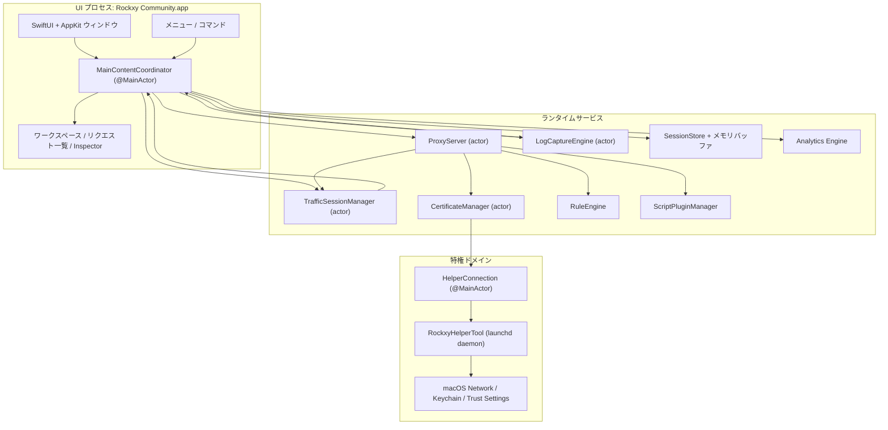
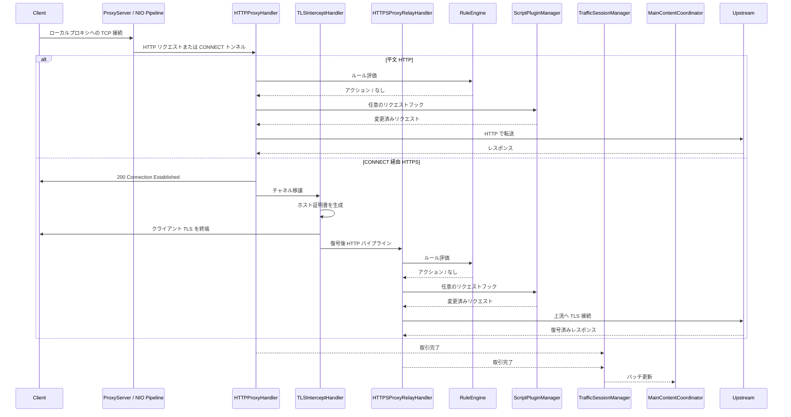
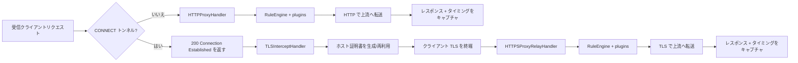
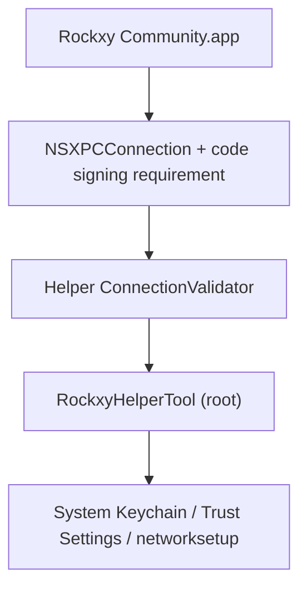

<p align="center">
  
</p>

<h1 align="center">Rockxy</h1>

<p align="center">
  <strong>macOS 向けのオープンソース HTTP デバッグプロキシ。</strong>
</p>

<p align="center">
  HTTP/HTTPS トラフィックを傍受し、API リクエストを検査し、WebSocket をデバッグし、GraphQL クエリを解析します。<br>
  Swift で構築し、SwiftNIO、SwiftUI、AppKit を使用しています。
</p>

<p align="center">
  <a href="#"></a>
  <a href="#"></a>
  <a href="LICENSE"></a>
  <a href="CONTRIBUTING.md"></a>
  <a href="https://github.com/sponsors/LocNguyenHuu"></a>
</p>

<p align="center">
  
</p>

---

> **ステータス**：アクティブ開発中。コアのプロキシエンジン、HTTPS 傍受、ルールシステム、プラグインエコシステム、Inspector UI は動作しています。進捗は [CHANGELOG.md](CHANGELOG.md) を参照してください。

## 機能

### ネットワークトラフィックのキャプチャ
- **HTTP/HTTPS プロキシ** — SwiftNIO ベースのインターセプトプロキシ（CONNECT トンネル対応）
- **SSL/TLS 傍受** — MITM 復号とホスト単位証明書の自動生成（LRU キャッシュ約 1000）
- **WebSocket デバッグ** — 双方向フレームのキャプチャと検査
- **GraphQL 検出** — operation 名の自動抽出とクエリ検査
- **プロセス識別** — `lsof` のポートマッピング + User-Agent 解析で送信元アプリを判定

### リクエスト/レスポンス Inspector
- **JSON ビューア** — 折りたたみ可能なツリー表示とシンタックスハイライト
- **Hex Inspector** — 非テキストのバイナリ body 表示
- **Timing ウォーターフォール** — DNS、TCP 接続、TLS ハンドシェイク、TTFB、転送フェーズを可視化
- **Headers/Cookies/Query/Auth** — タブ式 Inspector と raw 表示
- **カスタムヘッダー列** — 追加ヘッダーを列表示に設定

### ワークスペースと生産性
- **ワークスペースタブ** — 独立したキャプチャ空間とフィルター状態
- **お気に入り** — よく使うホストやリクエストをピン留め
- **タイムラインビュー** — 選択したリクエストの時系列表示

### トラフィック操作と Mock API
- **Map Local** — ローカルファイルからレスポンスを返す
- **Map Remote** — 別の host/port/path へリダイレクト
- **Breakpoints** — リクエスト/レスポンスを一時停止し編集後に転送
- **Block List** — URL パターン（ワイルドカード/正規表現）でブロック
- **Throttle** — 転送遅延で低速ネットワークを再現
- **Modify Headers** — ヘッダーの追加/削除/置換
- **Allow List** — 指定ドメインやアプリのみキャプチャ
- **Bypass Proxy** — システムプロキシ有効時に特定ホストを除外
- **SSL Proxying ルール** — ドメイン単位で TLS 傍受を制御

### デバッグ & 分析
- **OSLog 連携** — macOS のシステムログをキャプチャしタイムスタンプで関連付け
- **並列比較** — 2 つのリクエスト/レスポンスを比較
- **リクエストタイムライン** — シーケンスとタイミングのウォーターフォール
- **認証情報のマスキング** — Bearer トークンとパスワードを自動的に隠す

### 拡張性
- **JavaScript プラグイン** — JavaScriptCore 実行（5 秒タイムアウトのサンドボックス）
- **リクエスト/レスポンスフック** — プラグインでパイプライン内のトラフィックを検査・変更
- **プラグイン設定 UI** — manifest から自動生成
- **エクスポート形式** — cURL、HAR、raw HTTP、JSON
- **Compose + リプレイ** — リクエストを編集して再送、またはキャプチャを再生
- **インポートレビュー** — HAR/セッションの取り込み前に検証

### macOS ネイティブ体験
- **SwiftUI + AppKit ネイティブ** — Electron なし、WebView なし
- **NSTableView リクエスト一覧** — 100k+ 件でも高速スクロール
- **実アプリアイコン** — `NSWorkspace` の bundle ID から取得
- **システムプロキシ連携** — 特権 helper によりパスワード入力不要
- **ダークモード** — フル対応
- **ショートカット** — Cmd+Shift+R（開始）、Cmd+.（停止）、Cmd+K（クリア）など

## ユースケース

- **iOS / macOS アプリのデバッグ** — Simulator や実機からの API 呼び出しを検査
- **REST API テスト** — 正確な request/response を確認
- **GraphQL デバッグ** — operation、変数、レスポンスを即確認
- **Mock API 応答** — ローカルファイルをエンドポイントにマップ
- **WebSocket 検査** — リアルタイム接続のデバッグ
- **性能プロファイル** — 遅いエンドポイントや過大ペイロードを特定
- **SSL/TLS デバッグ** — ドメイン単位の HTTPS 傍受で解析
- **ネットワーク記録** — HTTP セッションのキャプチャ/リプレイ
- **API リバースエンジニアリング** — 未公開 API の挙動を把握
- **CI/CD 連携** — 自動 API コントラクトテスト用のヘッドレスプロキシ（予定）

## Rockxy vs Proxyman vs Charles Proxy

オープンソースの Proxyman/Charles Proxy 代替を探していますか？比較は以下の通りです。

| 機能 | Rockxy | Proxyman | Charles Proxy |
|---------|--------|----------|---------------|
| **ライセンス** | オープンソース（AGPL-3.0） | プロプライエタリ（フリーミアム） | プロプライエタリ（有料） |
| **価格** | 無料 | 無料枠 + $69/年 | $50 買い切り |
| **プラットフォーム** | macOS | macOS、iOS、Windows | macOS、Windows、Linux |
| **ソースコード** | GitHub で公開 | 非公開 | 非公開 |
| **技術** | Swift + SwiftNIO（ネイティブ） | Swift + AppKit（ネイティブ） | Java（クロスプラットフォーム） |
| **HTTP/HTTPS 傍受** | あり | あり | あり |
| **WebSocket デバッグ** | あり | あり | あり |
| **GraphQL 検出** | あり（自動） | あり | なし |
| **Map Local** | あり | あり | あり |
| **Map Remote** | あり | あり | あり |
| **Breakpoints** | あり | あり | あり |
| **Block List** | あり | あり | あり |
| **Modify Headers** | あり | あり | あり（rewrite） |
| **Throttle / Network Conditions** | あり | あり | あり |
| **リクエスト差分** | あり（並列） | あり | なし |
| **JavaScript プラグイン** | あり（JSCore サンドボックス） | あり（Scripting） | なし |
| **リクエスト再生** | あり（Repeat + Edit） | あり | あり |
| **HAR インポート/エクスポート** | あり | あり | なし（独自形式） |
| **OSLog 連携** | あり | なし | なし |
| **プロセス識別** | あり（アプリ判別） | あり | なし |
| **JSON ツリービュー** | あり | あり | あり |
| **Hex Inspector** | あり | あり | あり |
| **Timing ウォーターフォール** | あり | あり | あり |
| **仮想スクロール（100k+ 行）** | あり（NSTableView） | あり | 大量データで遅い |
| **特権 helper（sudo 不要）** | あり（SMAppService） | あり | なし（都度プロンプト） |
| **ダークモード** | あり | あり | 部分的 |
| **セルフホスト / 監査可能** | あり | なし | なし |
| **コミュニティ貢献** | PR 受付 | なし | なし |

**Rockxy を選ぶ理由**
- **無料のオープンソース**の HTTP デバッグプロキシが欲しい
- トラフィックを扱うツールの**ソースコードを監査**したい
- 機能追加やワークフローに合わせた**カスタマイズ**をしたい
- macOS のログとトラフィックを関連付ける **OSLog 連携**が必要
- Java ランタイムを避けて**ネイティブ macOS 体験**を求める

## 要件

- macOS 14.0+（Sonoma 以降）
- Xcode 16+
- Swift 5.9

## クイックスタート

```bash
git clone https://github.com/LocNguyenHuu/Rockxy.git
cd Rockxy
xcodebuild -project Rockxy.xcodeproj -scheme Rockxy -configuration Debug build
```

または Xcode で `Rockxy.xcodeproj` を開いて実行します。

初回起動時の Welcome ウィンドウで：
1. ルート CA の生成と信頼設定
2. システムプロキシ用の特権 helper をインストール
3. システムプロキシを有効化
4. プロキシサーバーを起動

## アーキテクチャ

### システム概要

Rockxy は 3 つの信頼・実行ドメインに分割されています。

1. **UI + オーケストレーション層** — SwiftUI/AppKit ウィンドウ、Inspector、メニュー、`MainContentCoordinator`
2. **プロキシ/ランタイム層** — SwiftNIO ハンドラ、証明書発行、リクエスト変換、ストレージ、分析、プラグイン
3. **特権 helper 層** — ルート権限が必要な操作を担う launchd デーモン

設計目標は、パケット処理をメインスレッドから切り離し、特権操作をアプリプロセス外に置き、actor もしくは `@MainActor` で同期を行うことです。

### コンポーネントマップ



### ランタイム層

| レイヤー | 主な型 | 役割 |
|-------|------------|----------------|
| **Presentation** | `MainContentCoordinator`, `ContentView`, Inspector/一覧/サイドバー view | UI 状態の保持、コマンドのルーティング、データのバインド |
| **Capture / transport** | `ProxyServer`, `HTTPProxyHandler`, `TLSInterceptHandler`, `HTTPSProxyRelayHandler` | 受信、CONNECT 処理、TLS MITM、上流転送 |
| **Mutation / policy** | `RuleEngine`, `BreakpointRequestBuilder`, `AllowListManager`, `NoCacheHeaderMutator`, `MapLocalDirectoryResolver` | 転送/保存前のルール適用 |
| **Certificate / trust** | `CertificateManager`, `RootCAGenerator`, `HostCertGenerator`, `CertificateStore`, `KeychainHelper` | ルート CA 管理、ホスト証明書、信頼チェック |
| **Storage / session** | `TrafficSessionManager`, `LogCaptureEngine`, `SessionStore`, メモリバッファ | データバッファ、SQLite への保存、UI へのバッチ更新 |
| **Observability / analysis** | analytics、GraphQL 検出、content-type 検出、ログ相関 | キャプチャデータへの付加情報 |
| **特権システム統合** | `HelperConnection`, `RockxyHelperTool`, 共有 XPC プロトコル | システムプロキシと証明書の特権操作 |

### プロキシリクエストのライフサイクル



### HTTP vs HTTPS フロー



### 並行性モデル

- `ProxyServer` は bind/shutdown を管理する actor。
- NIO handler は event-loop 上で動作し、必要時のみ actor にブリッジ。
- `CertificateManager` と `TrafficSessionManager` は actor を使用。
- `MainContentCoordinator` は `@MainActor` により UI 同期境界となる。
- UI 更新はバッチ化しメインスレッド負荷を軽減。

### コアサブシステム

| サブシステム | 位置 | 役割 |
|-----------|----------|--------------|
| **Proxy Engine** | `Core/ProxyEngine/` | SwiftNIO の `ServerBootstrap`、接続パイプライン、CONNECT、TLS、HTTP/HTTPS 転送 |
| **Certificate** | `Core/Certificate/` | ルート CA 管理、ホスト証明書発行、信頼確認、Keychain 保存 |
| **Rule Engine** | `Core/RuleEngine/` | block/map local/map remote/throttle/modify headers/breakpoint の順で評価 |
| **Traffic Capture** | `Core/TrafficCapture/` | セッションバッチ、allow-list ポリシー、replay、UI 連携 |
| **Storage** | `Core/Storage/` | SQLite 永続化、メモリバッファ、ボディ分割保存 |
| **Detection / enrichment** | `Core/Detection/` | GraphQL 検出、content-type 検出、API グルーピング |
| **Plugins** | `Core/Plugins/` | JavaScriptCore によるフック実行と設定 |
| **Helper Tool** | `RockxyHelperTool/`, `Shared/` | 特権 XPC サービス（プロキシ設定、bypass、証明書） |

### セキュリティアーキテクチャ

> **脆弱性報告:** セキュリティ問題は非公開で報告してください。詳しくは [SECURITY.md](SECURITY.md) を参照。

Rockxy は TLS を終端し、機微なトラフィックを保存し、root 権限 helper と通信するため、レイヤードセキュリティを採用しています。



#### セキュリティ境界

| 境界 | リスク | 現行の対策 |
|----------|------|-----------------|
| **App ↔ helper** | 不正アプリによる特権操作 | `NSXPCConnection` + 署名要求、helper 側検証と証明書チェーン比較 |
| **TLS 傍受** | 古い Root CA による信頼崩れ | Root CA ライフサイクル管理、信頼検証、指紋追跡 |
| **ボディ処理** | 巨大ボディによるメモリ枯渇 | 100 MB 制限（413）、URI 8 KB 制限（414）、WS 制限（10 MB/フレーム、100 MB/接続） |
| **Map Local** | パストラバーサル/シンボリックリンク回避 | fd ベース読み込み、シンボリックリンク解決、ルート内判定 |
| **正規表現ルール** | 悪性正規表現による ReDoS | コンパイル検証、パターンキャッシュ、500 文字制限、入力 8 KB 制限 |
| **ブレークポイント編集** | 不正なリクエスト転送 | `BreakpointRequestBuilder` による再構築、scheme 正規化、content-length 再計算 |
| **プラグイン実行** | 非決定的/危険な操作 | JSCore ブリッジ、制限 API、タイムアウト、ID 検証、FS/ネットワーク無効 |
| **保存トラフィック** | 機微データ保存のリスク | メモリ + SQLite、0o600 のボディ保存、パス検証、認証情報マスキング |
| **Header 注入** | MapRemote 経由の CRLF 注入 | 制御文字の除去 |
| **Helper 入力検証** | 不正なドメイン/サービス名 | ASCII 限定、サービス名サニタイズ、プロキシ種別のホワイトリスト |

#### Helper の信頼モデル

Helper は `com.amunx.Rockxy.HelperTool` の launchd デーモンとして `SMAppService.daemon()` で登録され、`networksetup` の都度認証を不要にします。

防御層は以下を含みます：

- アプリ側の特権 XPC 接続
- `ConnectionValidator` による呼び出し元検証（bundle ID 固定）
- code-signing 署名要件（`anchor apple generic`）
- 証明書チェーン比較による強固な検証
- 状態変更操作のレート制限
- すべての入力パラメータの検証
- 0o600 の原子ファイル作成
- 代理設定のバックアップ/復元

#### 証明書の信頼モデル

- Root CA の生成と永続化は `CertificateManager` が担当。
- アプリが root CA の作成・読み込み・信頼検証を管理。
- helper はシステム側インストールの補助のみ。
- ホスト証明書はオンデマンド生成し、キャッシュでコスト削減。
- Root 指紋追跡で古い証明書を整理。

#### 実運用上の注意

- Rockxy は機微なトラフィックを扱う開発ツールです。必要以上にシステムプロキシを有効化しないでください。
- Root CA をインストールすると、その CA を信頼するクライアントで HTTPS 傍受が有効になります。
- 保存セッション、エクスポート、プラグインコードは機微な成果物として扱ってください。

## プロジェクト構成

```
Rockxy/
├── Core/
│   ├── ProxyEngine/       # SwiftNIO server, HTTP/TLS/WS handlers, helper client
│   ├── Certificate/       # X.509 generation, root CA, Keychain integration
│   ├── RuleEngine/        # Rule matching and action execution
│   ├── LogEngine/         # OSLog + process log capture and correlation
│   ├── TrafficCapture/    # Session manager, system proxy, request replay
│   ├── Storage/           # SQLite store, in-memory buffer, settings
│   ├── Detection/         # Content type, GraphQL, API grouping
│   ├── Plugins/           # Plugin discovery, JS runtime, manifest parsing
│   ├── Services/          # Window management, notifications
│   └── Utilities/         # Body decoder, input validation, formatters
├── Views/
│   ├── Main/              # Main window, coordinator extensions
│   ├── RequestList/       # NSTableView-backed request list (100k+ rows)
│   ├── Inspector/         # Request/response tabs, JSON tree, hex display
│   ├── Sidebar/           # Domain tree, app grouping, favorites
│   ├── Toolbar/           # Status indicators, control buttons
│   ├── Welcome/           # Setup wizard, certificate checklist
│   ├── Settings/          # General, Proxy, SSL Proxying, Privacy tabs
│   ├── Rules/             # Rule list, add/edit dialogs
│   ├── Compose/           # Edit and Repeat request editor
│   ├── Diff/              # Side-by-side transaction comparison
│   ├── Scripting/         # Code editor, plugin console
│   ├── Timeline/          # Request waterfall visualization
│   ├── Breakpoint/        # Breakpoint edit window
│   └── Components/        # Reusable: StatusCodeBadge, FilterPill, etc.
├── Models/
│   ├── Network/           # HTTPTransaction, Request/Response, TimingInfo, WebSocket
│   ├── Log/               # LogEntry, LogLevel, LogSource
│   ├── Analytics/         # ErrorGroup, PerformanceMetric, SessionTrend
│   ├── Certificate/       # RootCA, RootCAStatusSnapshot
│   ├── Rules/             # ProxyRule, RuleAction
│   ├── Settings/          # AppSettings, ProxySettings
│   ├── UI/                # SidebarItem, FilterState
│   └── Plugins/           # PluginInfo, PluginConfig, PluginManifest
├── ViewModels/
├── Extensions/
└── Theme/

RockxyHelperTool/              # Privileged launchd daemon (runs as root)
├── main.swift                 # Entry point, XPC listener
├── HelperDelegate.swift       # Connection validation, disconnect handling
├── HelperService.swift        # Protocol impl, rate limiting, port validation
├── ConnectionValidator.swift  # Certificate chain extraction & comparison
├── CrashRecovery.swift        # Backup/restore proxy settings
└── ProxyConfigurator.swift    # networksetup wrapper

Shared/
└── RockxyHelperProtocol.swift # @objc XPC protocol (app ↔ helper)

RockxyTests/                   # Swift Testing framework (@Suite, @Test, #expect)
├── Core/                      # Rule engine, certificate, plugin, storage, proxy tests
├── ViewModels/                # WelcomeViewModel tests
└── Helpers/                   # TestFixtures factory methods

docs/                          # Documentation (Mintlify format)
.github/workflows/             # CI: lint → build (arm64 + x86_64) → release
```

## 技術スタック

| レイヤー | 技術 |
|-------|-----------|
| UI フレームワーク | SwiftUI + AppKit（NSTableView、NSViewRepresentable） |
| ネットワーク | [SwiftNIO](https://github.com/apple/swift-nio) 2.95 + [SwiftNIO SSL](https://github.com/apple/swift-nio-ssl) 2.36 |
| 証明書 | [swift-certificates](https://github.com/apple/swift-certificates) 1.18 + [swift-crypto](https://github.com/apple/swift-crypto) 4.2 |
| データベース | [SQLite.swift](https://github.com/stephencelis/SQLite.swift) 0.16 |
| 並行性 | Swift Actors、構造化並行、@MainActor |
| プラグイン | JavaScriptCore（macOS 内蔵） |
| Helper IPC | XPC Services + SMAppService（macOS 13+） |
| テスト | Swift Testing framework（@Suite、@Test、#expect） |
| CI/CD | GitHub Actions（SwiftLint → arm64/x86_64 並列 build → release） |

## ソースからビルド

### Development Build

```bash
git clone https://github.com/LocNguyenHuu/Rockxy.git
cd Rockxy
./scripts/setup-developer.sh   # ローカル署名用の Configuration/Developer.xcconfig を生成
xcodebuild -project Rockxy.xcodeproj -scheme Rockxy -configuration Debug build
```

### Release Build

```bash
# Apple Silicon (M1/M2/M3/M4)
xcodebuild -project Rockxy.xcodeproj -scheme Rockxy -configuration Release -arch arm64 build

# Intel
xcodebuild -project Rockxy.xcodeproj -scheme Rockxy -configuration Release -arch x86_64 build
```

### テスト実行

```bash
# 全テスト
xcodebuild -project Rockxy.xcodeproj -scheme Rockxy test

# 特定のテストクラス
xcodebuild -project Rockxy.xcodeproj -scheme Rockxy test -only-testing:RockxyTests/CertificateTests

# 特定のテストメソッド
xcodebuild -project Rockxy.xcodeproj -scheme Rockxy test -only-testing:RockxyTests/RuleEngineTests/testWildcardMatching
```

### Lint/フォーマット

```bash
brew install swiftlint swiftformat

swiftlint lint --strict    # 0 ルール違反必須
swiftformat .              # 自動整形
```

### Helper ツールの注意点

`RockxyHelperTool/` または `Shared/RockxyHelperProtocol.swift` を変更した場合、アプリの再ビルドだけでは反映されません。古い helper をアンインストールし、アプリの Helper Manager から再インストールしてください。

## 設計判断

### SwiftNIO を選ぶ理由

URLSession は高レベルの HTTP クライアントです。Rockxy は低レベルの TCP サーバーとして接続受付、HTTP 解析、CONNECT による MITM TLS、転送を行う必要があり、ソケット制御が必須です。SwiftNIO はイベント駆動の非同期 I/O を提供します。

### リクエスト一覧に NSTableView を使う理由

SwiftUI の `List` は 100k+ 行の仮想スクロールに弱いため、`NSTableView` を `NSViewRepresentable` でラップして高性能を確保しています。

### 特権 helper デーモンの理由

macOS では `networksetup` のたびに管理者認証が必要です。`SMAppService.daemon()` による helper が root で動作し、証明書チェーンによる検証で安全性を確保しつつパスワード入力を削減します。

### Actor ベースの並行性

Proxy server、session manager、certificate manager は Swift actor で管理し、ロック不要でデータ競合を回避します。`MainContentCoordinator` は 250ms のバッチ更新で `@MainActor` に橋渡しします。

### プラグインのサンドボックス

JavaScript プラグインは JavaScriptCore 上で動作し、`$rockxy` API で制限されます。実行は 5 秒でタイムアウトし、ファイルやネットワークに直接アクセスできません。

## パフォーマンス

- **100k+ リクエスト** — NSTableView の仮想スクロールで UI が滑らか
- **リングバッファ退避** — 50k 件を超えると最古 10% を SQLite へ退避/破棄
- **ボディのオフロード** — 1MB 超の body はディスク保存し必要時にロード
- **UI バッチ更新** — 250ms または 50 件単位
- **文字列性能** — 大きな body は `NSString.length`（O(1)）を使用
- **ログバッファ** — 100k 件を RAM、超過分は SQLite
- **並列ビルド** — `System.coreCount` に応じた event loop 线程数

## ストレージ

| データ | 仕組み | 位置 |
|------|-----------|----------|
| ユーザー設定 | UserDefaults | `AppSettingsStorage` |
| アクティブセッション | インメモリリングバッファ | `InMemorySessionBuffer` |
| 保存セッション | SQLite | `SessionStore` |
| Root CA 秘密鍵 | macOS Keychain | `KeychainHelper` |
| ルール | JSON ファイル | `RuleStore` |
| 大きな body | ディスクファイル | `~/Library/Application Support/Rockxy/bodies/` |
| ログ | SQLite | `SessionStore`（log_entries テーブル） |
| プロキシバックアップ | Plist（0o600） | `/Library/Application Support/com.amunx.Rockxy/proxy-backup.plist` |
| プラグイン | JS ファイル + manifest | `~/Library/Application Support/Rockxy/Plugins/` |

## コードスタイル

ルールは `.swiftlint.yml` と `.swiftformat` にあります。主なポイント：

- 4 スペースインデント、行長 120 文字
- すべての宣言でアクセス制御を明示
- `!` と `as!` を禁止し、`guard let`、`if let`、`as?` を使用
- ログは OSLog のみ、`print()` 禁止
- UI 文言は `String(localized:)`
- [Conventional Commits](https://www.conventionalcommits.org/) を採用

### ファイルサイズ制限

| 指標 | Warning | Error |
|--------|---------|-------|
| ファイル長 | 1200 行 | 1800 行 |
| 型本体 | 1100 行 | 1500 行 |
| 関数本体 | 160 行 | 250 行 |
| サイクロマティック複雑度 | 40 | 60 |

上限に近づいたら `TypeName+Category.swift` に切り出してください。

## CI/CD

GitHub Actions ワークフロー（手動実行、channel パラメータ対応）：

1. **Lint** — macOS 14 で `swiftlint lint --strict`
2. **Build** — Xcode 16 で arm64/x86_64 release を並列ビルド
3. **Artifacts** — 署名済み成果物をアップロード

## ロードマップ

### リリース済み

- [x] HAR インポート/エクスポート
- [x] リクエスト再生（Repeat と Edit and Repeat）
- [x] `.rockxysession` セッションファイル（保存/開く/メタデータ）
- [x] GraphQL-over-HTTP の検出と表示
- [x] JavaScript スクリプト（作成/編集/テスト/有効化）
- [x] 並列リクエスト比較
- [x] セキュリティ強化（ボディ制限、正規表現検証、パストラバーサル対策、入力検証）
- [x] 取得ログの認証情報マスキング

### 予定

- [ ] エラーグルーピングと分析ダッシュボード（HTTP 4xx/5xx、レイテンシ）
- [ ] HTTP/2 と HTTP/3 対応
- [ ] シーケンス録画（依存リクエストの再生）
- [ ] リモートデバイスプロキシ（USB/Wi-Fi の iOS デバッグ）
- [ ] CI/CD 向けヘッドレスモード
- [ ] gRPC / Protocol Buffers の検査
- [ ] ネットワーク条件シミュレーション（遅延、パケットロス、帯域）

## コントリビュート

バグ修正、機能追加、ドキュメント、UX フィードバックなど、あらゆる貢献を歓迎します。参加前に [Code of Conduct](CODE_OF_CONDUCT.md) をご確認ください。

**始め方：**

1. リポジトリを fork して clone
2. `develop` から機能ブランチを作成（`feat/your-change` または `fix/your-fix`）
3. 変更を加え、`swiftlint lint --strict` を通す
4. 変更内容と理由を明確にして PR を作成

詳細は [CONTRIBUTING.md](CONTRIBUTING.md) を参照してください。

**貢献の方法：**

- **コード** — バグ修正、機能追加、性能改善
- **テスト** — カバレッジ拡充、エッジケース追加、fixtures 改善
- **ドキュメント** — `docs/` 改善、誤字修正、例追加
- **バグ報告** — 再現手順と macOS バージョンを明記
- **UX フィードバック** — Inspector、サイドバー、ツールバーの改善

初心者向けの課題は [`good first issue`](https://github.com/LocNguyenHuu/Rockxy/labels/good%20first%20issue) にラベル付けされています。

PR の提出により [Contributor License Agreement](CLA.md) に同意したものとみなされます。

## サポート

- [GitHub Sponsors](https://github.com/sponsors/LocNguyenHuu) — Rockxy 開発を支援
- [GitHub Issues](https://github.com/LocNguyenHuu/Rockxy/issues) — バグ報告と機能要望
- [GitHub Discussions](https://github.com/LocNguyenHuu/Rockxy/discussions) — 質問やコミュニティ交流
- **Email** — [rockxyapp@gmail.com](mailto:rockxyapp@gmail.com)
- **セキュリティ** — 詳細は [SECURITY.md](SECURITY.md)

## ライセンス

[GNU Affero General Public License v3.0](LICENSE) — Copyright 2024–2026 Rockxy Contributors.

---

**Swift、SwiftNIO、SwiftUI、AppKit で構築。**
