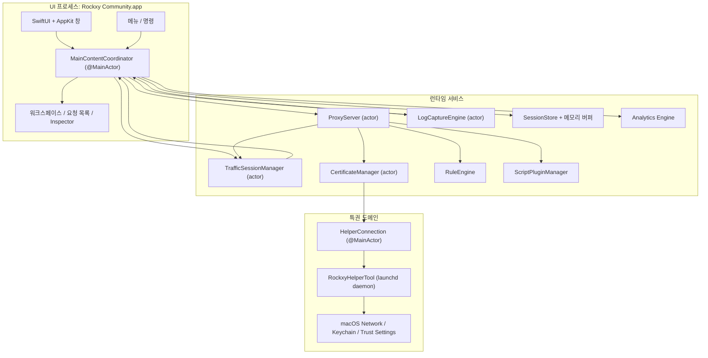
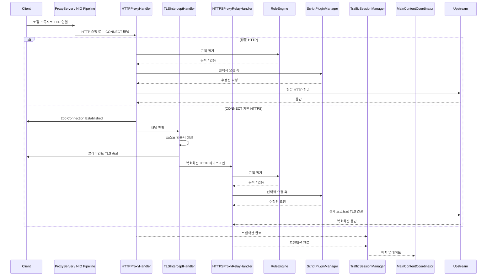
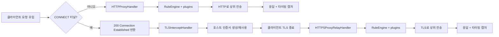
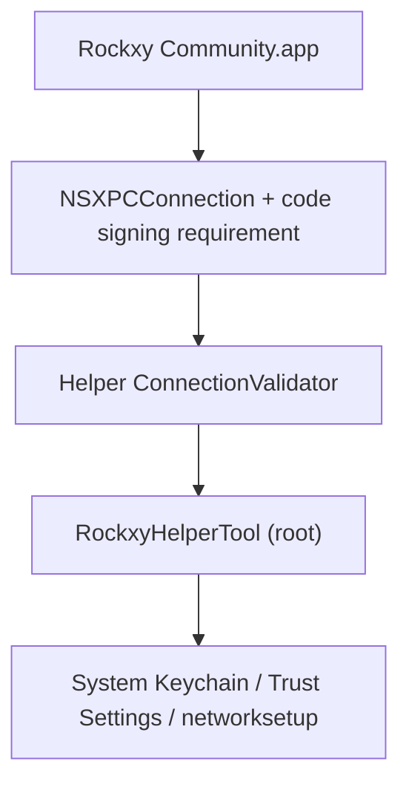

<p align="center">
  
</p>

<h1 align="center">Rockxy</h1>

<p align="center">
  <strong>macOS용 오픈 소스 HTTP 디버깅 프록시.</strong>
</p>

<p align="center">
  HTTP/HTTPS 트래픽을 가로채고, API 요청을 검사하며, WebSocket 연결을 디버깅하고, GraphQL 쿼리를 분석합니다.<br>
  Swift로 구축되었으며 SwiftNIO, SwiftUI, AppKit을 사용합니다.
</p>

<p align="center">
  <a href="#"></a>
  <a href="#"></a>
  <a href="LICENSE"></a>
  <a href="CONTRIBUTING.md"></a>
  <a href="https://github.com/sponsors/LocNguyenHuu"></a>
</p>

<p align="center">
  
</p>

---

> **상태**: 활발히 개발 중입니다. 핵심 프록시 엔진, HTTPS 가로채기, 규칙 시스템, 플러그인 생태계, Inspector UI가 동작합니다. 진행 상황은 [CHANGELOG.md](CHANGELOG.md)를 확인하세요.

## 기능

### 네트워크 트래픽 캡처
- **HTTP/HTTPS 프록시** — SwiftNIO 기반 인터셉팅 프록시, CONNECT 터널 지원
- **SSL/TLS 가로채기** — MITM 복호화와 호스트별 인증서 자동 생성 (LRU 캐시 약 1000)
- **WebSocket 디버깅** — 양방향 프레임 캡처 및 검사
- **GraphQL 감지** — operation 이름 자동 추출 및 쿼리 검사
- **프로세스 식별** — `lsof` 포트 매핑 + User-Agent 분석으로 요청 앱 식별

### 요청/응답 Inspector
- **JSON 뷰어** — 접기/펼치기 트리와 구문 강조
- **Hex Inspector** — 텍스트가 아닌 바이너리 body 표시
- **Timing waterfall** — DNS, TCP 연결, TLS 핸드셰이크, TTFB, 전송 단계를 시각화
- **Headers, cookies, query, auth** — 탭 방식 Inspector 및 raw 보기
- **사용자 지정 헤더 열** — 추가 헤더를 열로 표시

### 워크스페이스 & 생산성
- **워크스페이스 탭** — 독립 캡처 공간과 필터 상태
- **즐겨찾기** — 자주 쓰는 호스트/요청 고정
- **타임라인 보기** — 선택한 요청의 시퀀스 타임라인

### 트래픽 조작 & Mock API
- **Map Local** — 로컬 파일 응답 제공
- **Map Remote** — 다른 host/port/path로 리다이렉트
- **Breakpoints** — 요청/응답을 일시 중지하고 URL/headers/body/status 수정 후 전달 또는 중단
- **Block List** — URL 패턴(와일드카드/정규식)으로 차단
- **Throttle** — 지연 전송으로 느린 네트워크 시뮬레이션
- **Modify Headers** — 헤더 추가/삭제/교체
- **Allow List** — 지정 도메인/앱만 캡처
- **Bypass Proxy** — 시스템 프록시 활성화 시 특정 호스트 우회
- **SSL Proxying 규칙** — 도메인별 TLS 가로채기 제어

### 디버깅 & 분석
- **OSLog 통합** — macOS 시스템 로그 캡처 및 타임스탬프 상관
- **사이드 바이 사이드 비교** — 두 요청/응답 비교
- **요청 타임라인** — 시퀀스 및 타이밍 워터폴
- **자격 증명 마스킹** — Bearer 토큰과 비밀번호 자동 가림

### 확장성
- **JavaScript 플러그인 시스템** — JavaScriptCore 런타임 (5초 타임아웃 샌드박스)
- **요청/응답 훅** — 프록시 파이프라인에서 트래픽 검사 및 수정
- **플러그인 설정 UI** — manifest 기반 자동 폼 생성
- **내보내기 형식** — cURL, HAR, raw HTTP, JSON
- **Compose + 재생** — 요청 편집 후 재전송 또는 캡처 재생
- **Import 리뷰** — HAR/세션을 저장 전에 검토

### macOS 네이티브 경험
- **SwiftUI + AppKit 네이티브** — Electron 없음, WebView 없음
- **NSTableView 요청 목록** — 100k+ 요청에서도 부드러운 가상 스크롤
- **실제 앱 아이콘** — `NSWorkspace`의 번들 ID로 조회
- **시스템 프록시 통합** — 특권 helper로 비밀번호 없이 설정 (SMAppService)
- **다크 모드** — 완전 지원
- **단축키** — Cmd+Shift+R(시작), Cmd+.(정지), Cmd+K(지우기) 등

## 사용 사례

- **iOS / macOS 앱 디버깅** — 시뮬레이터/실기기에서 발생하는 API 호출 검사
- **REST API 테스트** — 정확한 요청/응답 페어 확인
- **GraphQL 디버깅** — operation, 변수, 응답을 빠르게 확인
- **Mock API 응답** — 로컬 파일을 엔드포인트에 매핑
- **WebSocket 검사** — 실시간 연결(채팅, 라이브, 게임) 디버깅
- **성능 분석** — 느린 엔드포인트와 큰 페이로드 식별
- **SSL/TLS 디버깅** — 도메인별 HTTPS 가로채기 제어
- **네트워크 기록** — HTTP 세션 캡처 및 재생
- **API 리버스 엔지니어링** — 문서 없는 API 동작 파악
- **CI/CD 통합** — 자동 API 계약 테스트용 헤드리스 프록시(예정)

## Rockxy vs Proxyman vs Charles Proxy

오픈 소스 Proxyman 또는 Charles Proxy 대안을 찾고 계신가요? 다음과 같이 비교할 수 있습니다.

| 기능 | Rockxy | Proxyman | Charles Proxy |
|---------|--------|----------|---------------|
| **라이선스** | 오픈 소스(AGPL-3.0) | 독점(freemium) | 독점(유료) |
| **가격** | 무료 | 무료 플랜 + $69/년 | $50 일회성 |
| **플랫폼** | macOS | macOS, iOS, Windows | macOS, Windows, Linux |
| **소스 코드** | GitHub 공개 | 비공개 | 비공개 |
| **기술** | Swift + SwiftNIO(네이티브) | Swift + AppKit(네이티브) | Java(크로스플랫폼) |
| **HTTP/HTTPS 가로채기** | 예 | 예 | 예 |
| **WebSocket 디버깅** | 예 | 예 | 예 |
| **GraphQL 감지** | 예(자동) | 예 | 아니요 |
| **Map Local** | 예 | 예 | 예 |
| **Map Remote** | 예 | 예 | 예 |
| **Breakpoints** | 예 | 예 | 예 |
| **Block List** | 예 | 예 | 예 |
| **Modify Headers** | 예 | 예 | 예(리라이트) |
| **Throttle / Network Conditions** | 예 | 예 | 예 |
| **요청 비교** | 예(사이드 바이 사이드) | 예 | 아니요 |
| **JavaScript 플러그인** | 예(JSCore 샌드박스) | 예(스크립팅) | 아니요 |
| **요청 재생** | 예(Repeat + Edit) | 예 | 예 |
| **HAR import/export** | 예 | 예 | 아니요(자체 형식) |
| **OSLog 통합** | 예 | 아니요 | 아니요 |
| **프로세스 식별** | 예(요청 앱 표시) | 예 | 아니요 |
| **JSON 트리 뷰어** | 예 | 예 | 예 |
| **Hex Inspector** | 예 | 예 | 예 |
| **Timing waterfall** | 예 | 예 | 예 |
| **가상 스크롤(100k+ 행)** | 예(NSTableView) | 예 | 대용량에서 느림 |
| **특권 helper(sudo 없이)** | 예(SMAppService) | 예 | 아니요(반복 프롬프트) |
| **다크 모드** | 예 | 예 | 부분 지원 |
| **자체 호스팅 / 감사 가능** | 예 | 아니요 | 아니요 |
| **커뮤니티 기여** | PR 환영 | 아니요 | 아니요 |

**Rockxy를 선택해야 하는 이유**
- **무료 오픈 소스** HTTP 디버깅 프록시가 필요하다
- 트래픽을 가로채는 도구의 **소스 코드를 검증**하고 싶다
- 기능을 **기여하거나 커스터마이즈**하고 싶다
- macOS 로그와 네트워크 요청을 연동하는 **OSLog 상관 분석**이 필요하다
- Java 런타임 없이 **네이티브 macOS 경험**을 원한다

## 요구 사항

- macOS 14.0+ (Sonoma 이상)
- Xcode 16+
- Swift 5.9

## 빠른 시작

```bash
git clone https://github.com/LocNguyenHuu/Rockxy.git
cd Rockxy
xcodebuild -project Rockxy.xcodeproj -scheme Rockxy -configuration Debug build
```

또는 Xcode에서 `Rockxy.xcodeproj`를 열고 Run을 누르세요.

첫 실행 시 Welcome 창에서 다음을 안내합니다:
1. 루트 CA 생성 및 신뢰 설정
2. 시스템 프록시 제어용 특권 helper 설치
3. 시스템 프록시 활성화
4. 프록시 서버 시작

## 아키텍처

### 시스템 개요

Rockxy는 3개의 신뢰/실행 도메인으로 분리됩니다.

1. **UI + 오케스트레이션 레이어** — SwiftUI/AppKit 창, Inspector, 메뉴, `MainContentCoordinator`
2. **프록시/런타임 레이어** — SwiftNIO 핸들러, 인증서 발급, 요청 변형, 저장소, 분석, 플러그인
3. **특권 helper 레이어** — 루트 권한이 필요한 시스템 작업을 수행하는 launchd 데몬

설계 목표는 패킷 처리를 메인 스레드 밖으로 이동하고, 특권 작업을 앱 프로세스 외부에서 수행하며, actor 또는 `@MainActor`로 동기화하는 것입니다.

### 컴포넌트 맵



### 런타임 레이어

| 레이어 | 주요 타입 | 역할 |
|-------|------------|----------------|
| **Presentation** | `MainContentCoordinator`, `ContentView`, Inspector/리스트/사이드바 뷰 | UI 상태 유지, 명령 라우팅, SwiftUI/AppKit에 데이터 바인딩 |
| **Capture / transport** | `ProxyServer`, `HTTPProxyHandler`, `TLSInterceptHandler`, `HTTPSProxyRelayHandler` | 프록시 트래픽 수신, CONNECT 처리, TLS MITM, 상위 전송 |
| **Mutation / policy** | `RuleEngine`, `BreakpointRequestBuilder`, `AllowListManager`, `NoCacheHeaderMutator`, `MapLocalDirectoryResolver` | 전송/저장 전 규칙 적용 |
| **Certificate / trust** | `CertificateManager`, `RootCAGenerator`, `HostCertGenerator`, `CertificateStore`, `KeychainHelper` | 루트 CA 생성, 호스트 인증서 캐시, 신뢰 확인 |
| **Storage / session** | `TrafficSessionManager`, `LogCaptureEngine`, `SessionStore`, 메모리 버퍼 | 실시간 데이터 버퍼링, SQLite 저장, UI 배치 업데이트 |
| **Observability / analysis** | analytics, GraphQL 감지, content-type 감지, 로그 상관 | 트래픽에 메타데이터 추가 |
| **특권 시스템 통합** | `HelperConnection`, `RockxyHelperTool`, 공유 XPC 프로토콜 | 시스템 프록시 및 인증서 특권 작업 |

### 프록시 요청 라이프사이클



### HTTP vs HTTPS 흐름



### 동시성 모델

- `ProxyServer`는 bind/shutdown 생명주기를 담당하는 actor입니다.
- NIO 핸들러는 이벤트 루프에서 실행되며 필요 시 actor로 브리지합니다.
- `CertificateManager`, `TrafficSessionManager`는 actor 격리를 사용합니다.
- `MainContentCoordinator`는 `@MainActor`로 UI 동기화 경계입니다.
- UI 업데이트는 배치 처리하여 메인 스레드 부하를 줄입니다.

### 핵심 서브시스템

| 서브시스템 | 위치 | 역할 |
|-----------|----------|--------------|
| **Proxy Engine** | `Core/ProxyEngine/` | SwiftNIO `ServerBootstrap`, 연결 파이프라인, CONNECT 처리, TLS 핸드오프, HTTP/HTTPS 전송 |
| **Certificate** | `Core/Certificate/` | 루트 CA, 호스트 인증서 발급, 신뢰 확인, Keychain 저장, 캐시 |
| **Rule Engine** | `Core/RuleEngine/` | block, map local, map remote, throttle, modify headers, breakpoint 순으로 평가 |
| **Traffic Capture** | `Core/TrafficCapture/` | 세션 배치, allow-list 정책, 재생, UI 동기화 |
| **Storage** | `Core/Storage/` | SQLite 저장, 메모리 버퍼, 대용량 body 분리 |
| **Detection / enrichment** | `Core/Detection/` | GraphQL 감지, content type 감지, API 그룹화 |
| **Plugins** | `Core/Plugins/` | JavaScriptCore 기반 훅 실행 및 플러그인 설정 |
| **Helper Tool** | `RockxyHelperTool/`, `Shared/` | 특권 XPC 서비스: 프록시 오버라이드, bypass, 인증서 설치/제거 |

### 보안 아키텍처

> **취약점 제보:** 보안 이슈는 비공개로 보고해 주세요. [SECURITY.md](SECURITY.md)를 참고하세요.

Rockxy는 TLS를 종료하고 민감한 트래픽을 저장하며 root 권한 helper와 통신하므로 계층형 보안 모델을 사용합니다.



#### 보안 경계

| 경계 | 위험 | 현재 제어 |
|----------|------|-----------------|
| **App ↔ helper** | 신뢰되지 않는 앱의 특권 호출 | `NSXPCConnection` + 코드 서명 요구, helper 측 검증 및 인증서 체인 비교 |
| **TLS 가로채기** | 오래된 Root CA로 인한 신뢰 문제 | 루트 CA 수명 관리, 신뢰 검사, 지문 추적 |
| **요청 본문 처리** | 과도한 body로 메모리 고갈 | 100 MB 제한(413), URI 8 KB 제한(414), WebSocket 제한(10 MB/프레임, 100 MB/연결) |
| **로컬 파일 매핑** | Map Local 경로 탈출 | fd 기반 로드, 심볼릭 링크 해석, 루트 경로 검증 |
| **규칙 정규식** | 병적인 정규식으로 ReDoS | 컴파일 시 검증, 패턴 캐시, 500자 제한, 입력 8 KB 제한 |
| **브레이크포인트 편집** | 잘못된 요청 전달 | `BreakpointRequestBuilder`로 재구성, authority 보존, scheme 정규화, content-length 재계산 |
| **플러그인 실행** | 위험/비결정적 동작 | JSCore 브리지, 제한된 API, 타임아웃, ID 검증, 파일/네트워크 접근 금지 |
| **저장된 트래픽** | 민감 정보 보관 위험 | 메모리 + SQLite, 0o600 권한 저장, 경로 검증, 자격 증명 마스킹 |
| **헤더 주입** | MapRemote로 CRLF 주입 | 제어 문자 제거 |
| **Helper 입력 검증** | 잘못된 도메인/서비스 이름 | ASCII만 허용, 서비스명 정제, 프록시 유형 화이트리스트 |

#### Helper 신뢰 모델

Helper는 `com.amunx.Rockxy.HelperTool` launchd 데몬으로 `SMAppService.daemon()`에 등록되어 `networksetup` 암호 프롬프트를 줄입니다.

방어 계층은 다음을 포함합니다:

- 앱 측 특권 XPC 연결
- `ConnectionValidator`에서 호출자 검증(하드코딩된 bundle ID)
- 코드 서명 요구(`anchor apple generic`)
- 인증서 체인 비교
- 상태 변경 작업에 대한 속도 제한
- 모든 입력 파라미터 검증
- 0o600 권한의 원자적 임시 파일
- 프록시 설정 백업/복원

#### 인증서 신뢰 모델

- Root CA 생성과 저장은 `CertificateManager`가 담당합니다.
- 앱이 root CA 생성, 로드, 신뢰 검증을 관리합니다.
- helper는 시스템 설치 작업만 보조합니다.
- 호스트 인증서는 필요 시 생성하고 캐시합니다.
- root 지문 추적으로 오래된 인증서를 정리합니다.

#### 실전 보안 노트

- Rockxy는 민감한 트래픽을 다루는 개발 도구입니다. 필요 이상으로 시스템 프록시를 켜두지 마세요.
- Root CA 설치는 해당 CA를 신뢰하는 클라이언트에만 HTTPS 가로채기를 허용합니다.
- 저장된 세션, 내보내기, 플러그인 코드는 민감한 산출물로 취급해야 합니다.

## 프로젝트 구조

```
Rockxy/
├── Core/
│   ├── ProxyEngine/       # SwiftNIO server, HTTP/TLS/WS handlers, helper client
│   ├── Certificate/       # X.509 generation, root CA, Keychain integration
│   ├── RuleEngine/        # Rule matching and action execution
│   ├── LogEngine/         # OSLog + process log capture and correlation
│   ├── TrafficCapture/    # Session manager, system proxy, request replay
│   ├── Storage/           # SQLite store, in-memory buffer, settings
│   ├── Detection/         # Content type, GraphQL, API grouping
│   ├── Plugins/           # Plugin discovery, JS runtime, manifest parsing
│   ├── Services/          # Window management, notifications
│   └── Utilities/         # Body decoder, input validation, formatters
├── Views/
│   ├── Main/              # Main window, coordinator extensions
│   ├── RequestList/       # NSTableView-backed request list (100k+ rows)
│   ├── Inspector/         # Request/response tabs, JSON tree, hex display
│   ├── Sidebar/           # Domain tree, app grouping, favorites
│   ├── Toolbar/           # Status indicators, control buttons
│   ├── Welcome/           # Setup wizard, certificate checklist
│   ├── Settings/          # General, Proxy, SSL Proxying, Privacy tabs
│   ├── Rules/             # Rule list, add/edit dialogs
│   ├── Compose/           # Edit and Repeat request editor
│   ├── Diff/              # Side-by-side transaction comparison
│   ├── Scripting/         # Code editor, plugin console
│   ├── Timeline/          # Request waterfall visualization
│   ├── Breakpoint/        # Breakpoint edit window
│   └── Components/        # Reusable: StatusCodeBadge, FilterPill, etc.
├── Models/
│   ├── Network/           # HTTPTransaction, Request/Response, TimingInfo, WebSocket
│   ├── Log/               # LogEntry, LogLevel, LogSource
│   ├── Analytics/         # ErrorGroup, PerformanceMetric, SessionTrend
│   ├── Certificate/       # RootCA, RootCAStatusSnapshot
│   ├── Rules/             # ProxyRule, RuleAction
│   ├── Settings/          # AppSettings, ProxySettings
│   ├── UI/                # SidebarItem, FilterState
│   └── Plugins/           # PluginInfo, PluginConfig, PluginManifest
├── ViewModels/
├── Extensions/
└── Theme/

RockxyHelperTool/              # Privileged launchd daemon (runs as root)
├── main.swift                 # Entry point, XPC listener
├── HelperDelegate.swift       # Connection validation, disconnect handling
├── HelperService.swift        # Protocol impl, rate limiting, port validation
├── ConnectionValidator.swift  # Certificate chain extraction & comparison
├── CrashRecovery.swift        # Backup/restore proxy settings
└── ProxyConfigurator.swift    # networksetup wrapper

Shared/
└── RockxyHelperProtocol.swift # @objc XPC protocol (app ↔ helper)

RockxyTests/                   # Swift Testing framework (@Suite, @Test, #expect)
├── Core/                      # Rule engine, certificate, plugin, storage, proxy tests
├── ViewModels/                # WelcomeViewModel tests
└── Helpers/                   # TestFixtures factory methods

docs/                          # Documentation (Mintlify format)
.github/workflows/             # CI: lint → build (arm64 + x86_64) → release
```

## 기술 스택

| 레이어 | 기술 |
|-------|-----------|
| UI 프레임워크 | SwiftUI + AppKit (NSTableView, NSViewRepresentable) |
| 네트워킹 | [SwiftNIO](https://github.com/apple/swift-nio) 2.95 + [SwiftNIO SSL](https://github.com/apple/swift-nio-ssl) 2.36 |
| 인증서 | [swift-certificates](https://github.com/apple/swift-certificates) 1.18 + [swift-crypto](https://github.com/apple/swift-crypto) 4.2 |
| 데이터베이스 | [SQLite.swift](https://github.com/stephencelis/SQLite.swift) 0.16 |
| 동시성 | Swift Actors, structured concurrency, @MainActor |
| 플러그인 | JavaScriptCore (macOS 내장) |
| Helper IPC | XPC Services + SMAppService (macOS 13+) |
| 테스트 | Swift Testing framework (@Suite, @Test, #expect) |
| CI/CD | GitHub Actions (SwiftLint → arm64/x86_64 병렬 빌드 → release) |

## 소스 빌드

### Development Build

```bash
git clone https://github.com/LocNguyenHuu/Rockxy.git
cd Rockxy
./scripts/setup-developer.sh   # 로컬 서명을 위한 Configuration/Developer.xcconfig 생성
xcodebuild -project Rockxy.xcodeproj -scheme Rockxy -configuration Debug build
```

### Release Build

```bash
# Apple Silicon (M1/M2/M3/M4)
xcodebuild -project Rockxy.xcodeproj -scheme Rockxy -configuration Release -arch arm64 build

# Intel
xcodebuild -project Rockxy.xcodeproj -scheme Rockxy -configuration Release -arch x86_64 build
```

### 테스트 실행

```bash
# 전체 테스트
xcodebuild -project Rockxy.xcodeproj -scheme Rockxy test

# 특정 테스트 클래스
xcodebuild -project Rockxy.xcodeproj -scheme Rockxy test -only-testing:RockxyTests/CertificateTests

# 특정 테스트 메서드
xcodebuild -project Rockxy.xcodeproj -scheme Rockxy test -only-testing:RockxyTests/RuleEngineTests/testWildcardMatching
```

### Lint 및 포맷

```bash
brew install swiftlint swiftformat

swiftlint lint --strict    # 위반 0건 필수
swiftformat .              # 자동 포맷
```

### Helper 도구 안내

`RockxyHelperTool/` 또는 `Shared/RockxyHelperProtocol.swift`를 변경했다면 앱 재빌드만으로는 반영되지 않습니다. 기존 helper를 제거한 뒤 앱의 Helper Manager로 다시 설치해야 합니다.

## 설계 결정

### URLSession 대신 SwiftNIO를 사용하는 이유

URLSession은 고수준 HTTP 클라이언트입니다. Rockxy는 TCP 서버로서 연결 수락, HTTP 파싱, CONNECT 기반 MITM TLS, 트래픽 포워딩이 필요하므로 소켓 제어가 필수입니다. SwiftNIO는 이벤트 기반 비동기 I/O 기반을 제공합니다.

### 요청 목록에 NSTableView를 사용하는 이유

SwiftUI `List`는 100k+ 행에서 가상 스크롤 성능이 부족합니다. Rockxy는 `NSTableView`를 `NSViewRepresentable`로 감싸 O(1) 스크롤 성능을 확보합니다.

### 특권 helper 데몬이 필요한 이유

macOS는 `networksetup` 호출마다 관리자 인증이 필요합니다. `SMAppService.daemon()` 기반 helper가 root로 실행되며 인증서 체인 검증을 통해 안전하게 반복 프롬프트를 줄입니다.

### Actor 기반 동시성 모델

프록시 서버, 세션 매니저, 인증서 매니저는 Swift actor로 관리되어 데이터 레이스를 방지합니다. `MainContentCoordinator`는 250ms 배치 업데이트로 `@MainActor`에 전달합니다.

### 플러그인 샌드박스

JavaScript 플러그인은 JavaScriptCore에서 제한된 API(`$rockxy`)로 실행되며 5초 타임아웃이 있습니다. 플러그인은 요청을 수정할 수 있지만 파일 시스템/네트워크 접근은 불가합니다.

## 성능

- **100k+ 요청** — NSTableView 가상 스크롤, UI 지연 없음
- **링 버퍼 이비션** — 50k 트랜잭션 초과 시 가장 오래된 10%를 SQLite로 이동 또는 삭제
- **body 오프로딩** — 1MB 초과 body는 디스크에 저장하고 필요 시 로드
- **UI 배치 업데이트** — 250ms 또는 50개 단위
- **문자열 성능** — 큰 body에 `NSString.length`(O(1)) 사용
- **로그 버퍼** — 메모리 100k, 초과분 SQLite 저장
- **병렬 빌드** — `System.coreCount`에 따른 NIO 이벤트 루프 스레드

## 스토리지

| 데이터 | 방식 | 위치 |
|------|-----------|----------|
| 사용자 설정 | UserDefaults | `AppSettingsStorage` |
| 활성 세션 | 메모리 링 버퍼 | `InMemorySessionBuffer` |
| 저장된 세션 | SQLite | `SessionStore` |
| Root CA 개인 키 | macOS Keychain | `KeychainHelper` |
| 규칙 | JSON 파일 | `RuleStore` |
| 대용량 body | 디스크 파일 | `~/Library/Application Support/Rockxy/bodies/` |
| 로그 엔트리 | SQLite | `SessionStore` (log_entries 테이블) |
| 프록시 백업 | Plist(0o600) | `/Library/Application Support/com.amunx.Rockxy/proxy-backup.plist` |
| 플러그인 | JS 파일 + manifest | `~/Library/Application Support/Rockxy/Plugins/` |

## 코드 스타일

규칙은 `.swiftlint.yml` 및 `.swiftformat`에 있습니다. 주요 사항:

- 4칸 들여쓰기, 120자 줄 길이
- 모든 선언에 명시적 접근 제어
- `!`, `as!` 금지 — `guard let`, `if let`, `as?` 사용
- OSLog 사용, `print()` 금지
- UI 문자열은 `String(localized:)`
- [Conventional Commits](https://www.conventionalcommits.org/) 준수

### 파일 크기 제한

| 지표 | 경고 | 오류 |
|--------|---------|-------|
| 파일 길이 | 1200줄 | 1800줄 |
| 타입 본문 | 1100줄 | 1500줄 |
| 함수 본문 | 160줄 | 250줄 |
| 순환 복잡도 | 40 | 60 |

한계에 가까워지면 `TypeName+Category.swift`로 분리하세요.

## CI/CD

GitHub Actions 워크플로(수동 실행, 채널 파라미터 지원):

1. **Lint** — macOS 14에서 `swiftlint lint --strict`
2. **Build** — Xcode 16으로 arm64/x86_64 release 병렬 빌드
3. **Artifacts** — 서명된 빌드 아티팩트 업로드

## 로드맵

### 출시됨

- [x] HAR 가져오기/내보내기
- [x] 요청 재생(Repeat 및 Edit and Repeat)
- [x] 네이티브 `.rockxysession` 세션 파일(저장, 열기, 메타데이터)
- [x] GraphQL-over-HTTP 감지 및 검사
- [x] JavaScript 스크립팅(생성, 편집, 테스트, 활성/비활성)
- [x] 요청 사이드 바이 사이드 비교
- [x] 보안 강화(body 제한, 정규식 검증, 경로 보호, 입력 검증)
- [x] 로그의 자격 증명 마스킹

### 예정됨

- [ ] 에러 그룹화 및 분석 대시보드(HTTP 4xx/5xx, 지연 지표)
- [ ] HTTP/2 및 HTTP/3 지원
- [ ] 시퀀스 기록(의존 요청 체인 재생)
- [ ] 원격 디바이스 프록시(USB/Wi-Fi iOS 디버깅)
- [ ] CI/CD용 헤드리스 모드
- [ ] gRPC / Protocol Buffers 검사
- [ ] 네트워크 조건 시뮬레이션(지연, 패킷 손실, 대역폭)

## 기여

버그 수정, 기능 추가, 문서화, UX 피드백 등 모든 기여를 환영합니다. 참여 전에 [Code of Conduct](CODE_OF_CONDUCT.md)를 읽어주세요.

**시작하기:**

1. 리포지토리를 fork하고 clone
2. `develop`에서 기능 브랜치 생성(`feat/your-change` 또는 `fix/your-fix`)
3. 변경 사항을 적용하고 `swiftlint lint --strict` 통과
4. 변경 이유와 내용을 명확히 적어 PR 생성

자세한 안내는 [CONTRIBUTING.md](CONTRIBUTING.md)를 참고하세요.

**기여 방법:**

- **코드** — 버그 수정, 기능 추가, 성능 개선
- **테스트** — 커버리지 확장, 엣지 케이스 추가, fixture 개선
- **문서** — `docs/` 개선, 오탈자 수정, 예제 추가
- **버그 리포트** — 재현 단계와 macOS 버전 명시
- **UX 피드백** — Inspector, 사이드바, 툴바 개선 제안

초보자용 이슈는 [`good first issue`](https://github.com/LocNguyenHuu/Rockxy/labels/good%20first%20issue)로 표시됩니다.

PR을 열면 [Contributor License Agreement](CLA.md)에 동의하는 것으로 간주됩니다.

## 지원

- [GitHub Sponsors](https://github.com/sponsors/LocNguyenHuu) — Rockxy 개발 지원
- [GitHub Issues](https://github.com/LocNguyenHuu/Rockxy/issues) — 버그 리포트 및 기능 요청
- [GitHub Discussions](https://github.com/LocNguyenHuu/Rockxy/discussions) — 질문 및 커뮤니티 대화
- **Email** — [rockxyapp@gmail.com](mailto:rockxyapp@gmail.com)
- **보안 이슈** — [SECURITY.md](SECURITY.md) 참고

## 라이선스

[GNU Affero General Public License v3.0](LICENSE) — Copyright 2024–2026 Rockxy Contributors.

---

**Swift, SwiftNIO, SwiftUI, AppKit으로 제작되었습니다.**
