<p align="center">
  
</p>

<h1 align="center">Rockxy</h1>

<p align="center">
  <a href="README.md">English</a> |
  <a href="README.vi.md">Tiếng Việt</a> |
  <a href="README.zh.md">中文</a> |
  <a href="README.zh-TW.md">繁體中文</a> |
  <a href="README.es.md">Español</a> |
  <a href="README.pt-BR.md">Português do Brasil</a> |
  <a href="README.ja.md">日本語</a> |
  <a href="README.ko.md">한국어</a> |
  <a href="README.fr.md">Français</a> |
  <a href="README.de.md">Deutsch</a> |
  <a href="README.it.md">Italiano</a> |
  <a href="README.tr.md">Türkçe</a> |
  <a href="README.pl.md">Polski</a> |
  <a href="README.nl.md">Nederlands</a> |
  <a href="README.ru.md">Русский</a> |
  <a href="README.uk.md">Українська</a> |
  <a href="README.ar.md">العربية</a> |
  <a href="README.fa.md">فارسی</a> |
  <a href="README.bn.md">বাংলা</a> |
  <a href="README.ro.md">Română</a> |
  <a href="README.ka.md">ქართული</a>
</p>

<p align="center">
  <strong>De open source, controleerbare foutopsporingsproxy voor macOS.</strong>
</p>

<p align="center">
  Onderschep, inspecteer en wijzig HTTP/HTTPS/WebSocket/GraphQL-verkeer met een native Swift-app die u kunt inspecteren, bouwen en vertrouwen.<br>
  Gebouwd voor API-, mobiele, MCP-ondersteunde, AI- en debugging-workflows uit het blockchain-tijdperk naarmate Rockxy evolueert.<br>
  Een local-first, AGPL-3.0-alternatief voor <a href="#rockxy-versus-alternatieven">Proxyman en Charles Proxy</a>.
</p>

<p align="center">
  <a href="https://github.com/RockxyApp/Rockxy/releases"></a>
  
  
  <a href="LICENSE"></a>
  <a href="CONTRIBUTING.md"></a>
  <a href="https://github.com/sponsors/LocNguyenHuu"></a>
  <a href="https://opencollective.com/rockxy/donate"></a>
</p>

<p align="center">
  <a href="https://trendshift.io/repositories/26380?utm_source=trendshift-badge&amp;utm_medium=badge&amp;utm_campaign=badge-trendshift-26380" target="_blank" rel="noopener noreferrer"></a>
</p>

<p align="center">
  <a href="https://youtu.be/RvkQuwUjBaQ" title="Watch the Rockxy demo on YouTube">
    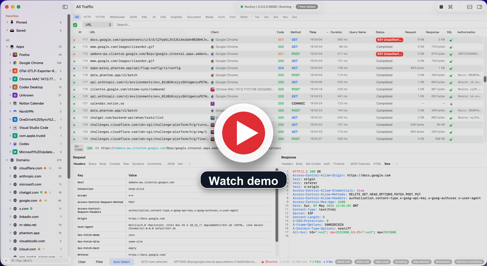
  </a>
</p>

---

<!-- BEGIN GENERATED: latest-release -->
## Latest Tagged Release

**v0.38.1** — 2026-09-05

### Fixed

- Preserved the same Rockxy root certificate across app relaunches, preventing unexpected certificate replacement and repeated HTTPS inspection setup.
- Made certificate installation, trust checks, and removal safer by targeting exact certificates, preserving unrelated roots, and preventing overlapping privileged changes.
- Improved recovery for outdated helpers and unreadable certificate states with clearer recheck, reinstall, and trust guidance.
- Clarified JetBrains IDE proxy setup and surfaced failed HTTPS CONNECT tunnels for easier diagnosis.

See [CHANGELOG.md](CHANGELOG.md) for the full release history.
<!-- END GENERATED: latest-release -->

## Hoogtepunten van de huidige vestiging

- AI Assistant onderzoekt nu een of meer geselecteerde requests met ingebouwde lokale analyse of een optioneel geconfigureerd Ollama/provider-model, met expliciete Review Data-bevestiging, begrensde redactie, streaming-antwoorden, evidence reveal en door de gebruiker gestarte handoffs.
- De native sidebar heeft nu herbruikbare Focus Sets voor app/domain/path-scopes plus workspace-brede Noise Control die overeenkomende domains of paths verbergt zonder de capture te stoppen.
- De hoofd-workspace gebruikt nu native verticale en horizontale split views voor de Context Dock en de onderste inspector, met volledige-hoogte dividers, afgestemde toolbar/footer-separators en automatische lay-outaanpassing.
- Upstream Proxy bevat nu gratis/kern automatische proxyconfiguratie met PAC URL-routering voor `DIRECT`, HTTP- en HTTPS-routes terwijl de bestaande SOCKS5- en authenticatiebeleidsgrenzen behouden blijven.
- Exportworkflows omvatten nu OpenAPI YAML/HTML en Gist-publicatie met geselecteerd verkeer met redactiebewuste payload-opbouw.
- Inspector-tools omvatten nu JSONPath/key/value-filtering en snelle voorbeelden voor geselecteerde payload-tekst zoals JWT's.
- AI- en Web3-verkeersinspectie voegt nu protocollabels, inspectortabbladen en debug-samenvattingen toe voor herkende modelaanroepen, JSON-RPC-verkeer en x402-achtige betalingshints.
- Node.js Developer Setup weerspiegelt nu de geselecteerde client tijdens de validatie en heeft een volledigere localhost-voorbeeldgids.
- Developer Setup Hub omvat nu runtimes, browsers, clients, apparaten, frameworks en omgevingen met doelspecifieke fragmenten, validatiewatchers en eerlijke gidsinhoud.
- De inspectie van binaire WebSocket-frames bevat nu begrensde, on-demand Protobuf wire-format-heuristieken zonder decoder work aan het capture hot path toe te voegen.
- De openbare roadmap richt zich nu op diepere protocolbewuste regels, replay, vergelijking en veiliger delen van geredigeerd bewijs.

## Kenmerken

De tools die u zoekt als browser DevTools zijn niet voldoende. Debugging van kernverkeer voor Mac en iOS werkt – native op macOS, met openbare releases en een local-first-workflow.

### Verkeer vastleggen

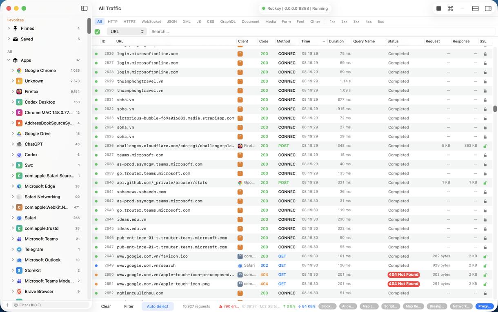

Inspecteer HTTP-, HTTPS-, WebSocket- en GraphQL-verkeer vanaf elke Mac-app, CLI of iOS-apparaat. Browser DevTools eindigen in de browser - Rockxy ziet de rest van je stapel.

`HTTP / HTTPS` · `WebSocket` · `GraphQL` · `iOS Device & Simulator` · `Filter by Process ID` · `Timing Waterfall`

### Geavanceerd filteren en zoeken

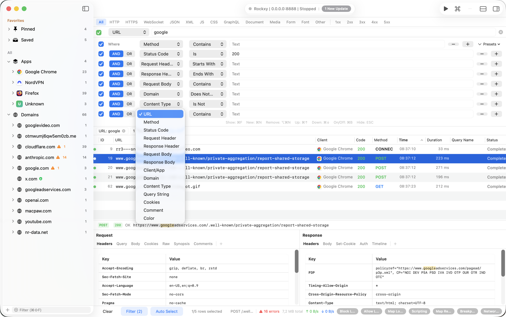

Beperk duizenden vastgelegde verzoeken in enkele seconden. Combineer methode-, host-, status-, header-, body- en procesfilters, of voer een volledige tekstzoekopdracht uit gedurende de hele sessie.

`Multi-Field Filters` · `Full-Text Search` · `Status / Method` · `Header / Body Match` · `Process / Host` · `Saved Filters`

### Focus Sets en Noise Control

Maak terugkerende onderzoeken tot herbruikbare scopes in de sidebar. Focus Sets combineert app-, domain- en path-includes met domain/path-excludes, blijft bewaard tussen starts en is beschikbaar in elke workspace. Noise Control blijft telemetrie en ander verkeer met lage waarde vastleggen, maar verbergt het in de huidige workspace.

`Reusable Focus Sets` · `App / Domain / Path Scope` · `Include & Exclude` · `Workspace Noise Control` · `Capture Continues`

### AI Assistant

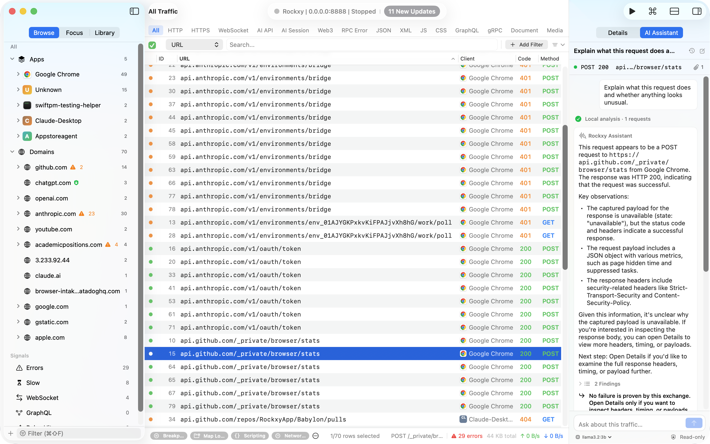

Selecteer een of meer vastgelegde requests en vraag wat er gebeurde, wat mislukte, wat veranderde of wat daarna moet worden gecontroleerd. Rockxy begint met evidence-based analyse op deze Mac; een geconfigureerd Ollama- of provider-model draait pas nadat Review Data de exacte, begrensde en geredigeerde context toont. Antwoorden kunnen de source request onthullen en native follow-up-workflows voorbereiden, maar wijzigen nooit automatisch verkeer en voeren geen acties uit.

`Built-in Local Analysis` · `Multi-Request Context` · `Ollama & Provider Models` · `Review Data` · `Sensitive-Data Redaction` · `Read-only Actions`

[Lees de AI Assistant-gids](docs/features/ai-assistant.mdx).

### MCP-server voor externe AI-clients

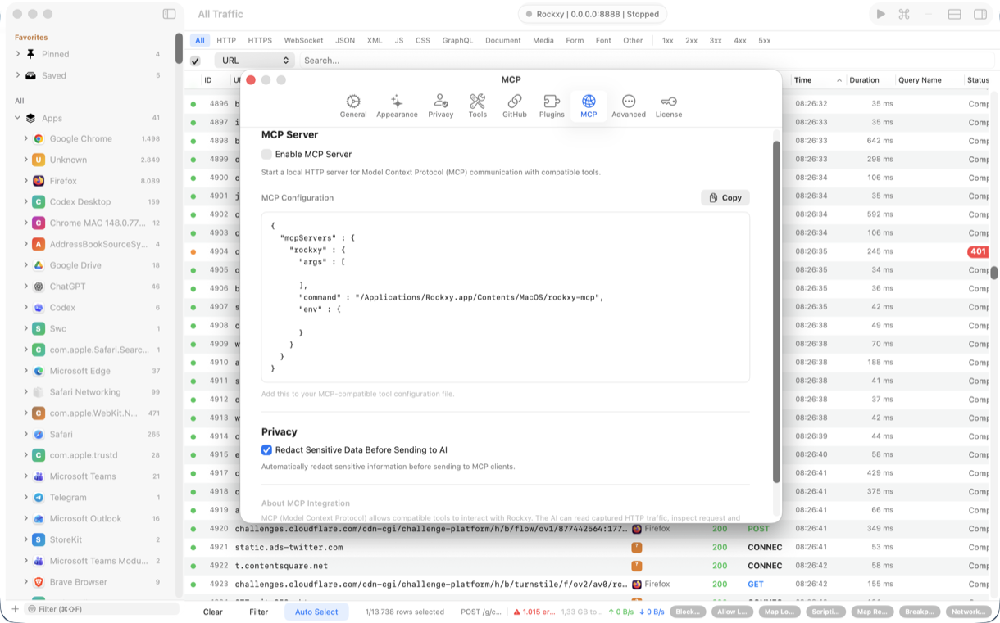

Laat Claude Desktop of Cursor uw vastgelegde verkeer inspecteren via tien alleen-lezen tools in de lokale MCP-server van Rockxy. Vraag "waarom deed deze 500?" in plaats van headers in de chat te plakken. De implementatie is open source, token-geauthenticeerd en houdt redactie van gevoelige gegevens standaard ingeschakeld.

`Claude Desktop` · `Cursor` · `Local stdio` · `Redaction` · `Open Source`

### Installatiehub voor ontwikkelaars

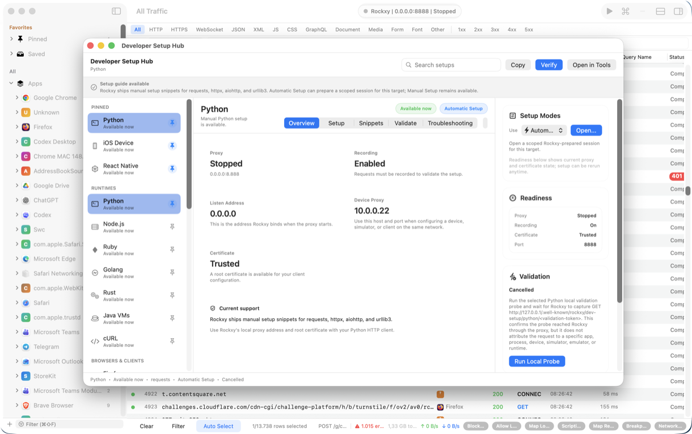

Kopieer en plak proxyfragmenten voor Python, Node.js, Go, Rust, cURL, Docker en browsers en klik vervolgens op Test uitvoeren om te bevestigen dat het verkeer daadwerkelijk stroomt.

`Python` · `Node.js` · `Go / Rust / Java` · `cURL / Docker` · `One-Click Verify` · `Trust Diagnostics`

### Certificaatbeheer voor HTTPS-foutopsporing

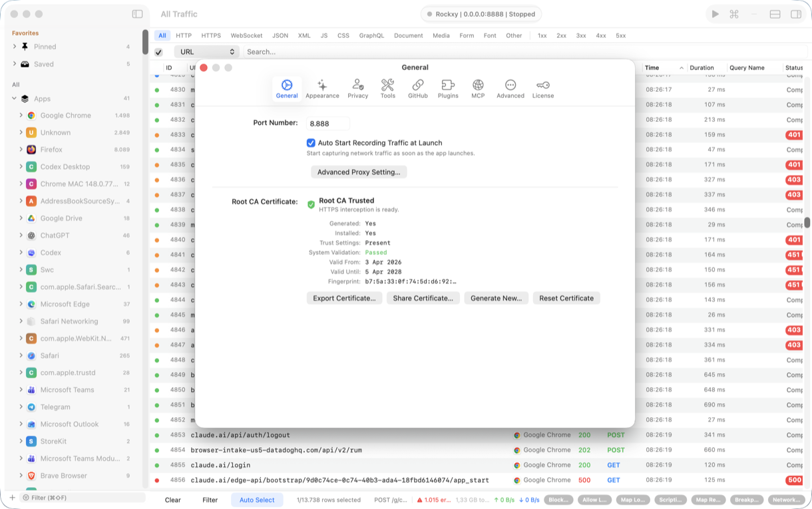

Een P-256 ECDSA-root-CA gegenereerd bij de eerste lancering, verzegeld in uw sleutelhanger. Decodeer HTTPS bij de eerste poging; vastgezette hosts passeren automatisch.

`P-256 ECDSA Root CA` · `Keychain-Sealed Key` · `Per-Host Leaf Certs` · `Trust Wizard` · `Pinned-Host Passthrough` · `Rotate / Reset`

### SSL-proxy en HTTPS-decodering

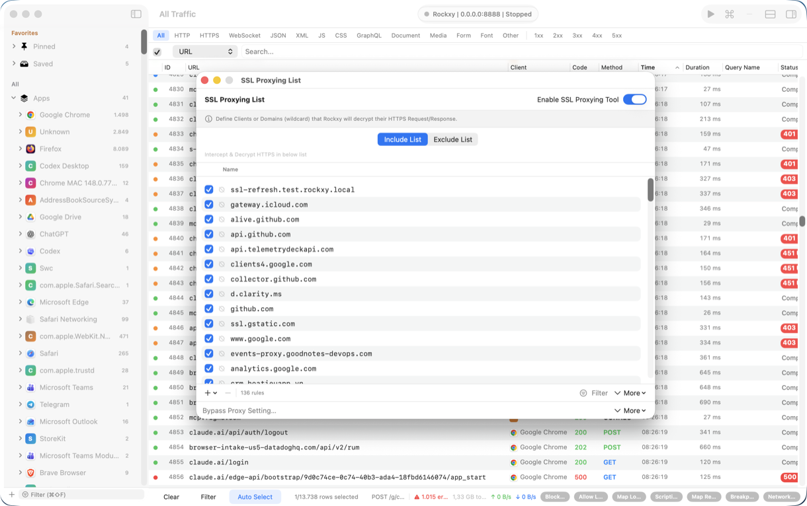

Kies welke hosts TLS-decodering krijgen. Gedecodeerd verkeer toont echte headers en JSON; al het andere gaat versleuteld door. Met regels voor jokertekens kunt u met één klik per domein zoeken.

`Per-Host Decryption` · `Wildcard Rules` · `Allow / Deny List` · `TLS 1.2 / 1.3` · `Pinned Host Passthrough`

### Omzeil proxy

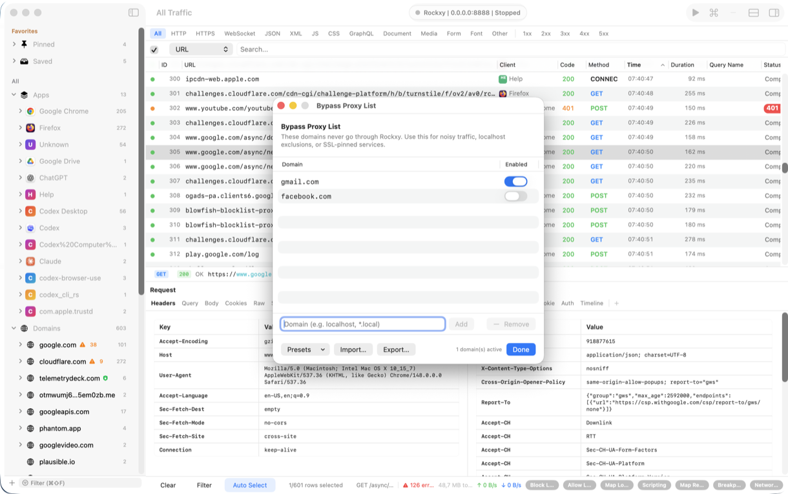

Sla specifieke hosts over, zodat gecertificeerde apps, interne services of luidruchtige telemetrie nooit in de opname terechtkomen. Wildcards houden de lijst kort en uw verzoeklogboek is gericht op datgene waar u echt om geeft.

`Per-Host Bypass` · `Wildcard Patterns` · `Skip Pinned Hosts` · `Mute Telemetry` · `Reduce Noise` · `Toggle Anytime`

### Blokkeer lijst

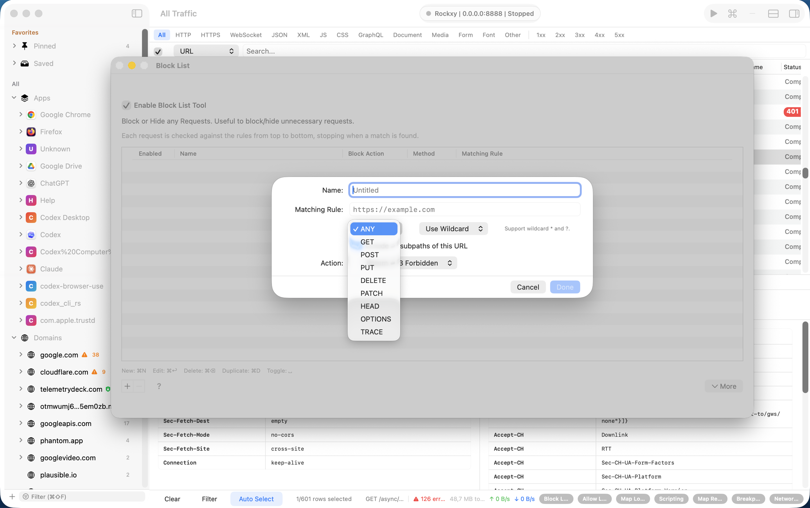

Zorg ervoor dat elke host faalt. Laat advertentienetwerken, trackers van derden of een zwakke afhankelijkheid achterwege en kijk hoe uw app verslechtert als deze weg is, zonder ook maar één regel code te wijzigen.

`Per-Host Block` · `Wildcard Match` · `Simulate Outage` · `Test Fallbacks` · `Strip Trackers` · `Toggle Anytime`

### Kaart Lokaal

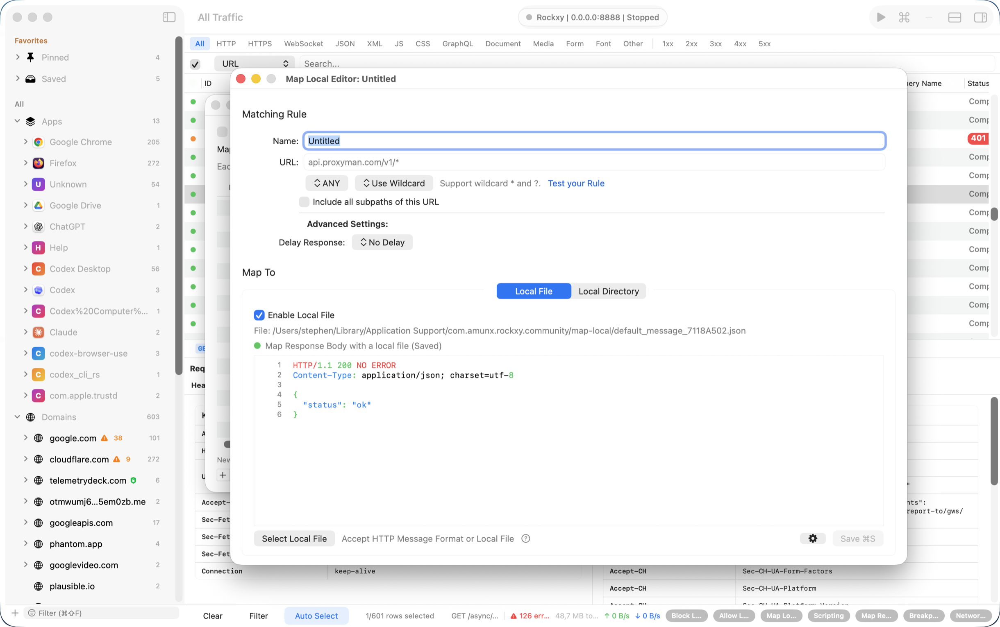

Serveer een opgeslagen bestand of een directorystructuur in plaats van een live antwoord. Verwissel een JSON-payload, speel een momentopname opnieuw af of maak een slechte API van derden vast aan een lokale kopie terwijl u fouten opspoort.

`File or Directory` · `Response Snapshot` · `Regex Patterns`

### Kaart op afstand

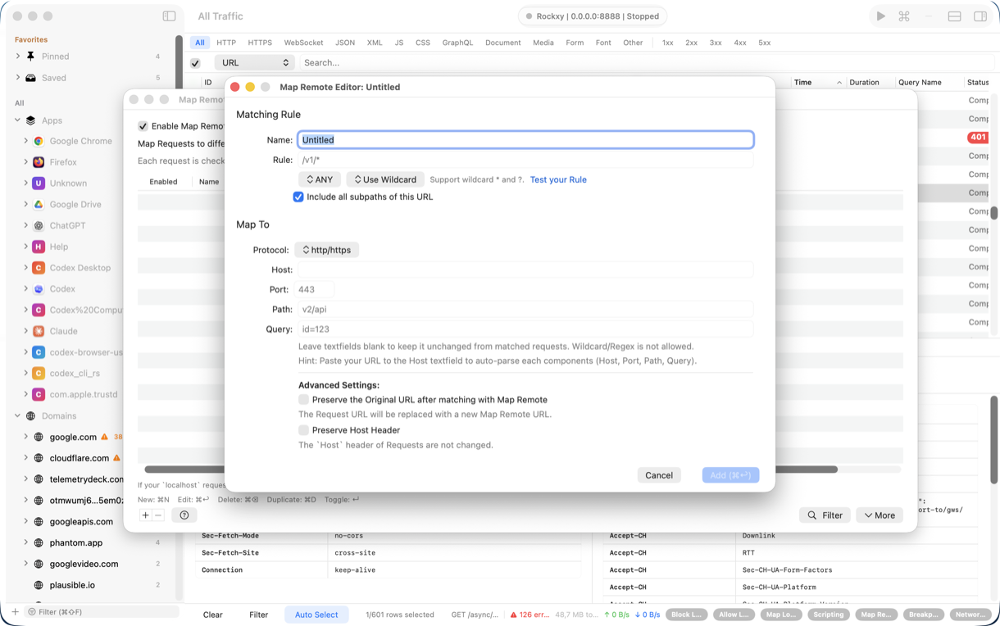

Herschrijf de bestemming van een vastgelegd verzoek zonder de app-code of /etc/hosts aan te raken. Richt het productieverkeer op de staging, uw ontwikkelserver of de machine van een collega voor een reproduceerbare bugreproductie.

`Host Rewrite` · `Regex Patterns` · `Preserve Host Header`

### Breekpunten en regels

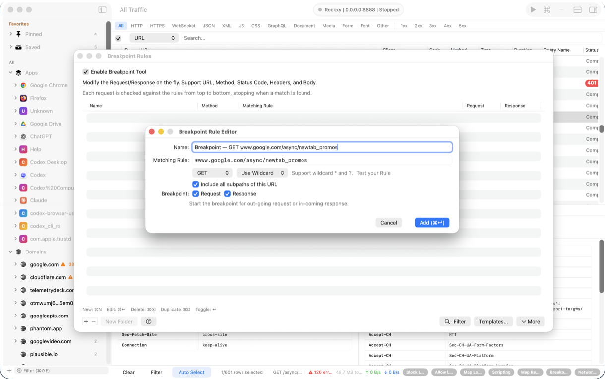

Pauzeer een verzoek of antwoord, bewerk de methode, kopteksten, hoofdtekst of status en ga vervolgens verder. De snelste manier om te testen "wat als de API 401 retourneert?" zonder de backend aan te raken.

`Request Breakpoints` · `Response Breakpoints` · `Block` · `Throttle` · `Regex / Wildcard Match` · `Inject Failure States`

### Wijzig kopteksten

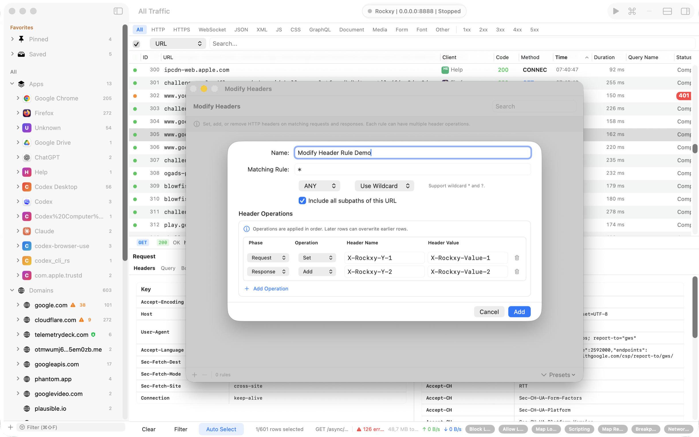

Voeg headers toe, verwijder of vervang ze op elke host zonder opnieuw te implementeren. Test CORS-, authenticatie- of cachewijzigingen binnen enkele seconden met ingebouwde presets.

`Add / Remove / Replace` · `CORS Presets` · `Auth Stripping` · `Request Phase` · `Response Phase` · `URL Pattern Scope`

### Aangepaste verzoek- en antwoordheaders

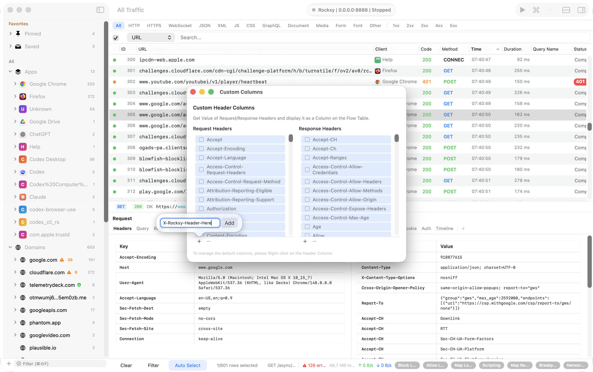

Promoveer elke verzoek- of antwoordheader tot een eersteklas kolom in de verkeerstabel. Houd verzoek- en antwoordbronnen gescheiden, bewaar de headers die u belangrijk vindt en scan vervolgens request-ID's, trace-ID's, cachestatus of eigen metadata zonder elke inspector te openen.

`Request Headers` · `Response Headers` · `Saved Columns` · `Trace IDs` · `Case-Insensitive Match` · `Live Table Update`

### Netwerkvoorwaarden

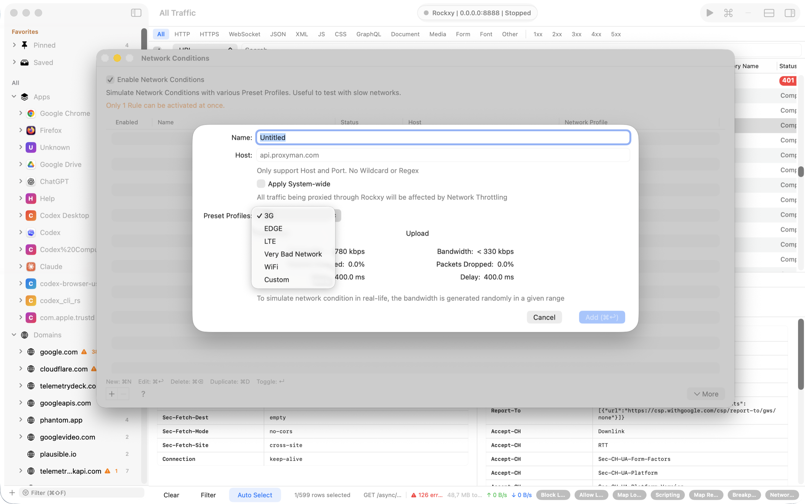

Geef gas naar 3G, EDGE, LTE, WiFi of een aangepaste vertraging. Je laptop beschikt over glasvezel; uw gebruikers niet: bekijk de UX op 400 ms RTT voordat zij dat doen.

`3G` · `EDGE` · `LTE` · `WiFi` · `Very Bad Network` · `Custom Latency`

### Componeren - Bewerken en opnieuw afspelen

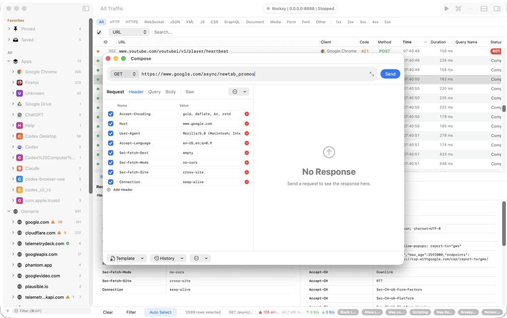

Herbouw elk vastgelegd HTTP-verzoek (wijzig de methode, URL, headers, queryparameters of hoofdtekst) en verzend het opnieuw zonder Rockxy te verlaten. Geen kopieer-plak-lus naar Postman, Insomnia of curl. Herhaal LLM-prompts, fuzz verificatiegrenzen of reproduceer binnen enkele seconden een falende case voor OpenAI-, Anthropic- en Cohere-eindpunten.

`Edit Headers` · `Edit Body` · `Edit Query` · `Edit Method` · `LLM Prompt Iteration` · `Postman Alternative` · `OAuth Flow Debug` · `Webhook Replay`

### Vergelijk

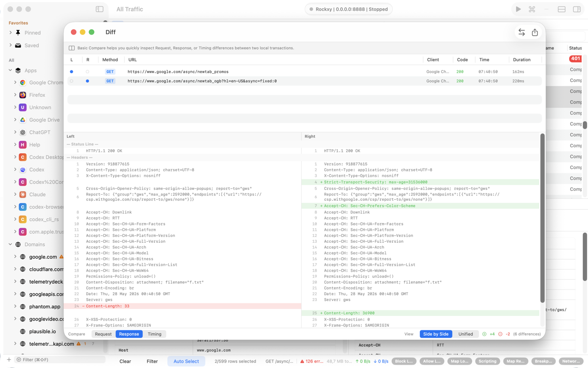

Stapel twee vastgelegde transacties of geplakte payloads naast elkaar en ontdek elk veld dat is veranderd: status, headers, JSON-sleutels of bodybytes. Vang stille API-regressies, niet-deterministische LLM-uitvoer en prompt-drift op zonder iets in een diff-tool van derden te verwerken.

`Diff Compare` · `Side-by-Side` · `JSON Diff` · `Header Diff` · `Body Diff` · `LLM Output Compare` · `Non-determinism` · `API Regression` · `Schema Drift`

### Aangepaste Previewer-tabbladen

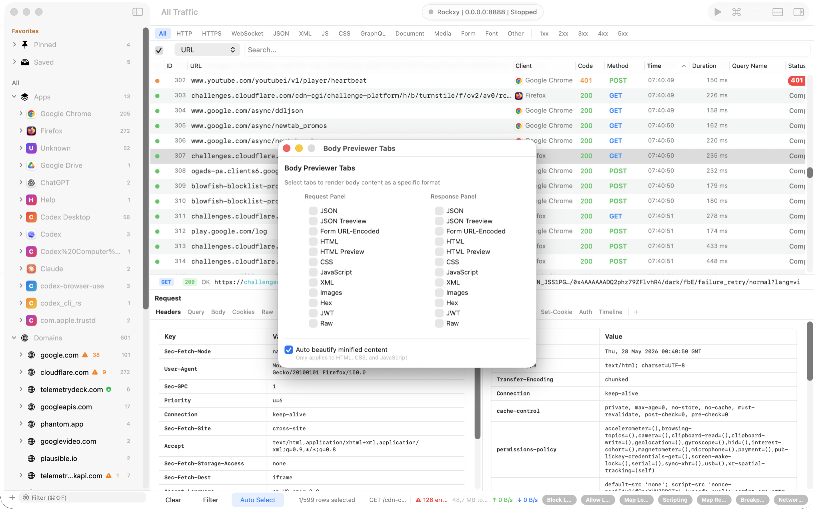

Geef verzoek- en antwoordteksten weer zoals u dat wilt. Maak extra tabbladen vast aan de inspecteur voor JSON, GraphQL, JWT, afbeelding of uw eigen indeling – herbruikbaar voor elk vastgelegd verzoek.

`JSON` · `GraphQL` · `JWT Decoder` · `Image / Hex` · `Custom Format` · `Pinned per Inspector`

### Sessies en exporteren

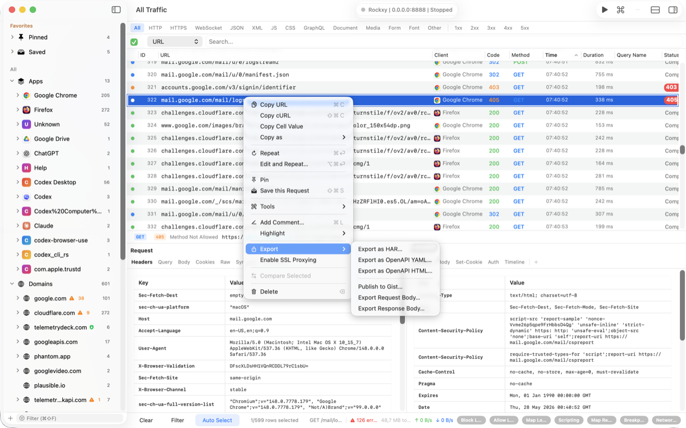

Sla sessies op, import/exporteer HAR voor cross-tool overdracht, kopieer elk verzoek als cURL of JSON. Bewerk autorisatieheaders, cookies en dragertokens voordat u ze deelt. Geef een teamgenoot een werkende bugreproductie zonder geheimen te lekken.

`.rockxysession` · `HAR Import / Export` · `Copy as cURL` · `Copy as JSON` · `Raw HTTP` · `Secret Redaction` · `Token Sanitize` · `Privacy-Safe Share`

### Werkruimten met meerdere tabbladen

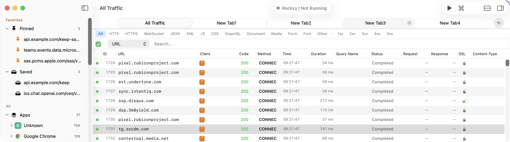

Houd onafhankelijke onderzoeksweergaven van dezelfde live capture naast elkaar — één tabblad voor staging-verkeer, één voor productie en één voor een iOS-apparaatstroom. Elk tabblad behoudt eigen filters, sortering, selectie, sidebar-scope en inspectorstatus, terwijl proxy en vastgelegde transacties worden gedeeld.

`Shared Live Capture` · `Per-Tab Filters & Sort` · `Per-Tab Inspector` · `Compare Environments` · `Mac & iOS Together` · `Detach & Rename`

### JavaScript-scripting

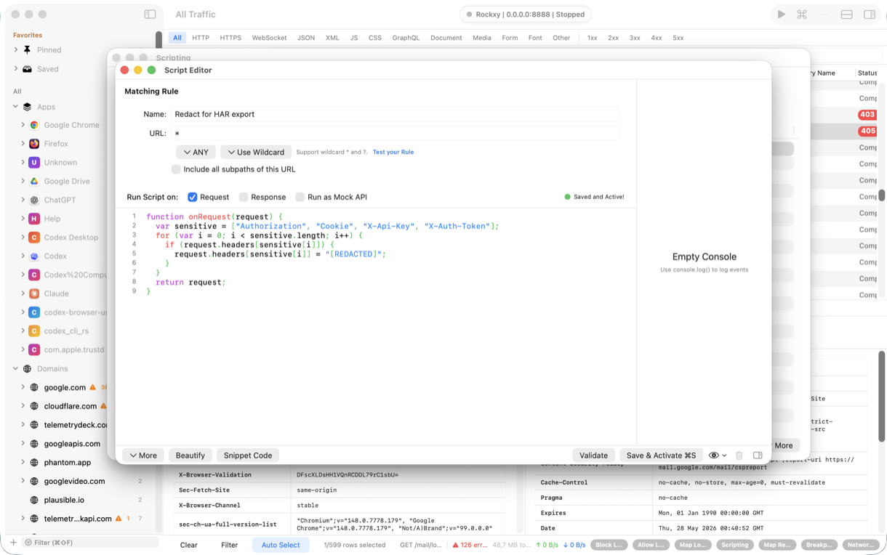

JS haakt in op verzoeken en antwoorden voor de gevallen die een statische regel niet kan dekken: PII redigeren, tokens ondertekenen, payloads herschrijven. Fouten komen inline naar voren in plaats van het verkeer te corrumperen.

`Request Hooks` · `Response Hooks` · `Programmatic Filtering` · `PII Redaction` · `Inline Error Feedback`

## Protocolbewuste Inspectie

Rockxy biedt protocolbewuste inspectie voor AI, Web3 RPC en x402 binnen de normale HTTP-debugworkflow.

### AI Verkeersinspectie

Rockxy detecteert herkende AI-verzoeken binnen de normale capture-workflow. Inspecteer geselecteerde modelaanroepen, streaming-status, usage-velden indien aanwezig, waarschuwingen, retrieval hints en tool-call-samenvattingen zonder gevoelige payloads in een andere service te plakken.

`AI Requests` · `Model Inspector` · `Streaming State` · `Tool Calls` · `Retrieval Hints` · `Usage Signals`

### Web3/RPC-inspectie

Rockxy verandert netwerkoproepen uit het blockchain-tijdperk in leesbaar bewijs voor foutopsporing. Inspecteer EVM- en Solana-achtig HTTP JSON-RPC-verkeer met provider host, request ID, method, batch summary, error, chain, transaction, payload en debug-intent-detail, zonder Rockxy in een wallet of block explorer te veranderen.

`JSON-RPC` · `Solana RPC` · `Request ID` · `RPC Errors` · `Batch Summary` · `Network Evidence`

### x402 Payment Flow Hints

Rockxy markeert payment-required en op retry gerichte hints, zodat payment-gated HTTP-stromen begrijpelijk zijn vanuit de netwerklaag, terwijl het debugbewijs lokaal en redaction-aware blijft.

`Payment Required` · `Retry Flow` · `Headers` · `Redaction` · `Local First`

## Toekomstig Werk

De volgende secties beschrijven de openbare richting, niet het huidige gedrag.

### Protocolbewuste regels

Rockxy kan AI- en Web3-verkeer vandaag al labelen en inspecteren. Diepere regelmatching op model, tool call, JSON-RPC-method, chain, transaction hash of batch subcall blijft toekomstig werk; de huidige verkeerswijzigingstools matchen nog steeds URL, HTTP-method en headers.

`Smart Filters` · `Request Badges` · `Protocol Column` · `Inspector Tabs` · `Future Rule Metadata`

### Geredigeerde bewijsbundels `Binnenkort`

Deel de feiten die nodig zijn om een bug te reproduceren zonder geheimen te lekken. Verpak geselecteerd verkeer met protocolsamenvattingen, redactievoorbeelden en broncontext die een teamgenoot kan controleren.

`Debug Bundles` · `Protocol Summary` · `Export Preview` · `Secret Redaction` · `Repro Context`

### Team delen en samenwerken `Binnenkort`

Stuur een vastgelegde sessie met één klik naar een teamgenoot. Annoteer falende verzoeken inline, kijk in realtime wie naar wat kijkt en debug HTTPS-verkeer zonder het scherm te delen. Gericht op een toekomstige release.

`Shared Sessions` · `Team Workspaces` · `Inline Comments` · `Live Cursor` · `Cloud Sync` · `Pair Debug` · `SSO` · `Audit Log`

> Native macOS-app-shell — geen Electron. SwiftUI + AppKit + SwiftNIO, met WebKit alleen gebruikt voor HTML-body-preview.

## Snel beginnen

```bash
git clone https://github.com/RockxyApp/Rockxy.git
cd Rockxy
open Rockxy.xcodeproj
```

Bouw en voer uit in Xcode. Het welkomstvenster begeleidt u bij het instellen van de root-CA, de helperinstallatie en de proxy-activering.

**Vereisten:** macOS 14.0+, Xcode 16+, Swift 5.9

Als je Rockxy na de installatie met een lokale MCP-client wilt verbinden, zie dan de [MCP-integratiegids](docs/features/mcp.mdx).

## Rockxy versus alternatieven

De hoofdmatrix omvat algemene proxy's voor webfoutopsporing. Beveiligingstests
suites en browser/API-georiënteerde interceptors met aanzienlijke workflow-overlapping
worden afzonderlijk vermeld, zodat andere producten niet als onderling uitwisselbaar worden gepresenteerd.
Pakketanalysatoren en clients die alleen API gebruiken, vallen buiten deze vergelijking.

### Directe proxy's voor webfoutopsporing

|  | **Rockxy** | **Proxyman** | **Charles Proxy** | **mitmproxy** | **HTTP Toolkit** | **Fiddler Everywhere** |
|---|---|---|---|---|---|---|
| **Productvorm** | Native macOS-foutopsporingsproxy | Native macOS-app; Electron-gebaseerde Windows/Linux-edities | Cross-platform desktop-foutopsporingsproxy | Cross-platform CLI/TUI en web-UI proxy-toolkit | Cross-platform Electron desktopproxy en HTTP-client | Cross-platform desktop-foutopsporingsproxy |
| **Bron- en bouwmodel** | Openbare communitybron onder AGPL-3.0-or-later; bouwbaar met Xcode. De officiële DMG bevat ook niet-openbare downstream-componenten | Gesloten bron; geen openbare applicatiebron geïdentificeerd in het beoordeelde officiële materiaal | Gesloten bron; geen openbare applicatiebron geïdentificeerd in het beoordeelde officiële materiaal | Openbare MIT-gelicentieerde bron; bouwbaar vanaf bron | Openbare AGPL desktopbron; bouwbaar vanaf de bron; gepubliceerde binaire bestanden hebben extra licentiemogelijkheden | Gesloten bron; gedistribueerd als objectcode onder de Fiddler Everywhere EULA |
| **Vastleggen en instellen** | Lokale systeemproxy met begeleide installatie voor Mac-apps, runtimes, iOS-apparaten en Simulator | Automatische configuratie voor Mac-apps, runtimes en mobiele apparaten | Lokale proxy met macOS-, iOS- en platformonafhankelijke installatiehandleidingen | Reguliere, lokale proces-, WireGuard-, omgekeerde, transparante en andere opnamemodi | Gerichte en handmatige proxy-onderschepping voor browsers, runtimes, containers en mobiele apparaten | Systeem-, netwerk-, browser-, terminal-, expliciete en externe apparaatopnamemodi |
| **Wijzigen en bespotten** | Breekpunten, Map Local/Remote, headerregels, blokkering en latentieregels | Breekpunten, Map Local/Remote, blokkeerlijsten, netwerkvoorwaarden en JavaScript-regels | Breekpunten, herschrijven, Map Local/Remote, blokkeren en beperken | Map Local/Remote, wijziging van hoofdtekst/header, blokkeren en serverherhaling | Breekpunten plus op regels gebaseerd herschrijven, omleiden, schijn- en foutinjectie; sommige automatisering is plangebonden | Regels, breekpunten, omleidingen, reactiewijzigingen en spottende opmerkingen |
| **Herhaal en vergelijk** | Opstellen/afspelen plus lokaal naast elkaar geplaatst verzoek, header en bodyvergelijking | Componeren, herhalen en differentiëren | Aanvragen herhalen en bewerken | Herhaling op client- en serverzijde | Ingebouwde HTTP-client voor het opstellen en verzenden van verzoeken | API Componist, verkeersherhaling en verkeersvergelijking gedocumenteerd als bèta |
| **WebSocket-workflows** | Tekst-/binaire frame-inspectie met begrensde Protobuf-heuristieken | WS/WSS-inspectie; scripts kunnen handshake-URL/headers wijzigen, geen berichten | WebSocket-ondersteuning is gedocumenteerd in de officiële versiegeschiedenis | WebSocket onderschepping en scripting; WebSocket opnieuw afspelen wordt niet ondersteund | WebSocket-inspectie plus WebSocket-specifieke regels | WebSocket afvang en inspectie |
| **Scripting en uitbreidbaarheid** | Sandboxed JavaScriptCore hooks met een begrensde API en uitvoeringstime-out | JavaScript verzoek/antwoord-scripting | Herschrijf regels en een controle-webinterface; geen algemene JavaScript-scriptfunctie gedocumenteerd | Python-add-ons en opdrachtregelautomatisering | Op regels gebaseerde automatisering plus openbare bron- en proxybibliotheken | Regelgebaseerde automatisering; geen algemene scriptfunctie van eigen hand gedocumenteerd |
| **Upstream-routering** | [HTTP/HTTPS upstream proxy en PAC URL-routering](docs/features/upstream-proxy.mdx); Het communitybeleid schakelt proxy-authenticatie uit en SOCKS5 en caps omzeilen regels op drie | Externe HTTP/HTTPS/SOCKS- en PAC-routering met bypass-regels | Externe HTTP/HTTPS/SOCKS-proxy's met authenticatie- en bypass-regels | HTTP/HTTPS upstream-modus plus omgekeerde en SOCKS luisteraarmodi | Systeem-, HTTP-, HTTPS- en SOCKS upstream-instellingen; planlimieten kunnen van toepassing zijn | Automatische koppeling aan systeemproxy's plus reverse-proxy-opname |
| **AI en MCP** | [In-app AI Assistant](docs/features/ai-assistant.mdx) en [ingebouwde lokale MCP](docs/features/mcp.mdx) met 10 alleen-lezen tools, tokenauthenticatie en redactie standaard ingeschakeld | Ingebouwde MCP voor externe AI-clients, inclusief verkeerslezingen en app-/regelcontroles | Niet gedocumenteerd | Niet gedocumenteerd | Een gebundelde lokale MCP-brug is aanwezig in de huidige officiële bron; geen in-app-assistent gedocumenteerd | Ingebouwde MCP plus een professionele foutopsporingsassistent waarvan de huidige documentatie vereist dat vastgelegde verkeersgegevens in de chat worden geplakt |

### Aangrenzende onderscheppingstools

Deze producten overlappen betekenisvol met Rockxy, maar zijn toonaangevend op het gebied van beveiligingstests.
browserregels of API-clientworkflows in plaats van hetzelfde algemene doel
native debugging-proxy focus.

| **Product** | **Waarom het aangrenzend is** | **Bron- en bouwmodel** | **Relevante overlap** | **AI en MCP** |
|---|---|---|---|---|
| **Burp Suite** | Testpakket voor webbeveiliging met een onderscheppende proxy | Gesloten source-applicatie; in de EULA staat dat gebruikers geen recht hebben op de applicatiebron. Extensies kunnen aparte licenties gebruiken | Proxy-onderschepping en match/replace, Repeater, WebSockets, upstream/SOCKS proxying en een groot uitbreidingsecosysteem | Burp AI is beschikbaar in Repeater; PortSwigger onderhoudt ook een openbare MCP-serverextensie voor externe AI-clients |
| **ZAP** | Beveiligingsscanner en onderscheppingsproxy | Openbare Apache-2.0-bron; bouwbaar vanaf bron | Onderscheppen/bewerken, handmatig opnieuw verzenden, WebSocket breekpunten en scripts, meertalige scripting, add-ons en automatisering | Officiële MCP-integratie en optionele LLM-ondersteuningsadd-ons |
| **Requestly HTTP Interceptor** | Browserextensie en platformonafhankelijke desktop-interceptor/mock-tool | Openbare AGPL desktop-interceptorbron; de afzonderlijke Requestly API Client is eigendom volgens de openbare community-repository-kennisgeving | Systeembrede/browserregistratie, omleiding, Map Local/Remote, header/body-wijziging, JavaScript-transformaties, mocks en vertragings-/foutsimulatie | Een aparte officiële MCP-server beheert regels en groepen; geen in-app-assistent voor verkeersanalyse gedocumenteerd |

De beschikbaarheid van functies kan variëren per editie, abonnement, platform of add-on.
"Niet gedocumenteerd" betekent dat er geen mogelijkheid is gevonden in de officiële first-party
bronnen beoordeeld op 2026-08-22; het is geen bewijs dat dit vermogen ontbreekt.
Product- en functieverklaringen hierboven zijn gecontroleerd aan de hand van leveranciersdocumentatie,
door de leverancier onderhouden bronopslagplaatsen, of licentievoorwaarden van de leverancier op die datum en
kan veranderen. Productnamen en handelsmerken zijn eigendom van hun respectievelijke eigenaren;
Rockxy is niet gelieerd aan of goedgekeurd door hen. Correcties zijn welkom
via de Rockxy issuetracker.

Op de routekaart: diepere protocolbewuste regels, veiliger geredigeerde bewijsbundels, sterkere herhalings- en vergelijkingsworkflows, bredere richtlijnen voor het instellen van ontwikkelaars en voortgezet HTTP/2- en HTTP/3-onderzoek.

## Beveiliging

Rockxy onderschept netwerkverkeer – beveiliging is fundamenteel, niet optioneel.

- XPC-helper valideert bellers via **certificaatketenvergelijking**, niet alleen bundel-ID
- Plug-ins komen binnen **gesandboxte JavaScriptCore** met een time-out van 5 seconden, geen toegang tot het bestandssysteem/netwerk
- **Invoervalidatie** op alle grenzen: maximale lichaamsgrootte, URI-limieten, regex DoS-bescherming, preventie van padtraversal
- Referenties **automatisch geredigeerd** in vastgelegde logboeken
- Gevoelige bestanden opgeslagen met **0o600 machtigingen**

Meld kwetsbaarheden via [BEVEILIGING.md](SECURITY.md). Zie de [volledige beveiligingsarchitectuur](docs/development/security.mdx) voor details.

## Routekaart

De publieke roadmap van Rockxy is workflow-georiënteerd en datumvrij. Het richt zich op betrouwbaarheid, native macOS UX, debugging-workflows, protocolondersteuning, verkeerszichtbaarheid uit het AI/Web3-tijdperk, documentatie en onboarding van bijdragers.

- [ROADMAP.md](ROADMAP.md): leiding op hoog niveau in de openbare techniek
- [Rockxy openbare routekaart](https://github.com/orgs/RockxyApp/projects/1): operationele zichtbaarheid voor problemen die via de routekaart worden gevolgd

## Documentatie

Volledige documentatie beschikbaar op de [Rockxy-documenten](docs/index.mdx):

- [Snelstartgids](docs/quickstart.mdx) - binnen enkele minuten aan de slag
- [Installatiehub voor ontwikkelaars](docs/features/developer-setup-hub.mdx) — runtimefragmenten, apparaathandleidingen, validatietests en ondersteuningsmatrix
- [AI Assistant](docs/features/ai-assistant.mdx) — onderzoek geselecteerd verkeer lokaal of met een geconfigureerd model na Review Data
- [Filters en zoeken](docs/core-features/filters-and-search.mdx) — sidebar-scopes, Focus Sets, Noise Control, toolbar-filters en zoeken
- [AI- en Web3-inspectie](docs/features/ai-web3-inspection.mdx) — inspecteer herkend model API-, JSON-RPC- en x402-verkeer
- [MCP-integratie](docs/features/mcp.mdx) — verbind Rockxy met lokale MCP-clients
- [Architectuur](docs/development/architecture.mdx) — proxy-engine, actormodel, gegevensstroom
- [Beveiligingsmodel](docs/development/security.mdx) — vertrouwensgrenzen, XPC-validatie, certificaatbeheer
- [Ontwerpbeslissingen](docs/development/design-decisions.mdx) — waarom SwiftNIO, NSTableView, acteurs
- [Bouwen vanuit de Bron](docs/development/building.mdx) - bouwen, testen, linten en debuggen
- [Codestijl](docs/development/code-style.mdx) — SwiftLint, SwiftFormat en conventies
- [Wijzigingslog](CHANGELOG.md) — niet-uitgebracht werk en getagde releases

## Bijdragen

Bijdragen zijn welkom: code, tests, documenten, bugrapporten en UX-feedback.

Zie **[BIJDRAGEN.md](CONTRIBUTING.md)** voor installatie-instructies, codestijl en de volledige PR-checklist.

Goede eerste nummers zijn gelabeld [`good first issue`](https://github.com/RockxyApp/Rockxy/labels/good%20first%20issue). Door een PR te openen, gaat u akkoord met de [CLA](CLA.md).

## Sponsoren & Partners

Rockxy wordt onafhankelijk onderhouden. Sponsoring helpt de voortdurende ontwikkeling, release-infrastructuur, documentatie en beveiligingswerk te financieren.

<p align="center">
  <a href="https://opencollective.com/rockxy/donate">
    
  </a>
  <a href="https://github.com/sponsors/LocNguyenHuu">
    
  </a>
</p>

Rockxy wordt fiscaal gehost door [Open Source Collective](https://docs.oscollective.org/). Bijdragen en projectuitgaven worden vastgelegd op de [openbare Open Collective-pagina van Rockxy](https://opencollective.com/rockxy), zodat ondersteuners transparant kunnen zien hoe fondsen worden ontvangen en gebruikt.

| Niveau | Bijdrage | Wat het ondersteunt |
|--------|----------|---------------------|
| **Backer** | Vanaf $5/maand | Open-sourceonderhoud, documentatie, tests en releases |
| **Builder** | Vanaf $25/maand | Regressietests, prestatieverbeteringen en dagelijkse debuggingworkflows |
| **Sponsor** | $100/maand | Langdurig onderhoud van een privacygericht hulpmiddel dat gratis blijft voor ontwikkelaars |
| **Sustaining Sponsor** | $500/maand | Gericht onderhoud en productontwikkeling, inclusief releaseautomatisering en protocolondersteuning |

**Vragen over partnerschap** — ontwikkelaarstoolbedrijven, beveiligingsbedrijven en bedrijfsteams die op zoek zijn naar aangepaste integraties of white-label-oplossingen: [rockxyapp@gmail.com](mailto:rockxyapp@gmail.com)

## Ondersteuning

- [Open Collective](https://opencollective.com/rockxy/donate) — draag bij aan Rockxy via het transparante projectbudget
- [GitHub Sponsors](https://github.com/sponsors/LocNguyenHuu) — ondersteuning van de ontwikkeling van Rockxy
- [GitHub-problemen](https://github.com/RockxyApp/Rockxy/issues) - bugrapporten en functieverzoeken
- [GitHub-discussies](https://github.com/RockxyApp/Rockxy/discussions) - vragen en community-chat
- **E-mail** — [rockxyapp@gmail.com](mailto:rockxyapp@gmail.com)
- **Beveiligingsproblemen** – zie [BEVEILIGING.md](SECURITY.md) voor verantwoorde openbaarmaking

## Licentie

[GNU Affero Algemene Publieke Licentie v3.0](LICENSE) — Copyright 2024–2026 Rockxy-bijdragers.

## Sterrengeschiedenis

<a href="https://star-history.dera.page/#RockxyApp/Rockxy&type=date&legend=top-left">
 <picture>
   <source media="(prefers-color-scheme: dark)" srcset="https://star-history.dera.page/svg?repos=RockxyApp/Rockxy&type=date&theme=dark&legend=top-left" />
   <source media="(prefers-color-scheme: light)" srcset="https://star-history.dera.page/svg?repos=RockxyApp/Rockxy&type=date&legend=top-left" />
   
 </picture>
</a>

---

<p align="center">
  <sub>Gemaakt door <a href="https://github.com/LocNguyenHuu">Stephen</a>. Gebouwd met Swift, SwiftNIO, SwiftUI en AppKit.</sub>
</p>
