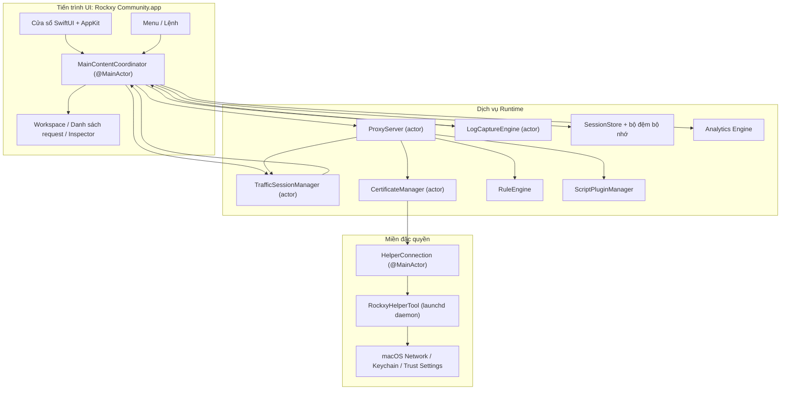
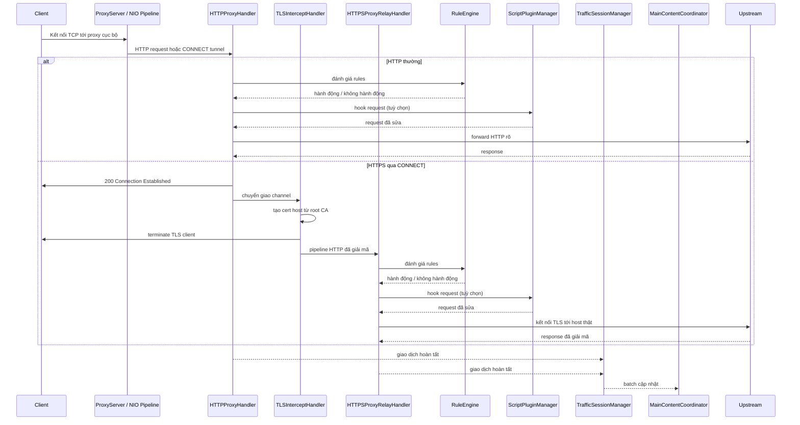
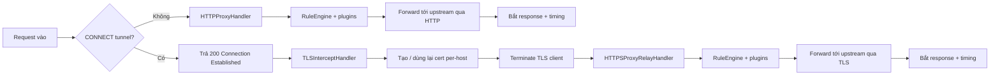
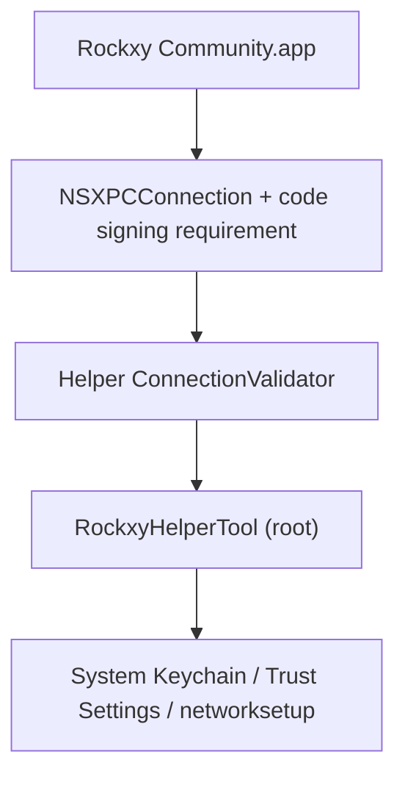

<p align="center">
  
</p>

<h1 align="center">Rockxy</h1>

<p align="center">
  <strong>Proxy gỡ lỗi HTTP mã nguồn mở cho macOS.</strong>
</p>

<p align="center">
  Chặn bắt lưu lượng HTTP/HTTPS, kiểm tra request API, gỡ lỗi WebSocket và phân tích truy vấn GraphQL.<br>
  Xây dựng bằng Swift với SwiftNIO, SwiftUI và AppKit.
</p>

<p align="center">
  <a href="#"></a>
  <a href="#"></a>
  <a href="LICENSE"></a>
  <a href="CONTRIBUTING.md"></a>
  <a href="https://github.com/sponsors/LocNguyenHuu"></a>
</p>

<p align="center">
  
</p>

---

> **Trạng thái**: Đang phát triển tích cực. Engine proxy, chặn bắt HTTPS, hệ thống rules, hệ sinh thái plugin và UI inspector đã hoạt động. Xem [CHANGELOG.md](CHANGELOG.md) để theo dõi tiến độ.

## Tính năng

### Bắt lưu lượng mạng
- **Proxy HTTP/HTTPS** — proxy can thiệp dựa trên SwiftNIO với hỗ trợ CONNECT tunnel
- **Chặn bắt SSL/TLS** — giải mã MITM với chứng chỉ per-host được tạo tự động (LRU cache ~1000)
- **Gỡ lỗi WebSocket** — bắt và kiểm tra frame hai chiều
- **Nhận diện GraphQL** — tự động trích xuất tên operation và kiểm tra query
- **Nhận diện tiến trình** — xem ứng dụng nào (Safari, Chrome, curl, Slack, Postman, v.v.) tạo request qua `lsof` + phân tích User-Agent

### Trình inspector request/response
- **JSON viewer** — cây gập/mở với tô màu cú pháp
- **Hex inspector** — hiển thị body nhị phân cho dữ liệu không phải text
- **Timing waterfall** — trực quan hóa DNS, TCP connect, TLS handshake, TTFB và transfer cho từng request
- **Headers, cookies, query params, auth** — inspector theo tab kèm chế độ raw
- **Cột header tùy chỉnh** — chọn thêm header request/response để hiển thị theo cột

### Workspace & năng suất
- **Tab workspace** — tách không gian làm việc với bộ lọc và trạng thái riêng
- **Favorites** — ghim host hoặc request hay dùng để truy xuất nhanh
- **Timeline view** — dòng thời gian trực quan cho chuỗi request đã chọn

### Thao tác lưu lượng & Mock API
- **Map Local** — trả response từ file cục bộ (mock API không cần sửa server)
- **Map Remote** — chuyển hướng sang host/port/path khác (test gateway, switch staging ↔ production)
- **Breakpoints** — tạm dừng request/response, sửa URL/header/body/status rồi tiếp tục hoặc hủy
- **Block List** — chặn request theo pattern URL (wildcard hoặc regex)
- **Throttle** — mô phỏng mạng chậm bằng cách trì hoãn forwarding
- **Modify Headers** — thêm, xóa hoặc thay thế header động
- **Allow List** — chỉ bắt lưu lượng từ domain/app được chọn để giảm nhiễu
- **Bypass Proxy** — bỏ qua proxy cho host nhất định khi bật system proxy
- **Rules SSL Proxying** — kiểm soát MITM TLS theo từng domain

### Gỡ lỗi & phân tích
- **Tích hợp OSLog** — bắt log hệ thống macOS và đối chiếu theo timestamp
- **So sánh side-by-side** — so sánh hai request/response đã bắt
- **Request timeline** — waterfall theo chuỗi request và thời gian
- **Tự động ẩn thông tin nhạy cảm** — redaction Bearer token và mật khẩu

### Mở rộng
- **Hệ thống plugin JavaScript** — mở rộng bằng script (JavaScriptCore, sandbox timeout 5s)
- **Hook request/response** — plugin có thể kiểm tra và chỉnh sửa lưu lượng trong pipeline
- **UI cấu hình plugin** — form cấu hình tự sinh từ manifest
- **Định dạng export** — copy dưới dạng cURL, HAR, raw HTTP hoặc JSON
- **Compose + replay** — chỉnh sửa và gửi lại request, hoặc replay lưu lượng đã bắt
- **Import review** — xem trước HAR/session trước khi lưu vào storage

### Trải nghiệm macOS thuần
- **SwiftUI + AppKit thuần** — không Electron, không web view, không thỏa hiệp đa nền tảng
- **Danh sách request bằng NSTableView** — cuộn ảo cho 100k+ request không lag
- **Icon ứng dụng thật** — tra theo bundle ID bằng `NSWorkspace`
- **Tích hợp system proxy** — helper đặc quyền để không phải nhập mật khẩu nhiều lần (SMAppService)
- **Dark mode** — hỗ trợ đầy đủ theo hệ thống
- **Phím tắt** — Cmd+Shift+R (start), Cmd+. (stop), Cmd+K (clear), v.v.

## Trường hợp sử dụng

- **Gỡ lỗi app iOS / macOS** — xem API call từ Simulator hoặc thiết bị thật
- **Test REST API** — xem cặp request/response chính xác mà không cần mở công cụ khác
- **Gỡ lỗi GraphQL** — xem operation, biến và response nhanh chóng
- **Mock API response** — map file cục bộ cho endpoint để dev offline hoặc test edge case
- **Kiểm tra WebSocket** — debug kết nối realtime (chat, live feed, game)
- **Phân tích hiệu năng** — xác định endpoint chậm, payload lớn, request dư thừa
- **Gỡ lỗi SSL/TLS** — kiểm tra HTTPS với kiểm soát MITM theo domain
- **Ghi lại lưu lượng mạng** — bắt và replay phiên HTTP để regression test
- **Reverse engineering API** — hiểu hành vi API không tài liệu hóa từ app bên thứ ba
- **Tích hợp CI/CD** — proxy headless cho kiểm thử hợp đồng API (dự kiến)

## Rockxy vs Proxyman vs Charles Proxy

Đang tìm một lựa chọn thay thế Proxyman hoặc Charles Proxy mã nguồn mở? Bảng dưới đây so sánh Rockxy:

| Tính năng | Rockxy | Proxyman | Charles Proxy |
|---------|--------|----------|---------------|
| **Giấy phép** | Mã nguồn mở (AGPL-3.0) | Độc quyền (freemium) | Độc quyền (trả phí) |
| **Giá** | Miễn phí | Miễn phí giới hạn + $69/năm | $50 trả một lần |
| **Nền tảng** | macOS | macOS, iOS, Windows | macOS, Windows, Linux |
| **Mã nguồn** | Công khai trên GitHub | Đóng | Đóng |
| **Công nghệ** | Swift + SwiftNIO (native) | Swift + AppKit (native) | Java (đa nền tảng) |
| **Chặn bắt HTTP/HTTPS** | Có | Có | Có |
| **Gỡ lỗi WebSocket** | Có | Có | Có |
| **Nhận diện GraphQL** | Có (tự động) | Có | Không |
| **Map Local** | Có | Có | Có |
| **Map Remote** | Có | Có | Có |
| **Breakpoints** | Có | Có | Có |
| **Block List** | Có | Có | Có |
| **Modify Headers** | Có | Có | Có (rewrite) |
| **Throttle / Network Conditions** | Có | Có | Có |
| **So sánh request** | Có (side-by-side) | Có | Không |
| **Plugin JavaScript** | Có (JSCore sandbox) | Có (Scripting) | Không |
| **Replay request** | Có (Repeat + Edit) | Có | Có |
| **Import/Export HAR** | Có | Có | Không (định dạng riêng) |
| **Tích hợp OSLog** | Có | Không | Không |
| **Nhận diện tiến trình** | Có (app nào gửi) | Có | Không |
| **JSON tree viewer** | Có | Có | Có |
| **Hex inspector** | Có | Có | Có |
| **Timing waterfall** | Có | Có | Có |
| **Cuộn ảo (100k+ rows)** | Có (NSTableView) | Có | Chậm khi dữ liệu lớn |
| **Helper đặc quyền (không cần sudo)** | Có (SMAppService) | Có | Không (hỏi mật khẩu nhiều lần) |
| **Dark mode** | Có | Có | Một phần |
| **Tự host / kiểm toán** | Có | Không | Không |
| **Cộng đồng đóng góp** | Mở PR | Không | Không |

**Vì sao chọn Rockxy?**
- Bạn muốn một proxy gỡ lỗi HTTP **miễn phí, mã nguồn mở** không bị ràng buộc giấy phép
- Bạn muốn **kiểm toán mã nguồn** của công cụ đang can thiệp vào traffic
- Bạn muốn **đóng góp tính năng** hoặc tùy biến theo workflow của mình
- Bạn cần **OSLog correlation** để debug log macOS cùng traffic
- Bạn muốn **trải nghiệm macOS thuần** không chịu overhead của Java runtime

## Yêu cầu hệ thống

- macOS 14.0+ (Sonoma hoặc mới hơn)
- Xcode 16+
- Swift 5.9

## Bắt đầu nhanh

```bash
git clone https://github.com/LocNguyenHuu/Rockxy.git
cd Rockxy
xcodebuild -project Rockxy.xcodeproj -scheme Rockxy -configuration Debug build
```

Hoặc mở `Rockxy.xcodeproj` trong Xcode và bấm Run.

Lần chạy đầu tiên, cửa sổ Welcome sẽ hướng dẫn:
1. Tạo và tin cậy (trust) root CA
2. Cài helper đặc quyền để điều khiển system proxy
3. Bật system proxy
4. Khởi động proxy server

## Kiến trúc

### Tổng quan hệ thống

Rockxy được chia thành ba miền tin cậy và thực thi:

1. **Lớp UI + điều phối** — cửa sổ SwiftUI/AppKit, inspector, menu và `MainContentCoordinator`
2. **Lớp proxy/runtime** — SwiftNIO handler, cấp phát chứng chỉ, sửa request, lưu trữ, analytics và plugin
3. **Lớp helper đặc quyền** — daemon riêng chạy bằng launchd cho các thao tác hệ thống cần quyền cao

Mục tiêu thiết kế là tách xử lý packet khỏi main thread, đưa thao tác đặc quyền ra khỏi tiến trình app, và đồng bộ trạng thái UI qua actor hoặc `@MainActor`.

### Bản đồ thành phần



### Các lớp runtime

| Lớp | Thành phần chính | Trách nhiệm |
|-------|------------|----------------|
| **Presentation** | `MainContentCoordinator`, `ContentView`, các view inspector/request-list/sidebar | Giữ trạng thái UI, route command, bind dữ liệu proxy/log vào SwiftUI/AppKit |
| **Capture / transport** | `ProxyServer`, `HTTPProxyHandler`, `TLSInterceptHandler`, `HTTPSProxyRelayHandler` | Nhận traffic, xử lý CONNECT, MITM TLS, forward HTTP/HTTPS |
| **Mutation / policy** | `RuleEngine`, `BreakpointRequestBuilder`, `AllowListManager`, `NoCacheHeaderMutator`, `MapLocalDirectoryResolver` | Áp dụng rule trước khi forward hoặc lưu |
| **Certificate / trust** | `CertificateManager`, `RootCAGenerator`, `HostCertGenerator`, `CertificateStore`, `KeychainHelper` | Sinh và quản lý root CA, cache chứng chỉ, kiểm tra trust, lưu Keychain |
| **Storage / session** | `TrafficSessionManager`, `LogCaptureEngine`, `SessionStore`, bộ đệm trong RAM | Đệm dữ liệu, lưu một phần vào SQLite và batch cập nhật UI |
| **Observability / analysis** | analytics, nhận diện GraphQL, nhận diện content-type, log correlation | Bổ sung metadata cho traffic |
| **Tích hợp hệ thống đặc quyền** | `HelperConnection`, `RockxyHelperTool`, XPC protocol dùng chung | Áp dụng system proxy và thao tác chứng chỉ cần quyền cao |

### Vòng đời request proxy



### Luồng HTTP vs HTTPS



### Mô hình concurrency

- `ProxyServer` là actor sở hữu vòng đời bind/shutdown.
- NIO handlers chạy trên event-loop và chỉ bridge vào actor khi cần.
- `CertificateManager`, `TrafficSessionManager` và các service liên quan dùng actor thay vì lock tay.
- `MainContentCoordinator` là `@MainActor` để đồng bộ SwiftUI/AppKit.
- Cập nhật UI được batch thay vì per-transaction để tránh nghẽn main thread dưới tải lớn.

### Các subsystem chính

| Subsystem | Vị trí | Vai trò |
|-----------|----------|--------------|
| **Proxy Engine** | `Core/ProxyEngine/` | `ServerBootstrap` của SwiftNIO, pipeline per-connection, CONNECT, TLS handoff, forward HTTP/HTTPS |
| **Certificate** | `Core/Certificate/` | Root CA, cấp chứng chỉ host, kiểm tra trust, lưu disk + Keychain, cache cert |
| **Rule Engine** | `Core/RuleEngine/` | Đánh giá rule theo thứ tự: block, map local, map remote, throttle, modify headers, breakpoint |
| **Traffic Capture** | `Core/TrafficCapture/` | Batch session, allow-list policy, replay, handoff trạng thái proxy cho UI |
| **Storage** | `Core/Storage/` | SQLite, buffer trong RAM, offload body lớn |
| **Detection / enrichment** | `Core/Detection/` | Nhận diện GraphQL, content type, nhóm endpoint |
| **Plugins** | `Core/Plugins/` | JSCore runtime cho hook request/response và config plugin |
| **Helper Tool** | `RockxyHelperTool/`, `Shared/` | XPC đặc quyền cho proxy override, bypass domain, cài/gỡ chứng chỉ |

### Kiến trúc bảo mật

> **Báo cáo lỗ hổng:** Nếu phát hiện vấn đề bảo mật, vui lòng báo riêng tư. Xem [SECURITY.md](SECURITY.md) để biết quy trình disclosure.

Rockxy dùng mô hình bảo mật nhiều lớp vì có MITM TLS, lưu traffic nhạy cảm và giao tiếp với helper chạy quyền root.



#### Biên giới bảo mật

| Biên giới | Rủi ro | Cơ chế hiện tại |
|----------|------|-----------------|
| **App ↔ helper** | Ứng dụng không tin cậy gọi thao tác proxy/cert đặc quyền | `NSXPCConnection` với yêu cầu code-signing và helper-side validation kèm so sánh chuỗi chứng chỉ |
| **TLS interception** | Root CA lỗi hoặc cũ gây hỏng trust hoặc MITM khó hiểu | Vòng đời root CA rõ ràng, kiểm tra trust, theo dõi fingerprint, cert per-host từ root hiện tại |
| **Xử lý body** | Cạn bộ nhớ do body quá lớn | Giới hạn body 100 MB (413), giới hạn URI 8 KB (414), giới hạn frame WebSocket (10 MB/frame, 100 MB/connection) |
| **Map Local** | Path traversal hoặc symlink escape | Đọc file theo fd, resolve symlink, kiểm tra containment |
| **Rule regex** | ReDoS do regex xấu | Validate khi compile, cache pattern, giới hạn 500 ký tự và input 8 KB |
| **Breakpoint edits** | Forward request sai định dạng sau chỉnh sửa | Rebuild tập trung trong `BreakpointRequestBuilder`, giữ authority, chuẩn hóa scheme, cập nhật content-length |
| **Plugin execution** | Script sửa traffic theo cách không an toàn | JSCore bridge, API giới hạn, timeout, validate ID/keys, không truy cập filesystem/network |
| **Stored traffic** | Lưu body nhạy cảm quá lâu hoặc quyền yếu | Buffer trong RAM + SQLite, offload body lớn với quyền 0o600, kiểm tra path, redaction credential |
| **Header injection** | CRLF injection qua MapRemote | Sanitization header, loại bỏ ký tự control |
| **Helper input validation** | Domain/service name sai cho networksetup | Validate ASCII-only, sanitize service name, whitelist loại proxy, giới hạn số domain |

#### Mô hình tin cậy helper

Helper chạy dưới dạng launchd daemon (`com.amunx.Rockxy.HelperTool`) đăng ký qua `SMAppService.daemon()`. Nó giúp thao tác proxy/cert mà không phải nhập mật khẩu `networksetup` liên tục.

Defense-in-depth hiện bao gồm:

- Thiết lập kết nối XPC đặc quyền từ app
- Helper-side validation trong `ConnectionValidator` với bundle ID hardcode
- Yêu cầu code-signing (`anchor apple generic`)
- So sánh chuỗi chứng chỉ để không chỉ dựa vào bundle/team ID
- Rate limiting cho thao tác thay đổi trạng thái (proxy, cài cert)
- Validate input cho mọi tham số helper (bypass domains, service names, proxy types)
- Tạo file tạm atomically với quyền 0o600
- Cơ chế backup/restore proxy khi crash

#### Mô hình trust cho chứng chỉ

- Root CA được tạo và lưu bởi `CertificateManager`.
- App quản lý tạo root CA, tải và kiểm tra trust.
- Helper có thể hỗ trợ cài đặt keychain hệ thống, nhưng vẫn có bước kiểm chứng từ app.
- Host cert được tạo theo yêu cầu và cache để tránh cấp phát lặp.
- Theo dõi fingerprint root để dọn chứng chỉ cũ.

#### Ghi chú bảo mật thực tế

- Rockxy là công cụ dev, có quyền truy cập traffic nhạy cảm. Không nên để system proxy bật lâu hơn cần thiết.
- Cài root CA chỉ bật MITM HTTPS cho client tin cậy root đó.
- Session đã lưu, export và plugin nên được xem là artefact nhạy cảm.

## Cấu trúc dự án

```
Rockxy/
├── Core/
│   ├── ProxyEngine/       # SwiftNIO server, HTTP/TLS/WS handlers, helper client
│   ├── Certificate/       # X.509 generation, root CA, Keychain integration
│   ├── RuleEngine/        # Rule matching and action execution
│   ├── LogEngine/         # OSLog + process log capture and correlation
│   ├── TrafficCapture/    # Session manager, system proxy, request replay
│   ├── Storage/           # SQLite store, in-memory buffer, settings
│   ├── Detection/         # Content type, GraphQL, API grouping
│   ├── Plugins/           # Plugin discovery, JS runtime, manifest parsing
│   ├── Services/          # Window management, notifications
│   └── Utilities/         # Body decoder, input validation, formatters
├── Views/
│   ├── Main/              # Main window, coordinator extensions
│   ├── RequestList/       # NSTableView-backed request list (100k+ rows)
│   ├── Inspector/         # Request/response tabs, JSON tree, hex display
│   ├── Sidebar/           # Domain tree, app grouping, favorites
│   ├── Toolbar/           # Status indicators, control buttons
│   ├── Welcome/           # Setup wizard, certificate checklist
│   ├── Settings/          # General, Proxy, SSL Proxying, Privacy tabs
│   ├── Rules/             # Rule list, add/edit dialogs
│   ├── Compose/           # Edit and Repeat request editor
│   ├── Diff/              # Side-by-side transaction comparison
│   ├── Scripting/         # Code editor, plugin console
│   ├── Timeline/          # Request waterfall visualization
│   ├── Breakpoint/        # Breakpoint edit window
│   └── Components/        # Reusable: StatusCodeBadge, FilterPill, etc.
├── Models/
│   ├── Network/           # HTTPTransaction, Request/Response, TimingInfo, WebSocket
│   ├── Log/               # LogEntry, LogLevel, LogSource
│   ├── Analytics/         # ErrorGroup, PerformanceMetric, SessionTrend
│   ├── Certificate/       # RootCA, RootCAStatusSnapshot
│   ├── Rules/             # ProxyRule, RuleAction
│   ├── Settings/          # AppSettings, ProxySettings
│   ├── UI/                # SidebarItem, FilterState
│   └── Plugins/           # PluginInfo, PluginConfig, PluginManifest
├── ViewModels/
├── Extensions/
└── Theme/

RockxyHelperTool/              # Privileged launchd daemon (runs as root)
├── main.swift                 # Entry point, XPC listener
├── HelperDelegate.swift       # Connection validation, disconnect handling
├── HelperService.swift        # Protocol impl, rate limiting, port validation
├── ConnectionValidator.swift  # Certificate chain extraction & comparison
├── CrashRecovery.swift        # Backup/restore proxy settings
└── ProxyConfigurator.swift    # networksetup wrapper

Shared/
└── RockxyHelperProtocol.swift # @objc XPC protocol (app ↔ helper)

RockxyTests/                   # Swift Testing framework (@Suite, @Test, #expect)
├── Core/                      # Rule engine, certificate, plugin, storage, proxy tests
├── ViewModels/                # WelcomeViewModel tests
└── Helpers/                   # TestFixtures factory methods

docs/                          # Documentation (Mintlify format)
.github/workflows/             # CI: lint → build (arm64 + x86_64) → release
```

## Tech Stack

| Lớp | Công nghệ |
|-------|-----------|
| UI Framework | SwiftUI + AppKit (NSTableView, NSViewRepresentable) |
| Networking | [SwiftNIO](https://github.com/apple/swift-nio) 2.95 + [SwiftNIO SSL](https://github.com/apple/swift-nio-ssl) 2.36 |
| Certificates | [swift-certificates](https://github.com/apple/swift-certificates) 1.18 + [swift-crypto](https://github.com/apple/swift-crypto) 4.2 |
| Database | [SQLite.swift](https://github.com/stephencelis/SQLite.swift) 0.16 |
| Concurrency | Swift Actors, structured concurrency, @MainActor |
| Plugins | JavaScriptCore (framework tích hợp sẵn trên macOS) |
| Helper IPC | XPC Services + SMAppService (macOS 13+) |
| Testing | Swift Testing framework (@Suite, @Test, #expect) |
| CI/CD | GitHub Actions (SwiftLint → build arm64/x86_64 song song → release) |

## Build từ source

### Development Build

```bash
git clone https://github.com/LocNguyenHuu/Rockxy.git
cd Rockxy
./scripts/setup-developer.sh   # Tạo Configuration/Developer.xcconfig cho local signing
xcodebuild -project Rockxy.xcodeproj -scheme Rockxy -configuration Debug build
```

### Release Build

```bash
# Apple Silicon (M1/M2/M3/M4)
xcodebuild -project Rockxy.xcodeproj -scheme Rockxy -configuration Release -arch arm64 build

# Intel
xcodebuild -project Rockxy.xcodeproj -scheme Rockxy -configuration Release -arch x86_64 build
```

### Chạy test

```bash
# Tất cả test
xcodebuild -project Rockxy.xcodeproj -scheme Rockxy test

# Một lớp test cụ thể
xcodebuild -project Rockxy.xcodeproj -scheme Rockxy test -only-testing:RockxyTests/CertificateTests

# Một method test cụ thể
xcodebuild -project Rockxy.xcodeproj -scheme Rockxy test -only-testing:RockxyTests/RuleEngineTests/testWildcardMatching
```

### Linting và format

```bash
brew install swiftlint swiftformat

swiftlint lint --strict    # Bắt buộc pass 0 violation
swiftformat .              # Auto-format
```

### Lưu ý về Helper Tool

Nếu bạn thay đổi code trong `RockxyHelperTool/` hoặc `Shared/RockxyHelperProtocol.swift`, chỉ build app là chưa đủ. Bạn cần gỡ helper cũ và cài lại helper mới qua Helper Manager trong app.

## Các quyết định thiết kế

### Vì sao dùng SwiftNIO thay vì URLSession

URLSession là HTTP client ở mức cao. Rockxy cần TCP server mức thấp để nhận kết nối, parse HTTP, MITM TLS qua CONNECT và forward traffic — những thứ cần kiểm soát socket trực tiếp. SwiftNIO cung cấp nền tảng I/O bất đồng bộ, event-driven cho proxy thuần Swift.

### Vì sao dùng NSTableView cho danh sách request

SwiftUI `List` không xử lý tốt 100k+ hàng với virtual scrolling. Danh sách request dùng `NSTableView` bọc trong `NSViewRepresentable` để cuộn O(1) dù dữ liệu lớn.

### Vì sao cần helper daemon đặc quyền

macOS yêu cầu xác thực admin cho mỗi lần gọi `networksetup`. Helper (`SMAppService.daemon()`) chạy quyền root, xác thực caller bằng chuỗi chứng chỉ, tránh phải nhập mật khẩu liên tục mà vẫn an toàn.

### Mô hình concurrency dựa trên actor

Proxy server, session managers và certificate manager là Swift actor. Điều này loại bỏ data race mà không cần lock thủ công. `MainContentCoordinator` bridge dữ liệu sang `@MainActor` qua batch update (mỗi 250ms).

### Sandbox plugin

Plugin JavaScript chạy trong JavaScriptCore với API bridge hạn chế (`$rockxy`). Mỗi lần chạy có timeout 5 giây. Plugin có thể đọc/sửa request nhưng không truy cập filesystem hay network trực tiếp.

## Hiệu năng

- **100k+ request** — NSTableView cuộn ảo với tái sử dụng cell, không lag UI
- **Ring buffer eviction** — tới 50k giao dịch, 10% cũ nhất chuyển sang SQLite hoặc bị loại
- **Body offloading** — body >1MB lưu ra disk, tải theo nhu cầu
- **Batch UI updates** — batch mỗi 250ms hoặc 50 mục trước khi đẩy lên UI
- **Hiệu năng chuỗi** — dùng `NSString.length` (O(1)) thay `String.count` (O(n)) cho body lớn
- **Log buffer** — 100k entries trong RAM, tràn sẽ chuyển SQLite
- **Concurrent builds** — NIO event loop threads theo `System.coreCount`

## Lưu trữ

| Dữ liệu | Cơ chế | Vị trí |
|------|-----------|----------|
| Cài đặt người dùng | UserDefaults | `AppSettingsStorage` |
| Session đang hoạt động | Ring buffer trong RAM | `InMemorySessionBuffer` |
| Session đã lưu | SQLite | `SessionStore` |
| Khóa private root CA | macOS Keychain | `KeychainHelper` |
| Rules | File JSON | `RuleStore` |
| Body lớn | File disk | `~/Library/Application Support/Rockxy/bodies/` |
| Log entries | SQLite | `SessionStore` (log_entries table) |
| Proxy backup | Plist (0o600) | `/Library/Application Support/com.amunx.Rockxy/proxy-backup.plist` |
| Plugins | File JS + manifest | `~/Library/Application Support/Rockxy/Plugins/` |

## Quy tắc code

Quy tắc đầy đủ ở `.swiftlint.yml` và `.swiftformat`. Các điểm chính:

- Thụt 4 khoảng, giới hạn 120 ký tự mỗi dòng
- Khai báo access control rõ ràng cho mọi declaration
- Không force unwrap (`!`) hoặc force cast (`as!`) — dùng `guard let`, `if let`, `as?`
- Ghi log bằng OSLog, không dùng `print()`
- `String(localized:)` cho chuỗi UI
- [Conventional Commits](https://www.conventionalcommits.org/) cho commit message

### Giới hạn kích thước file

| Chỉ số | Cảnh báo | Lỗi |
|--------|---------|-------|
| Độ dài file | 1200 dòng | 1800 dòng |
| Độ dài thân type | 1100 dòng | 1500 dòng |
| Độ dài function | 160 dòng | 250 dòng |
| Cyclomatic complexity | 40 | 60 |

Gần chạm giới hạn thì tách sang `TypeName+Category.swift` theo nhóm logic.

## CI/CD

Workflow GitHub Actions (kích hoạt thủ công với tham số channel):

1. **Lint** — `swiftlint lint --strict` trên macOS 14
2. **Build** — build release arm64 và x86_64 song song với Xcode 16
3. **Artifacts** — upload build artifacts đã ký để phân phối

## Lộ trình

### Đã phát hành

- [x] Import/export HAR
- [x] Request replay (Repeat và Edit and Repeat)
- [x] File session `.rockxysession` (save, open, metadata)
- [x] Nhận diện GraphQL-over-HTTP và inspector
- [x] JavaScript scripting (create, edit, test, enable/disable)
- [x] So sánh request side-by-side
- [x] Gia cố bảo mật (giới hạn body, validate regex, chống traversal, validate input)
- [x] Ẩn credential trong log đã bắt

### Dự kiến

- [ ] Gom nhóm lỗi và dashboard analytics (HTTP 4xx/5xx, latency)
- [ ] Hỗ trợ HTTP/2 và HTTP/3
- [ ] Ghi chuỗi request (replay các request phụ thuộc)
- [ ] Proxy cho thiết bị từ xa (debug iOS qua USB/Wi-Fi)
- [ ] Headless mode cho CI/CD
- [ ] Gỡ lỗi gRPC / Protocol Buffers
- [ ] Mô phỏng điều kiện mạng (latency, packet loss, bandwidth)

## Đóng góp

Chúng tôi hoan nghênh đóng góp. Dù là sửa bug, thêm tính năng, tài liệu hay feedback UX — mọi đóng góp đều giúp Rockxy tốt hơn. Vui lòng đọc [Code of Conduct](CODE_OF_CONDUCT.md) trước khi tham gia.

**Bắt đầu:**

1. Fork repository và clone bản fork
2. Tạo branch tính năng từ `develop` (`feat/your-change` hoặc `fix/your-fix`)
3. Thực hiện thay đổi, đảm bảo `swiftlint lint --strict` pass
4. Mở pull request với mô tả rõ ràng

Xem [CONTRIBUTING.md](CONTRIBUTING.md) để biết chi tiết về setup, code style, commit và PR checklist.

**Cách đóng góp:**

- **Code** — sửa bug, thêm tính năng, tối ưu hiệu năng
- **Tests** — mở rộng coverage, thêm edge cases, cải thiện fixtures
- **Documentation** — cải thiện docs ở `docs/`, sửa typo, thêm ví dụ
- **Bug reports** — gửi issue rõ ràng, có bước tái hiện và phiên bản macOS
- **UX feedback** — đề xuất cải tiến inspector, sidebar hoặc toolbar

Các issue phù hợp cho người mới được gắn nhãn [`good first issue`](https://github.com/LocNguyenHuu/Rockxy/labels/good%20first%20issue) trên GitHub.

Khi mở pull request, bạn đồng ý với [Contributor License Agreement](CLA.md).

## Hỗ trợ

- [GitHub Sponsors](https://github.com/sponsors/LocNguyenHuu) — hỗ trợ phát triển Rockxy
- [GitHub Issues](https://github.com/LocNguyenHuu/Rockxy/issues) — báo bug và đề xuất tính năng
- [GitHub Discussions](https://github.com/LocNguyenHuu/Rockxy/discussions) — hỏi đáp và trao đổi cộng đồng
- **Email** — [rockxyapp@gmail.com](mailto:rockxyapp@gmail.com)
- **Vấn đề bảo mật** — xem [SECURITY.md](SECURITY.md) để disclosure có trách nhiệm

## Giấy phép

[GNU Affero General Public License v3.0](LICENSE) — Bản quyền 2024–2026 Rockxy Contributors.

---

**Xây dựng với Swift, SwiftNIO, SwiftUI và AppKit.**
