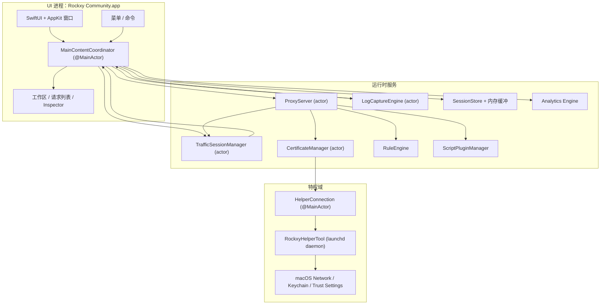
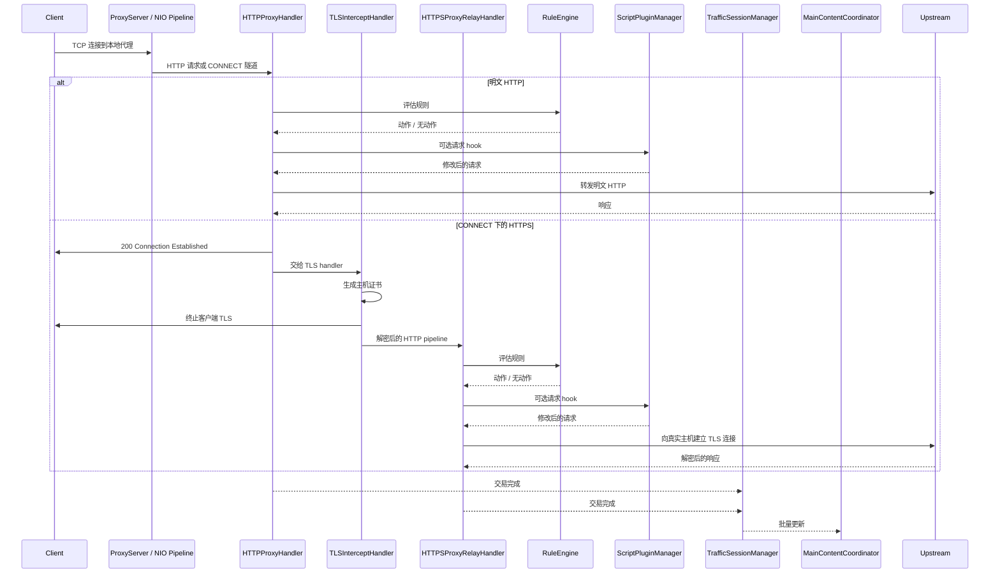
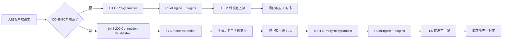
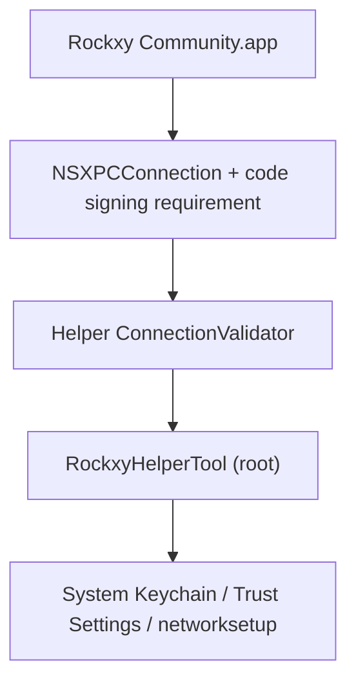

<p align="center">
  
</p>

<h1 align="center">Rockxy</h1>

<p align="center">
  <strong>macOS 上的开源 HTTP 调试代理。</strong>
</p>

<p align="center">
  拦截 HTTP/HTTPS 流量，检查 API 请求，调试 WebSocket 连接，并分析 GraphQL 查询。<br>
  基于 Swift，使用 SwiftNIO、SwiftUI 和 AppKit 构建。
</p>

<p align="center">
  <a href="#"></a>
  <a href="#"></a>
  <a href="LICENSE"></a>
  <a href="CONTRIBUTING.md"></a>
  <a href="https://github.com/sponsors/LocNguyenHuu"></a>
</p>

<p align="center">
  
</p>

---

> **状态**：积极开发中。核心代理引擎、HTTPS 拦截、规则系统、插件生态和 Inspector UI 已可用。进度请见 [CHANGELOG.md](CHANGELOG.md)。

## 功能

### 网络流量捕获
- **HTTP/HTTPS 代理** — 基于 SwiftNIO 的拦截代理，支持 CONNECT 隧道
- **SSL/TLS 拦截** — 通过 MITM 解密并自动生成按主机证书（LRU 缓存约 1000）
- **WebSocket 调试** — 双向帧捕获与检查
- **GraphQL 识别** — 自动提取 operation 名称并检查查询
- **进程识别** — 通过 `lsof` 端口映射 + User-Agent 分析识别请求来源应用（Safari、Chrome、curl、Slack、Postman 等）

### 请求与响应 Inspector
- **JSON 视图** — 可折叠树形结构与语法高亮
- **Hex Inspector** — 非文本内容的二进制 body 展示
- **Timing waterfall** — 展示 DNS、TCP 连接、TLS 握手、TTFB 与传输阶段
- **Headers、Cookies、Query、Auth** — 标签化 Inspector，支持原始视图
- **自定义 Header 列** — 选择额外请求/响应头作为列显示

### 工作区与效率
- **工作区标签页** — 独立的捕获空间与过滤状态
- **收藏夹** — 固定常用主机或请求，快速定位
- **时间线视图** — 聚焦子集的请求序列时间线

### 流量操控与 Mock API
- **Map Local** — 使用本地文件响应（无需改动服务端即可 Mock）
- **Map Remote** — 重定向到不同 host/port/path（测试网关、staging ↔ production 切换）
- **Breakpoints** — 中途暂停请求/响应，编辑 URL/headers/body/status 后转发或中止
- **Block List** — 按 URL pattern（通配或正则）阻断请求
- **Throttle** — 延迟转发以模拟慢网
- **Modify Headers** — 在线添加、移除或替换 header
- **Allow List** — 仅捕获指定域名或应用以降低噪音
- **Bypass Proxy** — 系统代理开启时绕过指定主机
- **SSL Proxying 规则** — 按域名控制 TLS 拦截

### 调试与分析
- **OSLog 集成** — 捕获 macOS 系统日志并按时间戳关联请求
- **并排对比** — 对比两条已捕获的请求/响应
- **请求时间线** — 请求序列与耗时瀑布图
- **凭据脱敏** — 自动隐藏 Bearer token 与密码

### 可扩展性
- **JavaScript 插件系统** — 基于 JavaScriptCore 的脚本扩展（5 秒超时沙箱）
- **请求/响应 Hook** — 插件可在代理流水线中检查并修改流量
- **插件设置 UI** — 根据 manifest 自动生成配置表单
- **导出格式** — cURL、HAR、原始 HTTP 或 JSON
- **Compose + 重放** — 编辑并重发请求，或重放已捕获流量
- **导入审核** — HAR/session 导入前进行检查

### 原生 macOS 体验
- **SwiftUI + AppKit 原生** — 非 Electron、非 WebView、无跨平台妥协
- **NSTableView 请求列表** — 支持 100k+ 请求的虚拟滚动
- **真实应用图标** — 通过 `NSWorkspace` 查询 bundle ID
- **系统代理集成** — 特权 helper 提供免密码代理设置（SMAppService）
- **深色模式** — 完整支持系统外观
- **快捷键** — Cmd+Shift+R（开始）、Cmd+.（停止）、Cmd+K（清空）等

## 使用场景

- **iOS / macOS 应用调试** — 检查来自模拟器或真机的 API 调用
- **REST API 测试** — 查看完整请求/响应对，无需切换工具
- **GraphQL 调试** — 快速查看 operation、变量和响应
- **Mock API 响应** — 将本地文件映射到端点，离线开发或测试边界情况
- **WebSocket 检查** — 调试实时连接（聊天、直播、游戏协议）
- **性能分析** — 定位慢接口、大 payload 与冗余请求
- **SSL/TLS 调试** — 通过按域名控制的 HTTPS 拦截进行分析
- **网络录制** — 捕获并重放 HTTP 会话用于回归测试
- **API 逆向** — 解析第三方应用的未文档化 API 行为
- **CI/CD 集成** — 用于自动化 API 合约测试的无界面代理（规划中）

## Rockxy vs Proxyman vs Charles Proxy

寻找 Proxyman 或 Charles Proxy 的开源替代？对比如下：

| 功能 | Rockxy | Proxyman | Charles Proxy |
|---------|--------|----------|---------------|
| **许可证** | 开源（AGPL-3.0） | 私有（freemium） | 私有（付费） |
| **价格** | 免费 | 免费版 + $69/年 | $50 一次性 |
| **平台** | macOS | macOS、iOS、Windows | macOS、Windows、Linux |
| **源码** | GitHub 完整可用 | 闭源 | 闭源 |
| **技术** | Swift + SwiftNIO（原生） | Swift + AppKit（原生） | Java（跨平台） |
| **HTTP/HTTPS 拦截** | 是 | 是 | 是 |
| **WebSocket 调试** | 是 | 是 | 是 |
| **GraphQL 识别** | 是（自动） | 是 | 否 |
| **Map Local** | 是 | 是 | 是 |
| **Map Remote** | 是 | 是 | 是 |
| **Breakpoints** | 是 | 是 | 是 |
| **Block List** | 是 | 是 | 是 |
| **Modify Headers** | 是 | 是 | 是（rewrite） |
| **Throttle / Network Conditions** | 是 | 是 | 是 |
| **请求对比** | 是（并排） | 是 | 否 |
| **JavaScript 插件** | 是（JSCore 沙箱） | 是（脚本） | 否 |
| **请求重放** | 是（Repeat + Edit） | 是 | 是 |
| **HAR 导入/导出** | 是 | 是 | 否（自有格式） |
| **OSLog 集成** | 是 | 否 | 否 |
| **进程识别** | 是（显示来源应用） | 是 | 否 |
| **JSON 树视图** | 是 | 是 | 是 |
| **Hex Inspector** | 是 | 是 | 是 |
| **Timing waterfall** | 是 | 是 | 是 |
| **虚拟滚动（100k+ 行）** | 是（NSTableView） | 是 | 大量数据时变慢 |
| **特权 helper（免 sudo 提示）** | 是（SMAppService） | 是 | 否（频繁提示） |
| **深色模式** | 是 | 是 | 部分 |
| **可自托管 / 可审计** | 是 | 否 | 否 |
| **社区贡献** | 接受 PR | 否 | 否 |

**为什么选择 Rockxy？**
- 你需要 **免费的开源 HTTP 调试代理**，没有许可证限制
- 你希望 **审计源码**，确保拦截流量工具可信
- 你想 **贡献功能** 或按工作流自定义
- 你需要 **OSLog 关联** 来调试 macOS 日志与网络请求
- 你想要 **原生 macOS 体验**，无需 Java 运行时

## 环境要求

- macOS 14.0+（Sonoma 或更高）
- Xcode 16+
- Swift 5.9

## 快速开始

```bash
git clone https://github.com/LocNguyenHuu/Rockxy.git
cd Rockxy
xcodebuild -project Rockxy.xcodeproj -scheme Rockxy -configuration Debug build
```

或在 Xcode 中打开 `Rockxy.xcodeproj` 并直接运行。

首次启动时，Welcome 窗口会引导你：
1. 生成并信任 root CA
2. 安装特权 helper 用于系统代理控制
3. 启用系统代理
4. 启动代理服务

## 架构

### 系统概览

Rockxy 拆分为三个信任与执行域：

1. **UI + 调度层** — SwiftUI/AppKit 窗口、Inspector、菜单与 `MainContentCoordinator`
2. **代理/运行层** — SwiftNIO handler、证书签发、请求变更、存储、分析与插件
3. **特权 helper 层** — 独立 launchd 守护进程，执行需要高权限的系统操作

设计目标是把包处理移出主线程，把特权操作移出应用进程，并通过 actor 或 `@MainActor` 明确同步边界。

### 组件图



### 运行时层

| 层 | 主要类型 | 职责 |
|-------|------------|----------------|
| **表现层** | `MainContentCoordinator`, `ContentView`, Inspector/列表/侧边栏视图 | 持有 UI 状态、路由命令、将代理与日志数据绑定到 SwiftUI/AppKit |
| **捕获 / 传输** | `ProxyServer`, `HTTPProxyHandler`, `TLSInterceptHandler`, `HTTPSProxyRelayHandler` | 接收代理流量、处理 CONNECT、执行 TLS MITM、上游转发 |
| **变更 / 策略** | `RuleEngine`, `BreakpointRequestBuilder`, `AllowListManager`, `NoCacheHeaderMutator`, `MapLocalDirectoryResolver` | 在转发或存储前应用规则与策略 |
| **证书 / 信任** | `CertificateManager`, `RootCAGenerator`, `HostCertGenerator`, `CertificateStore`, `KeychainHelper` | 生成与管理 root CA、缓存主机证书、检查信任、写入 Keychain |
| **存储 / 会话** | `TrafficSessionManager`, `LogCaptureEngine`, `SessionStore`, 内存缓冲 | 缓冲实时数据、选择性写入 SQLite，并批量更新 UI |
| **可观测 / 分析** | analytics、GraphQL 识别、content-type 识别、日志关联 | 为捕获流量增加元数据 |
| **特权系统集成** | `HelperConnection`, `RockxyHelperTool`, 共享 XPC 协议 | 执行系统代理与证书相关高权限操作 |

### 代理请求生命周期



### HTTP vs HTTPS 流程



### 并发模型

- `ProxyServer` 是负责 bind/shutdown 生命周期的 actor。
- NIO handlers 运行在 event-loop 线程，仅在需要时桥接到 actor。
- `CertificateManager`、`TrafficSessionManager` 等长期共享状态使用 actor。
- `MainContentCoordinator` 标记为 `@MainActor` 以同步 SwiftUI/AppKit。
- UI 更新采用批量模式避免高负载下主线程抖动。

### 核心子系统

| 子系统 | 位置 | 作用 |
|-----------|----------|--------------|
| **代理引擎** | `Core/ProxyEngine/` | SwiftNIO `ServerBootstrap`、连接 pipeline、CONNECT 处理、TLS 接管、HTTP/HTTPS 转发 |
| **证书** | `Core/Certificate/` | root CA、主机证书签发、信任检查、磁盘 + Keychain 持久化、证书缓存 |
| **规则引擎** | `Core/RuleEngine/` | 依次执行 block、map local、map remote、throttle、modify headers、breakpoint |
| **流量捕获** | `Core/TrafficCapture/` | session 批处理、allow-list 策略、replay、代理状态同步到 UI |
| **存储** | `Core/Storage/` | SQLite 持久化、内存缓冲、body 大小分流 |
| **检测 / 增强** | `Core/Detection/` | GraphQL 识别、content type 识别、API 分组 |
| **插件** | `Core/Plugins/` | 基于 JavaScriptCore 的 hook 执行与插件配置 |
| **Helper 工具** | `RockxyHelperTool/`, `Shared/` | 特权 XPC 服务：代理覆盖、bypass 域名、证书安装/移除 |

### 安全架构

> **漏洞报告：** 若发现安全问题请私下报告，详见 [SECURITY.md](SECURITY.md)。

Rockxy 采用分层安全模型，因为它终止 TLS、保存敏感流量，并与 root 权限 helper 通信。



#### 安全边界

| 边界 | 风险 | 现有控制 |
|----------|------|-----------------|
| **App ↔ helper** | 不可信应用调用特权代理/证书操作 | `NSXPCConnection` + code-signing 约束，helper 侧验证与证书链比对 |
| **TLS 拦截** | Root CA 过期/无效导致信任问题 | 明确 root CA 生命周期、信任校验、指纹跟踪、仅用当前 root 签发 |
| **请求体处理** | 超大 body 导致内存耗尽 | 100 MB 限制（413），8 KB URI 限制（414），WebSocket 限制（10 MB/帧，100 MB/连接） |
| **本地文件映射** | Map Local 的路径穿越或符号链接逃逸 | fd 读取、符号链接解析、根路径 containment 校验 |
| **规则正则** | 异常正则导致 ReDoS | 编译期校验、预编译缓存、500 字符限制、8 KB 输入限制 |
| **断点编辑** | 编辑后请求格式错误 | `BreakpointRequestBuilder` 集中重建、保持 authority、scheme 规范化、修正 content-length |
| **插件执行** | 脚本导致不安全或不可预测行为 | JSCore bridge、受限 API、超时、插件 ID 校验、禁用文件/网络访问 |
| **流量存储** | 敏感 body 存放过久或权限不足 | 内存 + SQLite，body 大小分流 0o600 权限，路径校验，凭据脱敏 |
| **Header 注入** | MapRemote 导致 CRLF 注入 | 过滤控制字符 |
| **Helper 输入验证** | 传入错误的域名/服务名 | ASCII-only 校验、服务名清理、代理类型白名单、域名数量限制 |

#### Helper 信任模型

Helper 作为 launchd daemon（`com.amunx.Rockxy.HelperTool`）通过 `SMAppService.daemon()` 注册，用于避免每次 `networksetup` 都提示密码。

现有防护包括：

- app 侧特权 XPC 连接配置
- `ConnectionValidator` 的 helper 侧调用方校验（硬编码 bundle ID）
- code-signing 约束（`anchor apple generic`）
- 证书链比对，避免仅依赖 bundle/team ID
- 对变更操作做速率限制（代理修改、证书安装）
- 全量参数校验（bypass 域名、服务名、代理类型）
- 0o600 权限的原子临时文件
- 代理设置备份/恢复用于崩溃恢复

#### 证书信任模型

- Root CA 的生成与持久化由 `CertificateManager` 负责。
- app 负责 root CA 的创建、加载与信任验证。
- helper 仅在需要时协助系统级安装，但信任仍可由 app 校验。
- 主机证书按需生成并缓存，避免重复成本。
- root 指纹跟踪用于清理旧证书。

#### 实际安全说明

- Rockxy 是开发工具，应视为可访问敏感流量的程序，避免长期启用系统代理。
- 安装 root CA 仅对信任该 CA 的客户端启用 HTTPS 拦截。
- 保存的会话、导出文件和插件脚本应视为敏感资产。

## 项目结构

```
Rockxy/
├── Core/
│   ├── ProxyEngine/       # SwiftNIO server, HTTP/TLS/WS handlers, helper client
│   ├── Certificate/       # X.509 generation, root CA, Keychain integration
│   ├── RuleEngine/        # Rule matching and action execution
│   ├── LogEngine/         # OSLog + process log capture and correlation
│   ├── TrafficCapture/    # Session manager, system proxy, request replay
│   ├── Storage/           # SQLite store, in-memory buffer, settings
│   ├── Detection/         # Content type, GraphQL, API grouping
│   ├── Plugins/           # Plugin discovery, JS runtime, manifest parsing
│   ├── Services/          # Window management, notifications
│   └── Utilities/         # Body decoder, input validation, formatters
├── Views/
│   ├── Main/              # Main window, coordinator extensions
│   ├── RequestList/       # NSTableView-backed request list (100k+ rows)
│   ├── Inspector/         # Request/response tabs, JSON tree, hex display
│   ├── Sidebar/           # Domain tree, app grouping, favorites
│   ├── Toolbar/           # Status indicators, control buttons
│   ├── Welcome/           # Setup wizard, certificate checklist
│   ├── Settings/          # General, Proxy, SSL Proxying, Privacy tabs
│   ├── Rules/             # Rule list, add/edit dialogs
│   ├── Compose/           # Edit and Repeat request editor
│   ├── Diff/              # Side-by-side transaction comparison
│   ├── Scripting/         # Code editor, plugin console
│   ├── Timeline/          # Request waterfall visualization
│   ├── Breakpoint/        # Breakpoint edit window
│   └── Components/        # Reusable: StatusCodeBadge, FilterPill, etc.
├── Models/
│   ├── Network/           # HTTPTransaction, Request/Response, TimingInfo, WebSocket
│   ├── Log/               # LogEntry, LogLevel, LogSource
│   ├── Analytics/         # ErrorGroup, PerformanceMetric, SessionTrend
│   ├── Certificate/       # RootCA, RootCAStatusSnapshot
│   ├── Rules/             # ProxyRule, RuleAction
│   ├── Settings/          # AppSettings, ProxySettings
│   ├── UI/                # SidebarItem, FilterState
│   └── Plugins/           # PluginInfo, PluginConfig, PluginManifest
├── ViewModels/
├── Extensions/
└── Theme/

RockxyHelperTool/              # Privileged launchd daemon (runs as root)
├── main.swift                 # Entry point, XPC listener
├── HelperDelegate.swift       # Connection validation, disconnect handling
├── HelperService.swift        # Protocol impl, rate limiting, port validation
├── ConnectionValidator.swift  # Certificate chain extraction & comparison
├── CrashRecovery.swift        # Backup/restore proxy settings
└── ProxyConfigurator.swift    # networksetup wrapper

Shared/
└── RockxyHelperProtocol.swift # @objc XPC protocol (app ↔ helper)

RockxyTests/                   # Swift Testing framework (@Suite, @Test, #expect)
├── Core/                      # Rule engine, certificate, plugin, storage, proxy tests
├── ViewModels/                # WelcomeViewModel tests
└── Helpers/                   # TestFixtures factory methods

docs/                          # Documentation (Mintlify format)
.github/workflows/             # CI: lint → build (arm64 + x86_64) → release
```

## 技术栈

| 层 | 技术 |
|-------|-----------|
| UI 框架 | SwiftUI + AppKit（NSTableView、NSViewRepresentable） |
| 网络 | [SwiftNIO](https://github.com/apple/swift-nio) 2.95 + [SwiftNIO SSL](https://github.com/apple/swift-nio-ssl) 2.36 |
| 证书 | [swift-certificates](https://github.com/apple/swift-certificates) 1.18 + [swift-crypto](https://github.com/apple/swift-crypto) 4.2 |
| 数据库 | [SQLite.swift](https://github.com/stephencelis/SQLite.swift) 0.16 |
| 并发 | Swift Actors、结构化并发、@MainActor |
| 插件 | JavaScriptCore（macOS 内建框架） |
| Helper IPC | XPC Services + SMAppService（macOS 13+） |
| 测试 | Swift Testing framework（@Suite、@Test、#expect） |
| CI/CD | GitHub Actions（SwiftLint → 并行 arm64/x86_64 build → release） |

## 从源码构建

### Development Build

```bash
git clone https://github.com/LocNguyenHuu/Rockxy.git
cd Rockxy
./scripts/setup-developer.sh   # 生成 Configuration/Developer.xcconfig 用于本地签名
xcodebuild -project Rockxy.xcodeproj -scheme Rockxy -configuration Debug build
```

### Release Build

```bash
# Apple Silicon (M1/M2/M3/M4)
xcodebuild -project Rockxy.xcodeproj -scheme Rockxy -configuration Release -arch arm64 build

# Intel
xcodebuild -project Rockxy.xcodeproj -scheme Rockxy -configuration Release -arch x86_64 build
```

### 运行测试

```bash
# 全部测试
xcodebuild -project Rockxy.xcodeproj -scheme Rockxy test

# 指定测试类
xcodebuild -project Rockxy.xcodeproj -scheme Rockxy test -only-testing:RockxyTests/CertificateTests

# 指定测试方法
xcodebuild -project Rockxy.xcodeproj -scheme Rockxy test -only-testing:RockxyTests/RuleEngineTests/testWildcardMatching
```

### Lint 与格式化

```bash
brew install swiftlint swiftformat

swiftlint lint --strict    # 必须零违规
swiftformat .              # 自动格式化
```

### Helper 工具说明

如果修改了 `RockxyHelperTool/` 或 `Shared/RockxyHelperProtocol.swift`，仅重建 app 不会生效。必须先卸载旧 helper，再通过应用的 Helper Manager 重新安装。

## 设计决策

### 为什么用 SwiftNIO 而不是 URLSession

URLSession 是高层 HTTP 客户端。Rockxy 需要底层 TCP 服务器以接收连接、解析 HTTP、在 CONNECT 隧道中执行 MITM TLS 并转发流量，这些需要直接控制 socket。SwiftNIO 提供事件驱动的非阻塞 I/O 基础，适合纯 Swift 实现代理。

### 为什么请求列表用 NSTableView

SwiftUI 的 `List` 无法在 100k+ 行场景下实现高性能虚拟滚动。Rockxy 使用 `NSTableView` 通过 `NSViewRepresentable` 封装，实现 O(1) 滚动性能。

### 为什么需要特权 helper 守护进程

macOS 对每次 `networksetup` 调用都要求管理员认证。helper（`SMAppService.daemon()`）以 root 运行，通过证书链验证调用方，避免反复输入密码并保持安全性。

### 基于 actor 的并发模型

代理服务器、会话管理和证书管理均使用 Swift actor，避免数据竞争。`MainContentCoordinator` 负责将 actor 状态批量同步到 `@MainActor`（每 250ms）。

### 插件沙箱

JavaScript 插件运行在 JavaScriptCore 中，桥接 API 受限（`$rockxy`），每次执行有 5 秒超时。插件可检查与修改请求，但无法直接访问文件系统或网络。

## 性能

- **100k+ 请求** — NSTableView 虚拟滚动与 cell 复用，UI 无卡顿
- **Ring buffer 淘汰** — 超过 50k 事务时淘汰最旧 10%，转存到 SQLite 或丢弃
- **Body 分流** — request/response body >1MB 写入磁盘按需加载
- **UI 批量更新** — 每 250ms 或 50 项批量推送
- **字符串性能** — 大 body 使用 `NSString.length`（O(1)）替代 `String.count`（O(n)）
- **日志缓冲** — 100k 条在内存，溢出写入 SQLite
- **并发构建** — NIO event loop 线程数取 `System.coreCount`

## 存储

| 数据 | 机制 | 位置 |
|------|-----------|----------|
| 用户偏好 | UserDefaults | `AppSettingsStorage` |
| 活动会话 | 内存 ring buffer | `InMemorySessionBuffer` |
| 保存会话 | SQLite | `SessionStore` |
| Root CA 私钥 | macOS Keychain | `KeychainHelper` |
| 规则 | JSON 文件 | `RuleStore` |
| 大 body | 磁盘文件 | `~/Library/Application Support/Rockxy/bodies/` |
| 日志条目 | SQLite | `SessionStore`（log_entries 表） |
| 代理备份 | Plist（0o600） | `/Library/Application Support/com.amunx.Rockxy/proxy-backup.plist` |
| 插件 | JS 文件 + manifest | `~/Library/Application Support/Rockxy/Plugins/` |

## 代码规范

完整规则见 `.swiftlint.yml` 与 `.swiftformat`。要点如下：

- 4 空格缩进，目标行宽 120 字符
- 所有声明显式访问控制
- 禁止 force unwrap（`!`）与 force cast（`as!`），使用 `guard let`、`if let`、`as?`
- 全部日志使用 OSLog，禁止 `print()`
- UI 文本使用 `String(localized:)`
- Commit 信息遵循 [Conventional Commits](https://www.conventionalcommits.org/)

### 文件大小限制

| 指标 | 警告 | 错误 |
|--------|---------|-------|
| 文件长度 | 1200 行 | 1800 行 |
| 类型体长度 | 1100 行 | 1500 行 |
| 函数体长度 | 160 行 | 250 行 |
| 圈复杂度 | 40 | 60 |

接近限制时请拆分到 `TypeName+Category.swift` 扩展文件。

## CI/CD

GitHub Actions 工作流（手动触发，可选 channel 参数）：

1. **Lint** — macOS 14 上执行 `swiftlint lint --strict`
2. **Build** — Xcode 16 并行构建 arm64 与 x86_64 release
3. **Artifacts** — 上传已签名的构建产物

## Roadmap

### 已发布

- [x] HAR 导入与导出
- [x] 请求重放（Repeat 与 Edit and Repeat）
- [x] 原生 `.rockxysession` 会话文件（保存、打开、元数据）
- [x] GraphQL-over-HTTP 识别与检查
- [x] JavaScript 脚本（创建、编辑、测试、启用/禁用）
- [x] 并排请求对比
- [x] 安全加固（body 限制、正则校验、路径穿越保护、输入校验）
- [x] 捕获日志中的凭据脱敏

### 计划中

- [ ] 错误分组与分析仪表盘（HTTP 4xx/5xx、延迟指标）
- [ ] HTTP/2 与 HTTP/3 支持
- [ ] 序列录制（重放依赖链请求）
- [ ] 远程设备代理（USB/Wi-Fi 调试 iOS）
- [ ] CI/CD 无界面模式
- [ ] gRPC / Protocol Buffers 检查
- [ ] 网络条件模拟（延迟、丢包、带宽）

## 贡献

欢迎贡献，无论是修复 bug、添加功能、改进文档还是 UX 反馈。参与前请阅读 [Code of Conduct](CODE_OF_CONDUCT.md)。

**入门步骤：**

1. Fork 仓库并克隆你的 fork
2. 从 `develop` 创建功能分支（`feat/your-change` 或 `fix/your-fix`）
3. 完成修改，确保 `swiftlint lint --strict` 通过
4. 提交清晰的 PR 描述

详见 [CONTRIBUTING.md](CONTRIBUTING.md) 了解完整设置、代码风格、提交规范与 PR 清单。

**贡献方式：**

- **代码** — 修复 bug、添加功能、性能优化
- **测试** — 扩展覆盖率、补充边界用例、改进 fixtures
- **文档** — 改进 `docs/`、修正错别字、添加示例
- **Bug 报告** — 提供可复现步骤与 macOS 版本
- **UX 反馈** — 改进 Inspector、侧边栏或工具栏体验

适合新手的问题标记为 [`good first issue`](https://github.com/LocNguyenHuu/Rockxy/labels/good%20first%20issue)。

提交 PR 即表示你同意 [Contributor License Agreement](CLA.md)。

## 支持

- [GitHub Sponsors](https://github.com/sponsors/LocNguyenHuu) — 支持 Rockxy 开发
- [GitHub Issues](https://github.com/LocNguyenHuu/Rockxy/issues) — Bug 报告与功能请求
- [GitHub Discussions](https://github.com/LocNguyenHuu/Rockxy/discussions) — 社区问答与交流
- **Email** — [rockxyapp@gmail.com](mailto:rockxyapp@gmail.com)
- **安全问题** — 参见 [SECURITY.md](SECURITY.md)

## 许可证

[GNU Affero General Public License v3.0](LICENSE) — Copyright 2024–2026 Rockxy Contributors.

---

**由 Swift、SwiftNIO、SwiftUI 与 AppKit 构建。**
